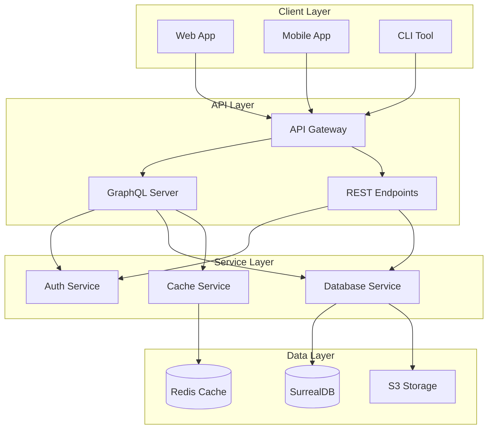

# Phase 3: Interactive Features & Enhancements (Days 11-15)

## Overview
This phase adds interactive elements, performance documentation, and prepares the documentation for advanced features through strategic placeholder placement.

## Day 11: Interactive Architecture Diagrams

### Morning Tasks (4 hours)

#### 11.1 System Architecture Diagram
Create `src/developers/architecture/system-overview.md`:

```markdown
# System Architecture

## High-Level Architecture



<!-- Future Enhancement: Interactive Features
When mdbook-interactive-diagrams plugin is available:
- Click on any component to navigate to its documentation
- Hover for component descriptions  
- Expand/collapse subgraphs for detail control

For now: Static diagram with clear labels and a legend below
-->
```

**Diagram Navigation Guide** (place after diagram):
- **API Gateway**: See [Gateway Configuration](/administrators/deployment/gateway.html)
- **GraphQL Server**: See [GraphQL Module](/developers/modules/graphql/index.html)  
- **Database Service**: See [Services Module](/developers/modules/services/index.html)

**Current Implementation**:
- Use descriptive labels in diagrams
- Add navigation guides below diagrams
- Consider numbered components with a legend
- Ensure diagrams are useful even without interactivity
```

#### 11.2 Request Flow Diagrams

Create `src/developers/architecture/request-flow.md`:

**GraphQL Request Flow**:


### Afternoon Tasks (4 hours)

#### 11.3 Module Interaction Diagrams

For each module, create interaction diagrams:

**Config Module Interactions**:


#### 11.4 Deployment Architecture Diagrams

Create `src/administrators/deployment/kubernetes-architecture.md`:


## Day 12: GraphQL Playground Integration

### Morning Tasks (4 hours)

#### 12.1 GraphQL Playground Setup

Create `src/users/graphql-playground.md`:

```markdown
# GraphQL Playground

<div class="warning">
The interactive playground connects to a mock server for documentation purposes.
To connect to your own instance, update the endpoint URL.
</div>

## Interactive Playground

<div id="graphql-playground-container">
  <!-- Placeholder for GraphQL Playground -->
  <div class="playground-mock">
    <div class="playground-header">
      <input type="text" value="https://mock.pcf-api.org/graphql" class="endpoint-url" />
      <button class="play-button">▶ Execute</button>
    </div>
    <div class="playground-body">
      <div class="query-editor">
        <pre><code>
query GetNotes {
  notes(first: 10) {
    edges {
      node {
        id
        title
        content
        createdAt
      }
    }
    pageInfo {
      hasNextPage
      endCursor
    }
  }
}
        </code></pre>
      </div>
      <div class="response-viewer">
        <pre><code>
{
  "data": {
    "notes": {
      "edges": [
        {
          "node": {
            "id": "01234567-89ab-cdef-0123-456789abcdef",
            "title": "Example Note",
            "content": "This is a mock response",
            "createdAt": "2024-01-01T00:00:00Z"
          }
        }
      ],
      "pageInfo": {
        "hasNextPage": false,
        "endCursor": null
      }
    }
  }
}
        </code></pre>
      </div>
    </div>
  </div>
</div>

<!-- mdbook-graphql-playground:
  endpoint: "https://mock.pcf-api.org/graphql"
  mock_data: "./playground-mocks.json"
  headers: {
    "Authorization": "Bearer <your-token>"
  }
-->
```

#### 12.2 Query Examples Library

Create `src/users/graphql-examples.md`:

Structure example queries by use case:

**Basic Queries**:
- Health check
- Fetch single note
- List notes with pagination

**Advanced Queries**:
- Filtered queries
- Sorted results
- Field selection

**Mutations**:
- Create note
- Update note
- Delete note

**Subscriptions**:
- Note created
- Note updated
- Note deleted

### Afternoon Tasks (4 hours)

#### 12.3 Mock Data Configuration

Create `src/users/playground-mocks.json`:
```json
{
  "mocks": {
    "Query": {
      "health": {
        "status": "healthy",
        "timestamp": "@datetime",
        "version": "1.0.0"
      },
      "note": {
        "id": "@uuid",
        "title": "@words(3)",
        "content": "@paragraph",
        "createdAt": "@datetime",
        "updatedAt": "@datetime"
      },
      "notes": {
        "edges": "@array(10)",
        "pageInfo": {
          "hasNextPage": "@boolean",
          "hasPreviousPage": "@boolean",
          "startCursor": "@string",
          "endCursor": "@string"
        }
      }
    }
  }
}
```

#### 12.4 Interactive Examples

Add interactive elements to each query example:
- "Try it" button that loads in playground
- Variable editor
- Headers configuration
- Response inspection

## Day 13: Performance Documentation

### Morning Tasks (4 hours)

#### 13.1 Benchmark Methodology

Create `src/reference/benchmarks/methodology.md`:

Document the benchmarking approach:
- Test environment specifications
- Load patterns
- Measurement techniques
- Statistical analysis
- Reproducibility guidelines

#### 13.2 Module Performance Profiles

Create performance documentation for each module:

**GraphQL Performance** (`src/reference/benchmarks/graphql-performance.md`):
```markdown
# GraphQL Performance Analysis

## Query Performance

| Query | Complexity | p50 | p90 | p99 | Max |
|-------|------------|-----|-----|-----|-----|
| health | 1 | <1ms | 1-2ms | 2-5ms | ~10ms |
| note(id) | 5 | 1-3ms | 3-7ms | 5-15ms | ~30ms |
| notes(first:10) | 20 | 3-8ms | 8-15ms | 15-35ms | ~75ms |
| notes(first:100) | 200 | 30-70ms | 70-150ms | 150-350ms | ~750ms |

*Note: Performance varies by environment. Times shown are approximations based on development testing.*

## Performance Visualization

<div class="perf-chart" data-module="graphql">
  <!-- Placeholder for interactive performance charts -->
  <canvas id="graphql-perf-chart"></canvas>
</div>

<!-- mdbook-performance-charts:
  data_source: "./benchmark-results/graphql.json"
  chart_type: "latency_percentiles"
  interactive: true
-->
```

### Afternoon Tasks (4 hours)

#### 13.3 Load Testing Results

Create `src/reference/benchmarks/load-testing.md`:

Document load testing scenarios:
- Normal load (100 concurrent users)
- Peak load (1000 concurrent users)
- Stress test (increasing load)
- Endurance test (24 hours)

Include visualizations:
```markdown
## Throughput Under Load

<div class="load-test-results">
  <div class="throughput-chart">
    <!-- Placeholder for throughput visualization -->
  </div>
  <div class="latency-chart">
    <!-- Placeholder for latency visualization -->
  </div>
  <div class="error-rate-chart">
    <!-- Placeholder for error rate visualization -->
  </div>
</div>
```

#### 13.4 Performance Optimization Guide

Create `src/developers/performance/optimization.md`:

- Query optimization techniques
- Caching strategies
- Connection pooling tuning
- Database query optimization
- N+1 query prevention

## Day 14: Custom Plugin Placeholders

### Morning Tasks (4 hours)

#### 14.1 Auto-Documentation Placeholders

Mark locations for auto-generated content:

**Module API Reference**:
```markdown
# Config Module API Reference

<!-- mdbook-auto-doc:
  source_file: "../src/config/mod.rs"
  include_private: false
  group_by: "type"
-->

## Structs

<!-- Auto-generated struct documentation will appear here -->

## Functions

<!-- Auto-generated function documentation will appear here -->

## Traits

<!-- Auto-generated trait documentation will appear here -->
```

#### 14.2 GraphQL Schema Documentation

Create `src/developers/graphql/schema-reference.md`:

```markdown
# GraphQL Schema Reference

<!-- mdbook-graphql-introspection:
  schema_file: "../src/graphql/schema.rs"
  include_deprecated: true
  generate_examples: true
-->

## Types

<!-- Auto-generated type documentation will appear here -->

## Queries

<!-- Auto-generated query documentation will appear here -->

## Mutations

<!-- Auto-generated mutation documentation will appear here -->

## Subscriptions

<!-- Auto-generated subscription documentation will appear here -->
```

### Afternoon Tasks (4 hours)

#### 14.3 Dependency Documentation Integration

Update `src/developers/dependencies/index.md`:

```markdown
# Project Dependencies

<!-- mdbook-dependency-doc:
  cargo_toml: "../Cargo.toml"
  rationales: "../dependencies.toml"
  show_graph: true
  check_licenses: true
-->

## Dependency Graph

<!-- Auto-generated dependency graph will appear here -->

## Direct Dependencies

<!-- Auto-generated dependency list with rationales will appear here -->

## Transitive Dependencies

<!-- Auto-generated transitive dependency analysis will appear here -->

## License Summary

<!-- Auto-generated license compatibility matrix will appear here -->
```

#### 14.4 Interactive Diagram Enhancement

Add enhanced interactivity markers to all architecture diagrams:

```markdown
<!-- mdbook-interactive-diagrams:
  features:
    - click_navigation: true
    - tooltips: true
    - zoom_pan: true
    - export: ["svg", "png"]
    - animations: true
  navigation_map:
    "API Gateway": "/administrators/deployment/gateway.html"
    "GraphQL Server": "/developers/modules/graphql/index.html"
    "Database Service": "/developers/modules/services/index.html"
  tooltips:
    "API Gateway": "Entry point for all client requests"
    "GraphQL Server": "Handles GraphQL query execution"
    "Database Service": "Manages database connections and queries"
-->
```

## Day 15: Advanced Features and Polish

### Morning Tasks (4 hours)

#### 15.1 Search Enhancement

Create `src/search-help.md`:
- Search syntax guide
- Filter examples
- Audience-specific searches
- Common search patterns

Add frontmatter to all pages:
```yaml
---
title: "Config Module"
description: "Configuration management with Figment"
keywords: ["config", "configuration", "figment", "environment"]
audience: ["developers", "administrators"]
category: "module"
---
```

#### 15.2 Navigation Improvements

Enhance `src/SUMMARY.md` with:
- Visual separators
- Emoji indicators for content type
- Audience badges
- Completion status markers

```markdown
# Summary

[Introduction](introduction.md)

---

# 🚀 Quick Start

- [👨‍💻 For Developers](quick-start/developers.md)
- [🔧 For Administrators](quick-start/administrators.md)
- [📱 For API Users](quick-start/users.md)

---

# 📚 Developer Documentation

## Architecture
- [🏗️ System Overview](developers/architecture/system-overview.md)
- [🔄 Request Flow](developers/architecture/request-flow.md)

## Modules
- [⚙️ Configuration](developers/modules/config/index.md) ✅
- [❌ Error Handling](developers/modules/error/index.md) ✅
- [📊 GraphQL](developers/modules/graphql/index.md) ✅
```

### Afternoon Tasks (4 hours)

#### 15.3 Cross-Reference Matrix

Create `src/reference/cross-reference.md`:

Table showing which documentation is relevant for each audience:

| Topic | Developers | Administrators | API Users |
|-------|------------|----------------|-----------|
| Configuration | [Module Docs](../developers/modules/config) | [Config Guide](../administrators/configuration) | - |
| GraphQL | [Module Docs](../developers/modules/graphql) | [Deployment](../administrators/deployment) | [API Guide](../users/graphql) |
| Health Checks | [Module Docs](../developers/modules/health) | [Monitoring](../administrators/monitoring) | [Endpoints](../users/api-endpoints) |

#### 15.4 Final Polish

1. **Consistency Check**:
   - Terminology consistency
   - Code example style
   - Link format standardization
   - Heading hierarchy

2. **Accessibility**:
   - Alt text for diagrams
   - Keyboard navigation hints
   - Screen reader considerations
   - High contrast mode support

3. **Print Stylesheet**:
   - Clean print layout
   - Page break control
   - Diagram handling
   - Link URL display

4. **Mobile Optimization**:
   - Responsive tables
   - Touch-friendly navigation
   - Collapsible sections
   - Optimized images

## Deliverables Checklist

### Interactive Diagrams
- [ ] System architecture with placeholders
- [ ] Request flow diagrams
- [ ] Module interaction diagrams
- [ ] Deployment architecture
- [ ] All diagrams have interactivity markers

### GraphQL Playground
- [ ] Playground container setup
- [ ] Mock data configuration
- [ ] Example query library
- [ ] Connection instructions
- [ ] Variable and header editors

### Performance Documentation
- [ ] Benchmark methodology
- [ ] Module performance profiles
- [ ] Load testing results
- [ ] Optimization guide
- [ ] Interactive charts placeholders

### Plugin Integration
- [ ] Auto-doc placeholders in all modules
- [ ] GraphQL introspection markers
- [ ] Dependency doc integration
- [ ] Interactive diagram configuration

### Enhanced Features
- [ ] Search optimization with frontmatter
- [ ] Navigation improvements
- [ ] Cross-reference matrix
- [ ] Accessibility features

## Success Criteria

### Minimum Viable Features
1. **Diagrams**: Static Mermaid diagrams with navigation guides
2. **Performance**: Basic benchmark structure with example data
3. **Integration**: Clear markers for future plugin integration
4. **Navigation**: Functional table of contents and cross-links
5. **Accessibility**: Alt text for diagrams, semantic HTML

### Target Implementation
1. **Enhanced Diagrams**: Numbered components with detailed legends
2. **Performance Docs**: Realistic ranges and methodology
3. **Plugin Preparation**: Well-documented integration points
4. **Polished Navigation**: Breadcrumbs and section jumps
5. **Good Accessibility**: Keyboard navigation, screen reader friendly

### Stretch Goals
1. **Interactive Elements**: Any working interactive features
2. **Live Performance**: Real benchmark data if available
3. **Partial Plugins**: Any custom plugin prototypes
4. **Beautiful Polish**: Custom styling and animations
5. **Full Accessibility**: WCAG 2.1 AA compliance

## Quality Metrics

### Interactive Elements
- [ ] Every architecture diagram is interactive-ready
- [ ] GraphQL playground mock functional
- [ ] Performance charts have data sources
- [ ] Navigation is intuitive

### Documentation Completeness
- [ ] All placeholders clearly marked
- [ ] Future features documented
- [ ] Integration points identified
- [ ] Migration paths outlined

## Next Phase Preview

Phase 4 will focus on:
- Quality assurance and testing
- Content review and refinement
- Lesson learned integration
- Cross-reference validation
- Final consistency checks

---

*This phase transforms static documentation into an interactive, engaging experience while preparing for future automation.*