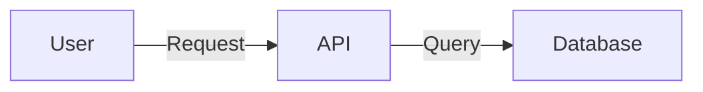

# MDBook Interactive Architecture Diagrams Plugin Specification

## Overview

This plugin enhances MDBook's diagram capabilities with interactive features including clickable navigation, tooltips, expand/collapse functionality, and optional animations.

## Plugin Name
`mdbook-interactive-diagrams`

## Features

### 1. Clickable Navigation
- Extend mermaid diagrams to support click events that navigate to documentation pages
- Support both internal MDBook links and external URLs
- Visual feedback on hoverable elements

### 2. Tooltip Support
- Rich tooltips on hover showing component descriptions
- Support for markdown formatting in tooltips
- Configurable delay and positioning

### 3. Expand/Collapse Diagrams
- Progressive disclosure for complex diagrams
- Remember user's expansion state
- Smooth animations between states

### 4. Optional Animations
- Data flow animations to show system behavior
- Configurable animation speed
- Play/pause controls

## Technical Implementation

### Architecture
```
mdbook-interactive-diagrams/
├── src/
│   ├── main.rs              # MDBook preprocessor entry
│   ├── parser.rs            # Parse custom syntax
│   ├── transformer.rs       # Convert to HTML/JS
│   ├── assets/
│   │   ├── diagram.js       # Client-side logic
│   │   └── diagram.css      # Styling
│   └── templates/
│       └── diagram.html     # HTML templates
├── Cargo.toml
└── README.md
```

### Syntax Design

#### Basic Interactive Diagram
```markdown
```mermaid-interactive
graph TD
    A[API Gateway] -->|HTTP| B[GraphQL Server]
    B --> C[Database]
    
    click A "/admin/deployment/gateway.html" "Learn about API Gateway"
    click B "/developers/modules/graphql/index.html" "GraphQL Documentation"
    
    tooltip A "Handles incoming requests and routing"
    tooltip B "Processes GraphQL queries and mutations"
```

#### Expandable Diagram
```markdown
```mermaid-interactive
graph TD
    A[API Server] --> B[Services]
    
    subgraph B [Services]
        collapsed: true
        B1[Auth Service]
        B2[Database Service]
        B3[Cache Service]
    end
    
    expand-icon B "+"
    collapse-icon B "-"
```

#### Animated Flow Diagram
```markdown
```mermaid-interactive
sequenceDiagram
    animate: true
    speed: 2000ms
    
    Client->>API: Request
    animate-flow: 500ms
    API->>Database: Query
    animate-flow: 300ms
    Database-->>API: Response
    animate-flow: 300ms
    API-->>Client: JSON
```

### Implementation Details

#### Preprocessor Logic
```rust
use mdbook::book::{Book, BookItem};
use mdbook::errors::Error;
use mdbook::preprocess::{Preprocessor, PreprocessorContext};

pub struct InteractiveDiagramPreprocessor;

impl Preprocessor for InteractiveDiagramPreprocessor {
    fn name(&self) -> &str {
        "interactive-diagrams"
    }

    fn run(&self, ctx: &PreprocessorContext, mut book: Book) -> Result<Book, Error> {
        // 1. Find all mermaid-interactive blocks
        // 2. Parse custom syntax
        // 3. Generate HTML with embedded JS
        // 4. Replace blocks with interactive version
        Ok(book)
    }
}
```

#### JavaScript Component
```javascript
class InteractiveDiagram {
    constructor(element, config) {
        this.element = element;
        this.config = config;
        this.initializeMermaid();
        this.setupInteractivity();
    }
    
    setupClickHandlers() {
        // Add click event listeners to specified nodes
    }
    
    setupTooltips() {
        // Initialize tooltip library (e.g., Tippy.js)
    }
    
    setupExpandCollapse() {
        // Handle subgraph expansion state
    }
    
    setupAnimations() {
        // Control flow animations
    }
}
```

### Configuration

In `book.toml`:
```toml
[preprocessor.interactive-diagrams]
command = "mdbook-interactive-diagrams"
renderer = ["html"]

[preprocessor.interactive-diagrams.config]
enable_animations = true
default_collapsed = false
tooltip_delay = 500
animation_speed = 1000
theme = "auto"  # auto, light, dark
```

### CSS Styling
```css
.interactive-diagram {
    position: relative;
}

.diagram-node.clickable {
    cursor: pointer;
    transition: all 0.2s ease;
}

.diagram-node.clickable:hover {
    filter: brightness(1.1);
    transform: scale(1.02);
}

.diagram-tooltip {
    position: absolute;
    background: var(--tooltip-bg);
    border: 1px solid var(--tooltip-border);
    padding: 8px 12px;
    border-radius: 4px;
    font-size: 14px;
    z-index: 1000;
}

.expand-collapse-icon {
    position: absolute;
    cursor: pointer;
    width: 20px;
    height: 20px;
    background: var(--icon-bg);
    border-radius: 50%;
    display: flex;
    align-items: center;
    justify-content: center;
}
```

## Dependencies
- `mdbook`: Core MDBook library
- `pulldown-cmark`: Markdown parsing
- `regex`: Pattern matching for custom syntax
- `serde`: Configuration handling
- `handlebars`: Template rendering

## Browser Dependencies
- Mermaid.js: Diagram rendering
- Tippy.js or Floating UI: Tooltip functionality
- Custom animation library or CSS animations

## Installation
```bash
cargo install mdbook-interactive-diagrams
```

## Usage Example

### Simple Navigation
```markdown


### Complex Architecture Diagram
```markdown
```mermaid-interactive
graph TB
    subgraph "Frontend" 
        collapsed: false
        A[Web App]
        B[Mobile App]
    end
    
    subgraph "Backend"
        collapsed: true
        C[API Gateway]
        D[GraphQL Server]
        E[REST API]
    end
    
    subgraph "Data Layer"
        collapsed: true
        F[PostgreSQL]
        G[Redis Cache]
        H[S3 Storage]
    end
    
    A --> C
    B --> C
    C --> D
    C --> E
    D --> F
    D --> G
    E --> F
    E --> H
    
    tooltip C "Handles authentication and routing"
    tooltip D "GraphQL API with subscriptions"
    tooltip F "Primary data store"
    
    click D "/developers/graphql/index.html" "GraphQL Documentation"
```

## Testing Strategy
1. Unit tests for syntax parsing
2. Integration tests with MDBook
3. Browser tests for interactivity
4. Visual regression tests
5. Performance tests for large diagrams

## Future Enhancements
1. Export interactive diagrams as standalone HTML
2. Support for other diagram types (PlantUML, D2)
3. Diagram versioning and diffing
4. Accessibility improvements (keyboard navigation)
5. Mobile touch support
6. Real-time collaboration features