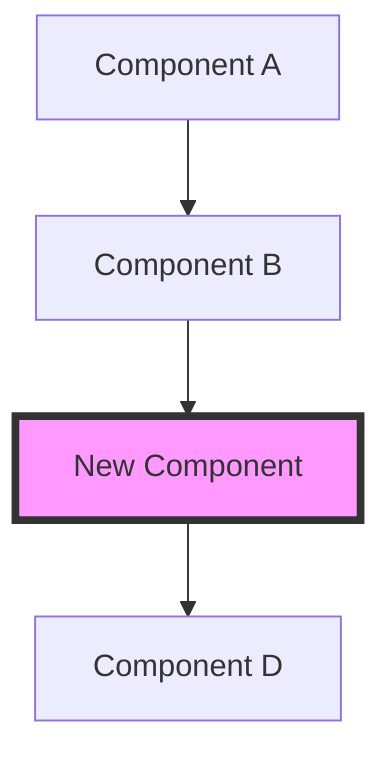

# Architecture Decision Record (ADR) Template

# ADR-[NUMBER]: [Title]

**Status**: [Proposed | Accepted | Deprecated | Superseded by ADR-XXX]  
**Date**: [YYYY-MM-DD]  
**Deciders**: [List of people involved in decision]  
**Technical Story**: [Link to issue/ticket]

## Context

[Describe the context and problem statement. What is the issue that we're seeing that is motivating this decision or change? Include any relevant background information, constraints, and forces at play.]

### Current State

[Describe how things work currently, what are the pain points]

### Requirements

- [Requirement 1]
- [Requirement 2]
- [Requirement 3]

### Constraints

- [Technical constraint 1]
- [Business constraint 2]
- [Time/resource constraint 3]

## Decision

[Describe the decision that was made and the rationale behind it. This is the core of the ADR.]

### Chosen Solution: [Solution Name]

[Detailed description of what we're going to do]

## Considered Options

### Option 1: [Option Name]

**Description**: [What this option entails]

**Pros**:
- [Advantage 1]
- [Advantage 2]

**Cons**:
- [Disadvantage 1]
- [Disadvantage 2]

**Estimated Effort**: [S/M/L/XL]

### Option 2: [Option Name]

**Description**: [What this option entails]

**Pros**:
- [Advantage 1]
- [Advantage 2]

**Cons**:
- [Disadvantage 1]
- [Disadvantage 2]

**Estimated Effort**: [S/M/L/XL]

### Option 3: [Option Name]

**Description**: [What this option entails]

**Pros**:
- [Advantage 1]
- [Advantage 2]

**Cons**:
- [Disadvantage 1]
- [Disadvantage 2]

**Estimated Effort**: [S/M/L/XL]

## Decision Matrix

| Criteria | Weight | Option 1 | Option 2 | Option 3 |
|----------|--------|----------|----------|----------|
| Performance | High | 8/10 | 6/10 | 9/10 |
| Maintainability | High | 7/10 | 9/10 | 6/10 |
| Development Effort | Medium | 6/10 | 8/10 | 4/10 |
| Operational Complexity | Medium | 7/10 | 8/10 | 5/10 |
| Cost | Low | 8/10 | 7/10 | 5/10 |
| **Total Score** | | **7.2** | **7.6** | **6.2** |

## Consequences

### Positive Consequences

- [Positive outcome 1]
- [Positive outcome 2]
- [Positive outcome 3]

### Negative Consequences

- [Negative outcome 1]
- [Negative outcome 2]
- [Trade-off 1]

### Neutral Consequences

- [Side effect 1]
- [Change required 1]

## Implementation Plan

### Phase 1: [Phase Name] (Timeline)
- [ ] Task 1
- [ ] Task 2
- [ ] Task 3

### Phase 2: [Phase Name] (Timeline)
- [ ] Task 1
- [ ] Task 2

### Phase 3: [Phase Name] (Timeline)
- [ ] Task 1
- [ ] Task 2

## Technical Details

### Architecture Diagram



### Code Example

```rust
// Example implementation
pub struct NewArchitecture {
    // Implementation details
}

impl NewArchitecture {
    pub fn process(&self) -> Result<Output, Error> {
        // Processing logic
    }
}
```

### Migration Strategy

```sql
-- Example migration
ALTER TABLE existing_table 
ADD COLUMN new_field VARCHAR(255);

-- Backfill data
UPDATE existing_table 
SET new_field = calculated_value 
WHERE new_field IS NULL;
```

## Risks and Mitigations

| Risk | Probability | Impact | Mitigation |
|------|-------------|---------|------------|
| [Risk 1] | High/Medium/Low | High/Medium/Low | [Mitigation strategy] |
| [Risk 2] | High/Medium/Low | High/Medium/Low | [Mitigation strategy] |

## Success Metrics

- [ ] [Metric 1]: Target value
- [ ] [Metric 2]: Target value
- [ ] [Metric 3]: Target value

### How to Measure

- **[Metric 1]**: [Measurement method]
- **[Metric 2]**: [Measurement method]
- **[Metric 3]**: [Measurement method]

## Review Schedule

- **Initial Review**: [Date]
- **3-Month Review**: [Date]
- **6-Month Review**: [Date]
- **Annual Review**: [Date]

## References

- [Link to relevant documentation]
- [Link to similar ADRs in other projects]
- [Link to research/articles]
- [Link to prototype/POC]

## Notes

[Any additional notes, assumptions, or clarifications]

## Sign-off

| Role | Name | Date | Approval |
|------|------|------|----------|
| Tech Lead | [Name] | [Date] | ✅ |
| Architect | [Name] | [Date] | ✅ |
| Product Owner | [Name] | [Date] | ✅ |
| Security | [Name] | [Date] | ⏳ |

---

## Updates

### [YYYY-MM-DD] - [Author]
[Description of what was updated and why]

### [YYYY-MM-DD] - [Author]
[Description of what was updated and why]