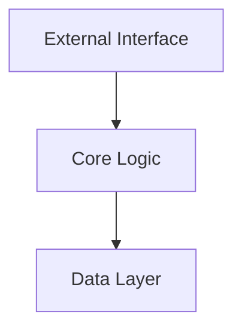
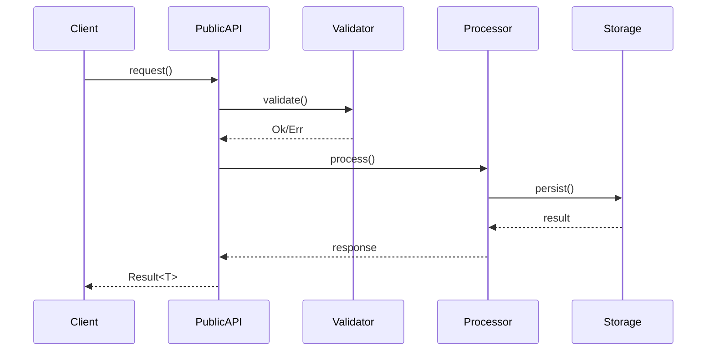

# Module Documentation Template

# Module: [Module Name]

[Brief one-line description of the module's purpose]

## Overview

[2-3 paragraph description of what this module does, why it exists, and how it fits into the overall system architecture]

## Quick Example

```rust
// Show the most common use case
use crate::[module_name]::{MainType, main_function};

let result = main_function(input)?;
```

## Architecture

### Component Diagram



### Responsibilities

This module is responsible for:
- [Responsibility 1]
- [Responsibility 2]
- [Responsibility 3]

This module is NOT responsible for:
- [Non-responsibility 1]
- [Non-responsibility 2]

## Public API

[Auto-generated from doc comments - see API Reference]

### Key Types

- [`MainStruct`](./api-reference/module_name.html#MainStruct) - Primary data structure
- [`ConfigOptions`](./api-reference/module_name.html#ConfigOptions) - Configuration
- [`Error`](./api-reference/module_name.html#Error) - Error types

### Key Functions

- [`initialize()`](./api-reference/module_name.html#initialize) - Module initialization
- [`process()`](./api-reference/module_name.html#process) - Main processing function

## Internal Architecture

<details>
<summary>Detailed Internal Structure</summary>

### Internal Components

```rust
// Simplified view of internal structure
mod internals {
    struct InternalState {
        // ...
    }
    
    impl InternalProcessor {
        // ...
    }
}
```

### Data Flow



</details>

## Configuration

### Required Configuration

```toml
[module_name]
required_field = "value"
```

### Optional Configuration

```toml
[module_name]
optional_field = "default_value"  # Default: "default_value"
timeout_ms = 5000                  # Default: 5000
```

### Environment Variables

- `MODULE_NAME__REQUIRED_FIELD` - Overrides config file
- `MODULE_NAME__OPTIONAL_FIELD` - Overrides config file

## Error Handling

### Error Types

| Error | Description | Recovery Strategy |
|-------|-------------|-------------------|
| `ConfigError` | Invalid configuration | Check configuration values |
| `ConnectionError` | Cannot connect to dependency | Retry with backoff |
| `ValidationError` | Input validation failed | Return error to client |

### Error Propagation

```rust
fn process_request(input: Input) -> Result<Output, Error> {
    validate_input(&input)?;  // Propagates ValidationError
    
    let conn = get_connection()
        .map_err(|e| Error::Connection(e))?;  // Wraps connection errors
    
    process_with_connection(conn, input)
}
```

## Performance Characteristics

### Time Complexity

- `initialize()`: O(1) - One-time setup
- `process()`: O(n) - Linear with input size
- `batch_process()`: O(n log n) - Due to sorting

### Space Complexity

- Memory usage: ~O(n) where n is active connections
- Cache size: Configurable, default 1000 entries

### Benchmarks

| Operation | p50 | p90 | p99 |
|-----------|-----|-----|-----|
| process() | 1ms | 5ms | 20ms |
| batch_process() | 10ms | 50ms | 200ms |

[See detailed benchmarks](../../reference/benchmarks/module_name.md)

## Security Considerations

### Input Validation

All inputs are validated for:
- Size limits (max 1MB)
- Format correctness
- Injection attacks

### Authentication & Authorization

- Uses central auth module
- Requires `module:read` permission for queries
- Requires `module:write` permission for mutations

### Sensitive Data Handling

- Never logs sensitive fields
- Implements `Debug` with redaction
- Uses `secrecy` crate for credentials

## Testing

### Unit Testing

```rust
#[cfg(test)]
mod tests {
    use super::*;
    
    #[test]
    fn test_basic_functionality() {
        // Test implementation
    }
}
```

### Integration Testing

See `tests/module_name_integration.rs` for:
- Database integration tests
- External service mocking
- End-to-end scenarios

### Test Coverage

- Line coverage: 85%
- Branch coverage: 80%
- Critical path coverage: 100%

## Monitoring & Observability

### Metrics

- `module_name_requests_total` - Counter of all requests
- `module_name_request_duration_seconds` - Histogram of request duration
- `module_name_errors_total` - Counter of errors by type

### Logging

```rust
info!(module = "module_name", operation = "process", "Processing request");
debug!(input = ?sanitized_input, "Request details");
error!(error = %e, "Failed to process request");
```

### Tracing

All operations are traced with:
- Operation name
- Input size
- Processing time
- Error details (if any)

## Dependencies

[Auto-generated from Cargo.toml and dependencies.toml]

### Direct Dependencies

- `tokio` - Async runtime
- `serde` - Serialization
- [Full list](../../developers/dependencies/index.md)

## Common Issues & Troubleshooting

### Issue: "Connection timeout"

**Symptoms**: Requests fail with timeout errors

**Cause**: Network issues or overloaded service

**Solution**:
1. Check network connectivity
2. Increase timeout in configuration
3. Implement retry logic

### Issue: "Memory usage growing"

**Symptoms**: Increasing memory consumption

**Cause**: Cache not evicting entries

**Solution**:
1. Check cache configuration
2. Monitor cache hit rates
3. Adjust cache size limits

## FAQ

### Q: How do I extend this module?

A: Follow the extension points:
1. Implement the `Processor` trait
2. Register with the module factory
3. Add configuration for your processor

### Q: What's the difference between X and Y?

A: [Clear explanation of commonly confused concepts]

## See Also

- [Architecture Overview](../../architecture/overview.md)
- [Related Module](../related_module/index.md)
- [API Reference](./api-reference/index.md)
- [Examples](./examples/index.md)

---
*Last updated: {{last_updated}}*  
*Module version: {{module_version}}*