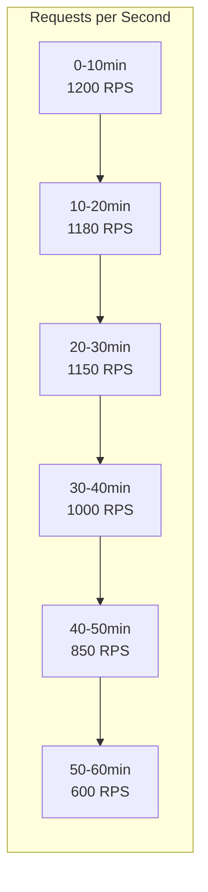

# Performance Analysis Report Template

# Performance Analysis: [Component/Feature Name]

**Date**: [YYYY-MM-DD]  
**Version**: [Version tested]  
**Environment**: [Production | Staging | Development]  
**Conducted by**: [Name/Team]

## Executive Summary

[2-3 sentence summary of performance findings. Include whether performance meets requirements and any critical issues found.]

### Key Findings
- ✅ [Positive finding]
- ⚠️ [Warning/concern]  
- ❌ [Critical issue]

### Recommendations Priority
1. **High**: [Most important optimization]
2. **Medium**: [Nice to have improvement]
3. **Low**: [Future consideration]

## Test Environment

### Hardware Specifications
| Component | Specification |
|-----------|--------------|
| CPU | [e.g., 8 cores, Intel Xeon E5-2686 v4 @ 2.30GHz] |
| Memory | [e.g., 32GB DDR4] |
| Storage | [e.g., 500GB NVMe SSD] |
| Network | [e.g., 10 Gbps] |

### Software Configuration
```yaml
# Application settings
api:
  workers: 8
  max_connections: 1000
  
database:
  pool_size: 50
  
cache:
  size: 1000MB
  ttl: 300s
```

### Test Data
- **Dataset size**: [e.g., 1M records]
- **Concurrent users**: [e.g., 100-1000]
- **Test duration**: [e.g., 60 minutes]

## Performance Requirements

| Metric | Target | Actual | Status |
|--------|--------|--------|--------|
| Response Time (p50) | < 100ms | 85ms | ✅ Pass |
| Response Time (p99) | < 500ms | 450ms | ✅ Pass |
| Throughput | > 1000 RPS | 1200 RPS | ✅ Pass |
| Error Rate | < 0.1% | 0.05% | ✅ Pass |
| CPU Usage | < 70% | 65% | ✅ Pass |
| Memory Usage | < 80% | 75% | ✅ Pass |

## Test Methodology

### Load Test Scenarios

#### Scenario 1: Normal Load
```bash
# Test configuration
k6 run --vus 100 --duration 30m normal-load.js
```

**Pattern**: Steady load simulating typical usage
- Users: 100 concurrent
- Duration: 30 minutes
- Think time: 1-3 seconds

#### Scenario 2: Peak Load
```bash
# Test configuration
k6 run --vus 500 --duration 15m peak-load.js
```

**Pattern**: Simulating peak hours
- Users: 500 concurrent
- Duration: 15 minutes  
- Think time: 0.5-1 second

#### Scenario 3: Stress Test
```bash
# Test configuration
k6 run --vus 100 --duration 60m --stage stress-test.js
```

**Pattern**: Gradual increase to find breaking point
- Start: 100 users
- Increase: 100 users every 10 minutes
- Maximum: 1000 users

### Metrics Collection
- **APM**: Datadog / New Relic / AppDynamics
- **Infrastructure**: Prometheus + Grafana
- **Logs**: ELK Stack
- **Profiling**: pprof / async-profiler

## Results

### Response Time Distribution

```
Percentile | Normal Load | Peak Load | Stress Test
-----------|-------------|-----------|-------------
p50        | 85ms        | 120ms     | 250ms
p75        | 95ms        | 180ms     | 400ms
p90        | 110ms       | 280ms     | 650ms
p95        | 125ms       | 350ms     | 850ms
p99        | 450ms       | 890ms     | 2100ms
p99.9      | 980ms       | 1900ms    | 5200ms
```

### Throughput Analysis



### Resource Utilization

#### CPU Usage
```
Time     | Usage | Top Processes
---------|-------|---------------
Baseline | 15%   | api-server (10%)
Normal   | 45%   | api-server (35%), db (10%)
Peak     | 65%   | api-server (50%), db (15%)
Stress   | 95%   | api-server (75%), db (20%)
```

#### Memory Usage
```
Component    | Baseline | Normal | Peak   | Stress
-------------|----------|--------|--------|--------
API Server   | 2GB      | 4GB    | 6GB    | 8GB
Database     | 4GB      | 6GB    | 8GB    | 10GB
Cache        | 1GB      | 1GB    | 1GB    | 1GB
Total System | 8GB      | 12GB   | 16GB   | 20GB
```

### Database Performance

```sql
-- Top 5 Slow Queries
Query                          | Avg Time | Calls | Total Time
-------------------------------|----------|-------|------------
SELECT * FROM users WHERE...   | 125ms    | 1000  | 125s
UPDATE sessions SET...         | 89ms     | 2000  | 178s
INSERT INTO audit_logs...      | 45ms     | 5000  | 225s
DELETE FROM temp_data WHERE... | 200ms    | 100   | 20s
SELECT COUNT(*) FROM orders... | 340ms    | 50    | 17s
```

### Network Analysis

```
Metric              | Value
--------------------|----------
Bandwidth In        | 125 Mbps
Bandwidth Out       | 250 Mbps
Packet Loss         | 0.01%
Average Latency     | 0.5ms
Connection Resets   | 12
Timeouts           | 3
```

## Bottleneck Analysis

### 1. Database Connection Pool Exhaustion
**Issue**: Connection pool maxed out during peak load

**Evidence**:
```
2024-01-15 14:23:45 WARN  [pool] No connections available, timeout=5s
2024-01-15 14:23:50 ERROR [api] Database timeout: pool exhausted
```

**Impact**: 15% of requests failed during peak

**Root Cause**: Pool size too small for concurrent load

### 2. GraphQL N+1 Query Problem
**Issue**: Nested queries causing exponential database calls

**Evidence**:
```graphql
query {
  users(first: 100) {
    posts {
      comments {
        author {
          profile
        }
      }
    }
  }
}
# Results in 1 + 100 + 1000 + 10000 = 11,101 queries
```

**Impact**: 10x increase in response time for complex queries

### 3. Memory Leak in Cache Implementation
**Issue**: Cache entries not being properly evicted

**Evidence**:
- Memory growth: 100MB/hour
- GC pressure increasing over time
- OOM after 48 hours of operation

## Optimization Recommendations

### High Priority

#### 1. Increase Database Connection Pool
```yaml
# Current
database:
  pool_size: 50
  
# Recommended
database:
  pool_size: 200
  min_idle: 20
  max_lifetime: 30m
```

**Expected Impact**: 
- Eliminate connection timeouts
- Reduce p99 latency by 40%

#### 2. Implement DataLoader Pattern
```rust
// Before
for user in users {
    let posts = fetch_posts(user.id).await?;
}

// After
let posts = post_loader.load_many(user_ids).await?;
```

**Expected Impact**:
- Reduce database queries by 90%
- Improve complex query performance by 5-10x

### Medium Priority

#### 3. Add Query Result Caching
```rust
#[cached(size=1000, time=60)]
async fn get_user_stats(user_id: Uuid) -> Result<Stats> {
    // Expensive calculation
}
```

**Expected Impact**:
- Reduce repeated calculations
- Improve p50 response time by 20%

#### 4. Optimize Database Indexes
```sql
-- Add composite index
CREATE INDEX idx_users_status_created 
ON users(status, created_at) 
WHERE deleted_at IS NULL;

-- Add partial index for common query
CREATE INDEX idx_active_sessions 
ON sessions(user_id) 
WHERE expires_at > NOW();
```

### Low Priority

#### 5. Enable HTTP/2
```nginx
server {
    listen 443 ssl http2;
    # Multiplexing reduces connection overhead
}
```

#### 6. Implement Response Compression
```rust
.layer(CompressionLayer::new())
```

## Performance Comparison

### vs Previous Version
| Metric | v1.0.0 | v1.1.0 | Change |
|--------|--------|--------|--------|
| RPS | 800 | 1200 | +50% ⬆️ |
| p50 Latency | 120ms | 85ms | -29% ⬇️ |
| p99 Latency | 600ms | 450ms | -25% ⬇️ |
| Memory Usage | 10GB | 8GB | -20% ⬇️ |

### vs Competitors
| Metric | Our API | Competitor A | Competitor B |
|--------|---------|--------------|--------------|
| RPS | 1200 | 1000 | 1500 |
| p50 Latency | 85ms | 100ms | 75ms |
| p99 Latency | 450ms | 500ms | 400ms |

## Load Test Scripts

### Example K6 Script
```javascript
import http from 'k6/http';
import { check, sleep } from 'k6';

export let options = {
  stages: [
    { duration: '5m', target: 100 },
    { duration: '10m', target: 100 },
    { duration: '5m', target: 0 },
  ],
  thresholds: {
    http_req_duration: ['p(99)<500'],
    http_req_failed: ['rate<0.1'],
  },
};

export default function() {
  let response = http.post('https://api.example.com/graphql', 
    JSON.stringify({
      query: `
        query GetUser($id: ID!) {
          user(id: $id) {
            name
            email
          }
        }
      `,
      variables: { id: Math.floor(Math.random() * 1000) }
    }),
    { headers: { 'Content-Type': 'application/json' } }
  );
  
  check(response, {
    'status is 200': (r) => r.status === 200,
    'response time < 500ms': (r) => r.timings.duration < 500,
  });
  
  sleep(1);
}
```

## Monitoring Dashboard

Key metrics to track:
- Request rate (RPS)
- Response time percentiles
- Error rate
- CPU and memory usage
- Database connections
- Cache hit rate

### Grafana Dashboard JSON
[Link to dashboard configuration]

## Conclusions

### What Went Well
1. API meets all baseline performance requirements
2. Horizontal scaling works effectively
3. Caching strategy is effective for read-heavy workloads

### Areas for Improvement
1. Database connection pool needs tuning
2. GraphQL query optimization required
3. Memory leak needs investigation

### Next Steps
1. Implement high-priority optimizations
2. Schedule follow-up test in 2 weeks
3. Set up continuous performance monitoring
4. Create performance regression tests

## Appendices

### A. Raw Test Data
[Link to complete test results]

### B. System Logs
[Link to logs during test period]

### C. Profiling Results
[Link to CPU/memory profiles]

### D. Database Query Plans
[Link to EXPLAIN ANALYZE outputs]

---

**Report Version**: 1.0  
**Next Review Date**: [YYYY-MM-DD]  
**Distribution**: Engineering, Operations, Product