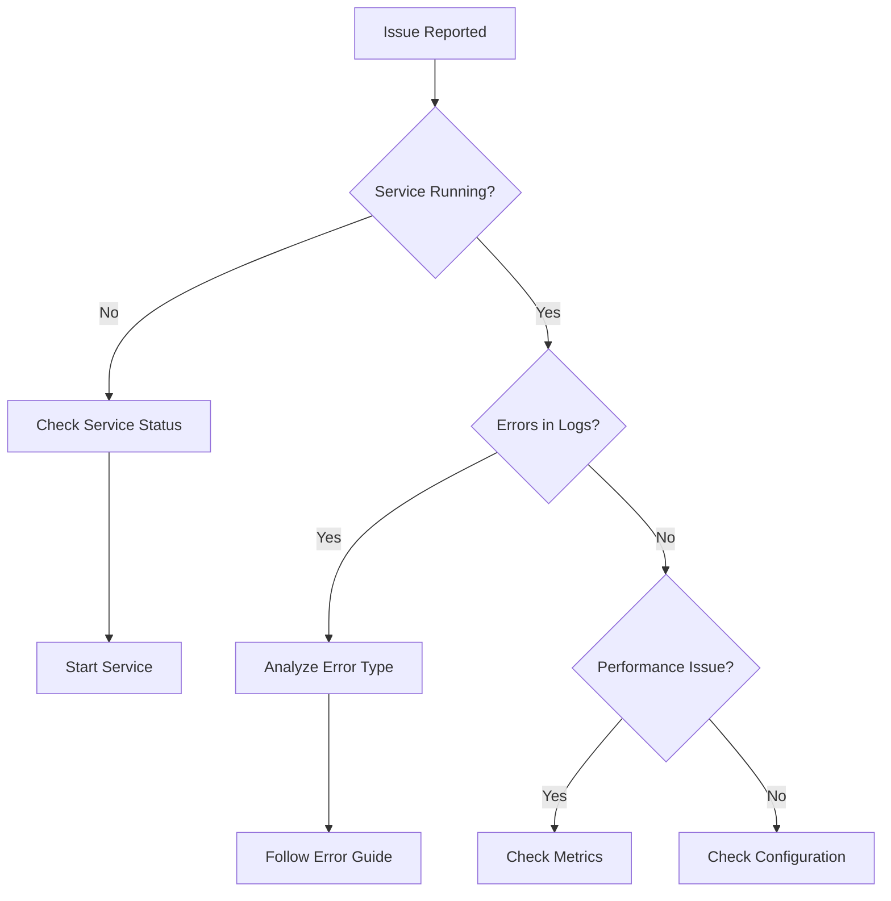

# Troubleshooting Guide Template

# Troubleshooting: [Component/Feature Name]

Quick links: [Common Issues](#common-issues) | [Diagnostic Tools](#diagnostic-tools) | [Emergency Procedures](#emergency-procedures)

## Overview

This guide helps diagnose and resolve issues with [component/feature]. Before starting:

1. Check [System Status](../monitoring/status.md)
2. Review recent [Changelog](../reference/changelog.md)
3. Ensure you have necessary [access permissions](#required-access)

## Required Access

- **Logs**: Read access to application logs
- **Metrics**: Access to monitoring dashboards
- **Commands**: Permission to run diagnostic commands
- **Configuration**: Read access to config files

## Quick Diagnosis Flowchart



## Common Issues

### Issue: Service Won't Start

**Symptoms**:
- Service fails to start
- Exit code 1 or similar
- No process running

**Quick Check**:
```bash
# Check service status
systemctl status pcf-api

# Check last logs
journalctl -u pcf-api -n 50

# Verify configuration
pcf-api validate-config
```

**Common Causes & Solutions**:

1. **Configuration Error**
   ```bash
   # Validate configuration
   pcf-api validate-config
   
   # Common issues:
   # - Missing required fields
   # - Invalid values
   # - Wrong file permissions
   ```

2. **Port Already in Use**
   ```bash
   # Check what's using the port
   lsof -i :8080
   # or
   netstat -tulpn | grep 8080
   
   # Solution: Change port or stop conflicting service
   ```

3. **Missing Dependencies**
   ```bash
   # Check database connection
   pcf-api check-db
   
   # Verify external services
   pcf-api check-services
   ```

**Resolution Steps**:
1. Check error message in logs
2. Validate configuration
3. Verify dependencies are running
4. Try starting in debug mode
5. If still failing, check [advanced diagnostics](#advanced-diagnostics)

---

### Issue: High Memory Usage

**Symptoms**:
- Memory usage > 80%
- OOM killer activated
- Slow response times

**Quick Check**:
```bash
# Check memory usage
free -h
ps aux | grep pcf-api | awk '{print $6}'

# Check for memory leaks
pcf-api memory-profile
```

**Common Causes & Solutions**:

1. **Cache Size Too Large**
   ```yaml
   # config.yaml
   cache:
     max_size: 1000  # Reduce from 10000
     ttl: 300        # Reduce from 3600
   ```

2. **Connection Pool Leak**
   ```bash
   # Check connection count
   pcf-api pool-stats
   
   # Restart to clear connections
   systemctl restart pcf-api
   ```

3. **Large Request Processing**
   ```bash
   # Check request sizes
   grep "Content-Length" /var/log/pcf-api/access.log | sort -n
   
   # Add request size limits
   ```

**Resolution Steps**:
1. Identify memory growth pattern
2. Check cache and pool sizes
3. Review recent code changes
4. Enable memory profiling
5. Consider increasing memory limits

---

### Issue: Slow API Response Times

**Symptoms**:
- Response time > 1s
- Timeouts occurring
- Users reporting slowness

**Quick Check**:
```bash
# Check response times
tail -f /var/log/pcf-api/access.log | awk '{print $10}'

# Run performance test
pcf-api benchmark --endpoint /health

# Check database slow queries
pcf-api slow-queries
```

**Common Causes & Solutions**:

1. **Database Performance**
   ```sql
   -- Check slow queries
   SELECT query, calls, mean_time 
   FROM pg_stat_statements 
   ORDER BY mean_time DESC 
   LIMIT 10;
   
   -- Add missing indexes
   CREATE INDEX CONCURRENTLY idx_table_column ON table(column);
   ```

2. **Unoptimized GraphQL Queries**
   ```bash
   # Enable query complexity logging
   export GRAPHQL__LOG_COMPLEXITY=true
   
   # Check for N+1 queries
   grep "dataloader" /var/log/pcf-api/debug.log
   ```

3. **Resource Contention**
   ```bash
   # Check CPU usage
   top -p $(pgrep pcf-api)
   
   # Check I/O wait
   iostat -x 1
   ```

**Resolution Steps**:
1. Identify slow endpoints
2. Check database performance
3. Review query complexity
4. Monitor resource usage
5. Consider scaling options

---

### Issue: Authentication Failures

**Symptoms**:
- 401 Unauthorized errors
- "Invalid token" messages
- Users can't log in

**Quick Check**:
```bash
# Check auth service
pcf-api check-auth

# Verify token validation
pcf-api validate-token "Bearer ..."

# Check clock sync
timedatectl status
```

**Common Causes & Solutions**:

1. **Token Expiration**
   ```bash
   # Check token expiry settings
   grep -i "jwt" /etc/pcf-api/config.yaml
   
   # Verify system time
   date
   ntpdate -q pool.ntp.org
   ```

2. **Key Rotation Issues**
   ```bash
   # Check current signing key
   pcf-api show-signing-key
   
   # Rotate keys if needed
   pcf-api rotate-keys --grace-period 1h
   ```

3. **Permission Service Down**
   ```bash
   # Check SpiceDB connection
   pcf-api check-spicedb
   
   # Use cached permissions
   export AUTH__USE_CACHE=true
   ```

---

## Diagnostic Tools

### Built-in Commands

```bash
# Health check
pcf-api healthcheck

# Validate configuration
pcf-api validate-config

# Check all dependencies
pcf-api check-deps

# Performance profiling
pcf-api profile --duration 60s

# Generate debug bundle
pcf-api debug-bundle --output debug.tar.gz
```

### Log Analysis

```bash
# Error frequency
grep ERROR /var/log/pcf-api/app.log | awk '{print $5}' | sort | uniq -c | sort -rn

# Response time analysis
awk '{print $10}' /var/log/pcf-api/access.log | sort -n | awk '
  BEGIN {
    c = 0;
  }
  {
    a[c++] = $1;
  }
  END {
    print "Min:", a[0];
    print "p50:", a[int(c*0.5)];
    print "p90:", a[int(c*0.9)];
    print "p99:", a[int(c*0.99)];
    print "Max:", a[c-1];
  }'

# Trace specific request
grep "trace_id=12345" /var/log/pcf-api/*.log
```

### Metrics Queries

```promql
# High error rate
rate(http_requests_total{status=~"5.."}[5m]) > 0.05

# Memory usage trend
process_resident_memory_bytes{job="pcf-api"}

# Request latency
histogram_quantile(0.95, 
  rate(http_request_duration_seconds_bucket[5m])
)

# Connection pool usage
database_connections_active / database_connections_max
```

## Emergency Procedures

### Service Unresponsive

1. **Immediate Actions**:
   ```bash
   # Take thread dump
   kill -3 $(pgrep pcf-api)
   
   # Force restart
   systemctl restart pcf-api
   
   # Scale up temporarily
   kubectl scale deployment pcf-api --replicas=5
   ```

2. **Preserve Evidence**:
   ```bash
   # Save logs
   cp -r /var/log/pcf-api /tmp/incident-$(date +%s)/
   
   # Capture metrics
   curl http://localhost:8080/metrics > metrics-$(date +%s).txt
   
   # Generate heap dump (if possible)
   pcf-api heap-dump
   ```

### Database Connection Lost

1. **Failover to Read Replica**:
   ```bash
   # Update connection string
   export DATABASE__URL="postgresql://replica.example.com/db"
   
   # Restart with read-only mode
   export APP__READ_ONLY=true
   systemctl restart pcf-api
   ```

2. **Enable Degraded Mode**:
   ```yaml
   # Emergency config
   database:
     circuit_breaker:
       enabled: true
       threshold: 5
       timeout: 30s
   ```

### High Load Emergency

1. **Enable Rate Limiting**:
   ```bash
   # Apply emergency rate limits
   export RATE_LIMIT__ENABLED=true
   export RATE_LIMIT__REQUESTS_PER_MINUTE=10
   ```

2. **Shed Load**:
   ```nginx
   # In nginx/load balancer
   limit_req_zone $binary_remote_addr zone=emergency:10m rate=1r/s;
   limit_req zone=emergency burst=5;
   ```

## Advanced Diagnostics

### Memory Profiling

```bash
# Enable profiling endpoint
export PROFILING__ENABLED=true
systemctl restart pcf-api

# Capture heap profile
curl http://localhost:8080/debug/pprof/heap > heap.prof

# Analyze profile
go tool pprof heap.prof
```

### Distributed Tracing

```bash
# Enable detailed tracing
export TRACING__SAMPLE_RATE=1.0
export TRACING__LOG_SPANS=true

# Find slow trace
curl http://jaeger:16686/api/traces?service=pcf-api&minDuration=1s

# Export trace
pcf-api export-trace --id=abc123 --format=jaeger
```

### Query Analysis

```sql
-- Enable query logging
SET log_statement = 'all';
SET log_duration = on;

-- Analyze query plan
EXPLAIN (ANALYZE, BUFFERS) 
SELECT * FROM your_query;

-- Check index usage
SELECT schemaname, tablename, indexname, idx_scan
FROM pg_stat_user_indexes
ORDER BY idx_scan;
```

## Escalation Path

1. **Level 1**: Application logs and basic diagnostics
2. **Level 2**: Database and infrastructure checks  
3. **Level 3**: Code-level debugging and profiling
4. **Level 4**: Architecture team consultation

### When to Escalate

- Issue persists after basic troubleshooting
- Multiple services affected
- Data integrity concerns
- Security implications

### Information to Provide

- [ ] Exact error messages
- [ ] Time of occurrence
- [ ] Steps to reproduce
- [ ] Debug bundle output
- [ ] Recent changes
- [ ] Business impact

## Prevention

### Monitoring Setup

```yaml
# Recommended alerts
alerts:
  - name: high_error_rate
    expr: rate(errors_total[5m]) > 0.05
    severity: warning
    
  - name: high_memory_usage
    expr: memory_usage_percent > 80
    severity: critical
```

### Regular Maintenance

- [ ] Weekly: Review error logs
- [ ] Monthly: Analyze performance trends
- [ ] Quarterly: Update dependencies
- [ ] Yearly: Architecture review

## Additional Resources

- [Performance Tuning Guide](../performance/tuning.md)
- [Security Hardening](../security/hardening.md)
- [Monitoring Dashboard](https://monitoring.example.com)
- [Runbook Collection](../runbooks/)

---

**Last Updated**: {{date}}  
**Version**: {{version}}  
**Maintainers**: [Team Name]