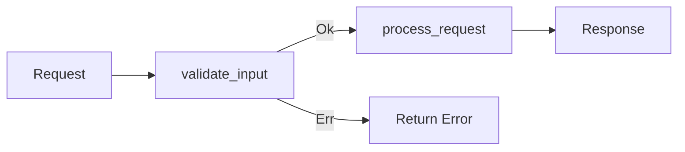

# PCF API MDBook Documentation Specification

## 1. Overview

This specification defines the comprehensive documentation system for the PCF API project using MDBook. The documentation serves three primary audiences (Developers, Administrators, and API Users) with a self-contained, version-aware, and interactive documentation experience.

### Key Principles
- **Self-contained**: All documentation is complete without external references
- **Source-linked**: Implementation details link to source code
- **Interactive**: Diagrams, playgrounds, and examples enhance understanding
- **Version-aware**: Documentation tracks API versions
- **Quality-assured**: Automated checks ensure completeness

## 2. Target Audiences

### Developers
- **Internal developers**: Contributing to the API codebase
- **External developers**: Building applications using the API
- **Open source contributors**: Anyone can contribute

### Administrators  
- **DevOps/SRE teams**: Deploying and monitoring the API
- **System administrators**: Managing API server instances
- **Security teams**: Hardening and auditing deployments

### API Users
- **End-users**: Directly consuming the API
- **Integration developers**: Building applications against the API
- **Partner organizations**: Integrating with their systems

## 3. Documentation Structure

```
docs/
├── book.toml                    # MDBook configuration
├── theme/                       # Custom theme and assets
├── src/
│   ├── SUMMARY.md              # Table of contents
│   ├── introduction.md         # Project overview
│   ├── quick-start/            # Audience-specific quick starts
│   │   ├── developers.md
│   │   ├── administrators.md
│   │   └── users.md
│   ├── shared/                 # Cross-cutting concerns
│   │   ├── patterns/           # Design patterns
│   │   ├── standards/          # Coding standards
│   │   ├── security/           # Security principles
│   │   └── glossary.md         # Terms and definitions
│   ├── developers/             # Developer documentation
│   │   ├── overview.md
│   │   ├── architecture/
│   │   ├── modules/            # Per-module documentation
│   │   ├── api-reference/      # Auto-generated from code
│   │   ├── graphql/            # GraphQL schema docs
│   │   ├── contributing/
│   │   ├── testing/
│   │   ├── dependencies/
│   │   └── cookbook/
│   ├── administrators/         # Admin documentation
│   │   ├── overview.md
│   │   ├── deployment/
│   │   ├── configuration/
│   │   ├── monitoring/
│   │   ├── security/
│   │   ├── troubleshooting/
│   │   └── cookbook/
│   ├── users/                  # API user documentation
│   │   ├── overview.md
│   │   ├── authentication/
│   │   ├── api-endpoints/
│   │   ├── rate-limiting/
│   │   ├── errors/
│   │   ├── troubleshooting/
│   │   └── cookbook/
│   ├── reference/              # Reference documentation
│   │   ├── changelog.md
│   │   ├── roadmap.md
│   │   ├── benchmarks/
│   │   └── compliance/
│   └── appendices/
│       ├── deprecated/
│       ├── migrations/
│       └── licenses.md
```

## 4. MDBook Configuration

### book.toml
```toml
[book]
title = "PCF API Documentation"
authors = ["PCF Contributors"]
description = "Comprehensive documentation for the PCF API"
language = "en"
multilingual = false
src = "src"

[build]
build-dir = "book"
create-missing = true

[preprocessor.index]
enable = true

[preprocessor.links]
enable = true

# Essential plugins
[preprocessor.mermaid]
command = "mdbook-mermaid"
renderer = ["html"]

[preprocessor.admonish]
command = "mdbook-admonish"
renderer = ["html"]

[preprocessor.toc]
command = "mdbook-toc"
renderer = ["html"]

[preprocessor.linkcheck]
command = "mdbook-linkcheck"
renderer = ["html"]
follow-web-links = true

# Advanced plugins
[preprocessor.variables]
command = "mdbook-variables"

[preprocessor.variables.variables]
api_version = "1.0.0"
min_rust_version = "1.75"
github_url = "https://github.com/org/pcf-api"

[preprocessor.katex]
command = "mdbook-katex"
renderer = ["html"]

[preprocessor.pagetoc]
command = "mdbook-pagetoc"

[preprocessor.open-on-gh]
command = "mdbook-open-on-gh"
repository = "https://github.com/org/pcf-api"
branch = "main"

# Custom plugins
[preprocessor.auto-doc]
command = "mdbook-auto-doc"
renderer = ["html"]

[preprocessor.auto-doc.config]
source_dir = "../src"
output_dir = "developers/api-reference"
visibility = "public"
generate_index = true

[preprocessor.graphql-introspection]
command = "mdbook-graphql-introspection"
renderer = ["html"]

[preprocessor.graphql-introspection.config]
rust_source = "../src/graphql/schema.rs"
output_dir = "developers/graphql"
generate_examples = true
include_deprecated = true

[preprocessor.dependency-doc]
command = "mdbook-dependency-doc"
renderer = ["html"]

[preprocessor.dependency-doc.config]
cargo_toml = "../Cargo.toml"
dependencies_toml = "../dependencies.toml"
output_dir = "developers/dependencies"
require_rationale = true

[preprocessor.interactive-diagrams]
command = "mdbook-interactive-diagrams"
renderer = ["html"]

[preprocessor.interactive-diagrams.config]
enable_animations = true
default_collapsed = false

# Existing plugin - glossary
[preprocessor.glossary]
command = "mdbook-glossary"
renderer = ["html"]

[output.html]
default-theme = "rust"
preferred-dark-theme = "navy"
copy-fonts = true
additional-css = ["theme/custom.css"]
additional-js = ["theme/custom.js"]
git-repository-url = "https://github.com/org/pcf-api"
edit-url-template = "https://github.com/org/pcf-api/edit/main/docs/{path}"
site-url = "https://docs.pcf-api.org/"
cname = "docs.pcf-api.org"
input-404 = "404.md"

[output.html.playground]
editable = true
copyable = true

[output.html.search]
enable = true
limit-results = 20
teaser-word-count = 30
use-boolean-and = true
boost-title = 2
boost-hierarchy = 2
boost-paragraph = 1
expand = true
heading-split-level = 2

[output.html.redirect]
"/api/graphql.html" = "developers/graphql/index.html"
"/deployment.html" = "administrators/deployment/index.html"

[output.linkcheck]
follow-web-links = true
traverse-parent-directories = false
warning-policy = "error"

[output.epub]
enable = false
```

## 5. Documentation Standards

### Writing Style Guide

#### Voice and Tone
- **Instructions**: Third person ("The user configures...")
- **Design decisions**: First person plural ("We chose X because...")
- **User interactions**: Second person ("You can authenticate by...")

#### Code Example Standards
```rust
fn handle_request(req: Request) -> Result<Response> {
    // Step 1: Validate input
    validate_input(&req)?;  // <-- Early return on validation failure
    
    // Step 2: Process request
    process_request(req)     // <-- Main processing logic
}
```

With execution flow diagram:


#### Dependency Documentation Format
```markdown
### tokio
- **Version**: 1.35
- **Purpose**: Async runtime for concurrent operations
- **License**: MIT
- **Why chosen**: Best-in-class performance, ecosystem support
- **Alternatives considered**: async-std, smol
```

### Documentation Templates

See `.plan/mdbook/templates/` for:
- Module documentation template
- API endpoint documentation template
- Architecture Decision Records (ADR) template
- Troubleshooting guide template
- Performance analysis template

## 6. Content Requirements

### Developer Documentation

#### Per Module Documentation
- Module purpose and responsibilities
- Public API documentation (auto-generated)
- Internal architecture
- Testing approach
- Performance considerations
- Security considerations

#### Architecture Documentation
- System overview with interactive diagrams
- Component interactions
- Data flow diagrams
- Deployment architecture
- Scalability patterns

#### Contributing Documentation
- Development setup
- Code style guide
- Testing requirements
- PR process
- Documentation standards

### Administrator Documentation

#### Deployment Documentation
- Prerequisites
- Installation steps
- Container deployment
- Kubernetes deployment
- Monitoring setup
- Security hardening

#### Configuration Documentation
- All configuration options
- Environment variables
- Runtime vs build-time settings
- Configuration precedence
- Example configurations

### User Documentation

#### API Usage
- Authentication methods
- Rate limiting rules
- Error handling
- GraphQL queries/mutations
- Subscription setup
- Best practices

## 7. Interactive Features

### GraphQL Playground
- Embedded GraphiQL for testing
- Pre-populated example queries
- Mock mode for documentation
- Connect to own instance option

### Architecture Diagrams
- Clickable components linking to documentation
- Expand/collapse for complexity management
- Tooltips with descriptions
- Optional data flow animations

### Performance Benchmarks
- Interactive charts
- Methodology documentation
- Comparison tools
- Historical data (when available)

## 8. Build Pipeline

### Documentation Generation Flow
```yaml
name: Documentation Build

on:
  push:
    branches: [main]
  pull_request:

jobs:
  build-docs:
    runs-on: ubuntu-latest
    steps:
      - uses: actions/checkout@v3
      
      - name: Install Rust
        uses: actions-rs/toolchain@v1
        
      - name: Install MDBook and plugins
        run: |
          cargo install mdbook
          cargo install mdbook-mermaid
          cargo install mdbook-admonish
          # ... other plugins
          
      - name: Extract GraphQL Schema
        run: cargo run --bin extract-schema > schema.json
        
      - name: Generate dependency docs
        run: mdbook-dependency-doc prepare
        
      - name: Check documentation completeness
        run: |
          cargo doc-coverage --min 80
          mdbook-linkcheck check
          
      - name: Build documentation
        run: mdbook build
        
      - name: Deploy preview (PRs)
        if: github.event_name == 'pull_request'
        uses: actions/upload-artifact@v3
        with:
          name: docs-preview
          path: book/
          
      - name: Deploy to GitHub Pages (main)
        if: github.ref == 'refs/heads/main'
        uses: peaceiris/actions-gh-pages@v3
        with:
          github_token: ${{ secrets.GITHUB_TOKEN }}
          publish_dir: ./book
```

### PR Preview Comments
```yaml
      - name: Comment PR with preview
        if: github.event_name == 'pull_request'
        uses: actions/github-script@v6
        with:
          script: |
            github.rest.issues.createComment({
              issue_number: context.issue.number,
              owner: context.repo.owner,
              repo: context.repo.repo,
              body: '📚 Documentation preview available at: ...'
            })
```

## 9. Quality Assurance

### Automated Checks
1. **Link validation**: All internal and external links verified
2. **Code coverage**: Doc comments must cover 80% of public API
3. **Dependency rationales**: All dependencies must have documentation
4. **Cross-references**: Validate all cross-references exist
5. **Example compilation**: Code examples must compile

### Documentation Completeness
- Required sections per module
- Mandatory frontmatter fields
- Example requirements
- Benchmark placeholders

### Version Management
- Documentation versioned with API
- Deprecation notices inline
- Migration guides in appendix
- Breaking changes highlighted

## 10. Search and Navigation

### Enhanced Search
- Frontmatter tags for categorization
- Audience-specific filtering
- Search analytics (future)
- Auto-complete suggestions

### Navigation Features
- Breadcrumbs
- Previous/Next links
- In-page table of contents
- Quick jump to sections

## 11. Performance Considerations

### Build Optimization
- Incremental builds
- Parallel processing
- Caching strategies
- Minimal dependencies

### Runtime Performance
- Lazy loading for diagrams
- Progressive enhancement
- Optimized search index
- CDN deployment

## 12. Future Enhancements

### Phase 1 (Immediate)
- Basic MDBook setup
- Essential plugins
- Core documentation structure
- CI/CD pipeline

### Phase 2 (Short-term)
- Custom plugins implementation
- Interactive features
- Performance benchmarks
- Enhanced search

### Phase 3 (Long-term)
- Analytics integration
- Multi-language support
- API versioning UI
- Advanced visualizations

## 13. Implementation Checklist

- [ ] Set up MDBook project structure
- [ ] Install and configure essential plugins
- [ ] Create documentation templates
- [ ] Implement custom plugins
- [ ] Set up CI/CD pipeline
- [ ] Create initial documentation
- [ ] Add interactive examples
- [ ] Configure GitHub Pages deployment
- [ ] Implement quality checks
- [ ] Add search enhancements
- [ ] Create contributor guidelines
- [ ] Document the documentation process

## Related Specifications

- [Custom Plugin Specifications](../.plan/mdbook/plugins/)
- [Documentation Templates](../.plan/mdbook/templates/)
- [Implementation Plan](../.plan/mdbook/README.md)