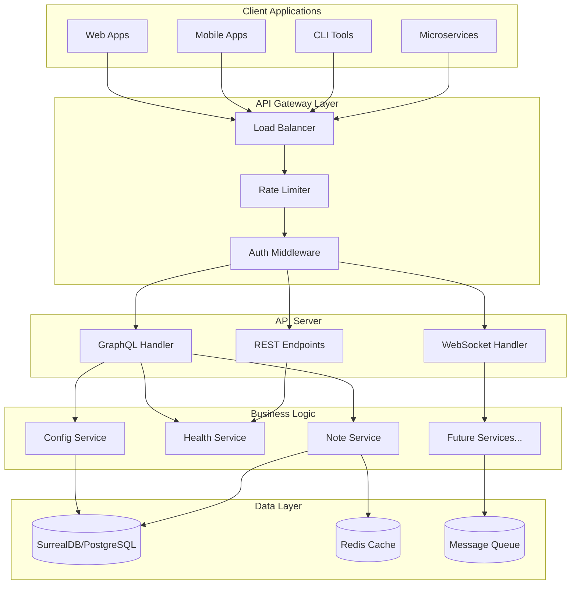

# PCF API Documentation

Welcome to the comprehensive documentation for the PCF (Platform Control Framework) API. This documentation serves as the primary resource for developers, administrators, and API users working with the PCF system.

## What is PCF API?

The Platform Control Framework (PCF) API is a modern, GraphQL-first API server built with Rust that demonstrates best practices for building scalable, maintainable, and secure API services. It serves as both a reference implementation and a production-ready foundation for platform control services.

### Project Goals

1. **Demonstrate Best Practices**: Show how to build production-ready APIs in Rust
2. **Provide a Foundation**: Offer a solid starting point for new projects
3. **Enable Learning**: Help developers understand modern API architecture
4. **Ensure Quality**: Maintain high standards for code, tests, and documentation
5. **Foster Community**: Encourage contributions and knowledge sharing

## Architecture Overview

The PCF API follows a clean, layered architecture designed for maintainability and extensibility:

## Technology Stack

The PCF API is built with a carefully selected technology stack chosen for performance, reliability, and developer experience:

### Core Technologies
- **Language**: [Rust](https://www.rust-lang.org/) (minimum version {{ min_rust_version }})
- **Web Framework**: [Axum](https://github.com/tokio-rs/axum) - Modern, ergonomic web framework built on Tower
- **GraphQL**: [async-graphql](https://github.com/async-graphql/async-graphql) - Full-featured GraphQL server library
- **Database**: [SurrealDB](https://surrealdb.com/) (demo) / [PostgreSQL](https://www.postgresql.org/) (production)
- **Configuration**: [Figment](https://github.com/SergioBenitez/Figment) - Flexible configuration management

### Supporting Technologies
- **Async Runtime**: [Tokio](https://tokio.rs/) - Industry-standard async runtime
- **Serialization**: [Serde](https://serde.rs/) - The de-facto serialization framework
- **Validation**: [Garde](https://github.com/jprochazk/garde) - Modern validation library
- **Logging**: [Tracing](https://github.com/tokio-rs/tracing) - Structured, async-aware logging
- **Error Handling**: [Anyhow](https://github.com/dtolnay/anyhow) + [Thiserror](https://github.com/dtolnay/thiserror) - Ergonomic error handling

For detailed rationale on each dependency, see our [Dependencies Analysis](./developer/dependencies/analysis.md).

## Demo vs Production Features

The PCF API includes both demo features for easy exploration and production-ready capabilities:

### Demo Features
- **In-memory SurrealDB**: Zero-configuration database for quick starts
- **Sample Data Generation**: Pre-populated with example data
- **Simplified Authentication**: Basic token authentication
- **Local File Storage**: No external dependencies required
- **GraphQL Playground**: Built-in API exploration

### Production Features
- **PostgreSQL Support**: Battle-tested relational database
- **Redis Caching**: High-performance caching layer
- **Distributed Tracing**: OpenTelemetry integration
- **Prometheus Metrics**: Complete observability
- **Horizontal Scaling**: Stateless architecture
- **Circuit Breakers**: Fault tolerance patterns
- **Connection Pooling**: Efficient resource management

### Future Production Features
- **Kratos Authentication**: Full identity management
- **SpiceDB Authorization**: Fine-grained permissions
- **S3 Object Storage**: Scalable file handling
- **Kafka Integration**: Event streaming
- **Multi-tenancy**: Isolated customer data

## Documentation Navigation

This documentation is organized to help you find information quickly:

### By Audience
- **[Developers](./developer/overview.md)**: Build, extend, and contribute to PCF API
- **[Administrators](./admin/overview.md)**: Deploy, configure, and maintain PCF API
- **[API Users](./user/overview.md)**: Integrate with and consume the PCF API

### Quick Start Guides
- **[Developer Quick Start](./quick-start/developers.md)**: Clone, build, and run locally
- **[Administrator Quick Start](./quick-start/administrators.md)**: Deploy with Docker
- **[User Quick Start](./quick-start/users.md)**: Make your first API call

### Key Sections
- **[Architecture](./developer/architecture/overview.md)**: System design and patterns
- **[API Reference](./developer/api-reference/README.md)**: Complete API documentation
- **[Configuration](./admin/configuration/README.md)**: All configuration options
- **[GraphQL Schema](./developer/graphql/schema.md)**: Complete schema reference
- **[Troubleshooting](./admin/troubleshooting/common-issues.md)**: Common issues and solutions

## Key Features

### Current Implementation
- ✅ **GraphQL API**: Queries, mutations, and real-time subscriptions
- ✅ **Health Checks**: Kubernetes-ready liveness and readiness probes
- ✅ **Structured Logging**: Trace correlation and structured output
- ✅ **Prometheus Metrics**: Complete application instrumentation
- ✅ **Configuration Management**: 4-tier configuration with validation
- ✅ **Error Handling**: Consistent, secure error responses
- ✅ **Input Validation**: Comprehensive request validation
- ✅ **CORS Support**: Configurable cross-origin requests
- ✅ **Graceful Shutdown**: Clean connection draining
- ✅ **Docker Support**: Multi-stage production builds

### Security Features
- ✅ **Input Sanitization**: Protection against injection attacks
- ✅ **Error Sanitization**: No sensitive data in error messages
- ✅ **Rate Limiting**: Configurable request limits
- ✅ **TLS Support**: HTTPS with modern cipher suites
- 🚧 **Authentication**: Ory Kratos integration (coming soon)
- 🚧 **Authorization**: SpiceDB permissions (coming soon)

## Getting Help

- **Questions**: Use [GitHub Discussions]({{ github_url }}/discussions)
- **Bug Reports**: Open an [issue]({{ github_url }}/issues)
- **Security Issues**: See [Security Policy](./shared/security/reporting.md)
- **Contributing**: Read our [Contribution Guide](./developer/contributing/README.md)

## Version Information

- **API Version**: {{ api_version }}
- **Minimum Rust Version**: {{ min_rust_version }}
- **Documentation Updated**: {{ date }}

---

*This documentation is actively maintained. We welcome contributions to improve clarity, add examples, or expand coverage. See our [documentation guide](./developer/contributing/documentation.md) for details.*