# Deployment Architecture

Detailed architectural patterns and considerations for deploying the PCF API in production environments.

<!-- toc -->

## Overview

The PCF API deployment architecture is designed for scalability, reliability, and security. This guide covers architectural patterns, component interactions, and deployment topologies suitable for different scales and requirements.

## Core Architecture Principles

### 1. Microservices Design

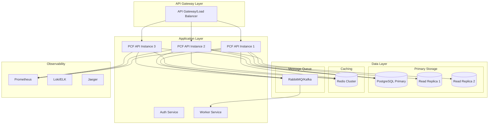

### 2. Layered Architecture

```
┌─────────────────────────────────────────────────┐
│                 Presentation Layer               │
│            (GraphQL / REST Endpoints)            │
├─────────────────────────────────────────────────┤
│                Application Layer                 │
│          (Business Logic / Services)             │
├─────────────────────────────────────────────────┤
│                 Domain Layer                     │
│           (Entities / Aggregates)                │
├─────────────────────────────────────────────────┤
│              Infrastructure Layer                │
│        (Database / Cache / External APIs)        │
└─────────────────────────────────────────────────┘
```

### 3. Event-Driven Architecture

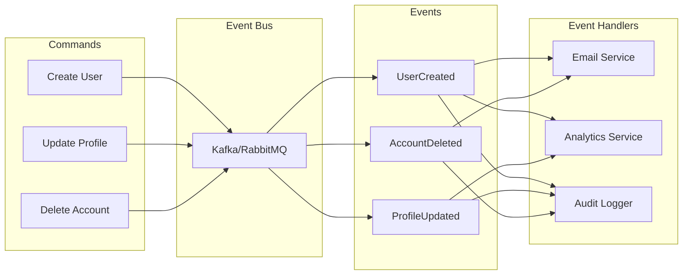

## Deployment Topologies

### 1. Single Region Architecture

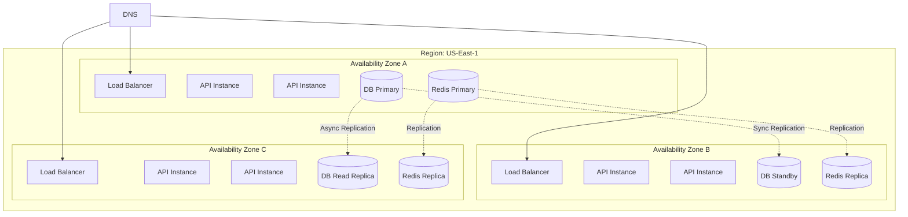

### 2. Multi-Region Architecture

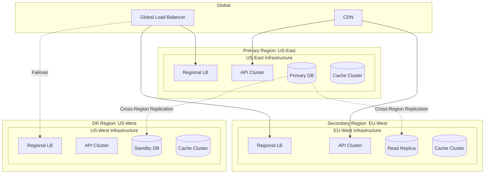

### 3. Hybrid Cloud Architecture

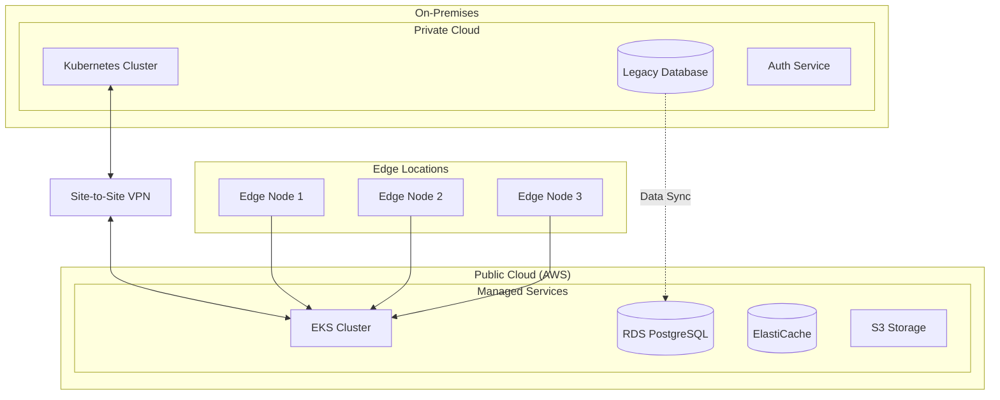

## Component Architecture

### API Gateway Pattern

```yaml
# API Gateway responsibilities
gateway:
  features:
    - rate_limiting:
        default: 1000/min
        authenticated: 5000/min
        premium: 10000/min
    
    - authentication:
        methods: [jwt, api_key, oauth2]
        cache_ttl: 300
    
    - routing:
        rules:
          - path: /api/v1/*
            service: pcf-api-v1
          - path: /api/v2/*
            service: pcf-api-v2
          - path: /graphql
            service: pcf-graphql
    
    - circuit_breaking:
        error_threshold: 50%
        timeout: 30s
        recovery_time: 60s
```

### Database Architecture

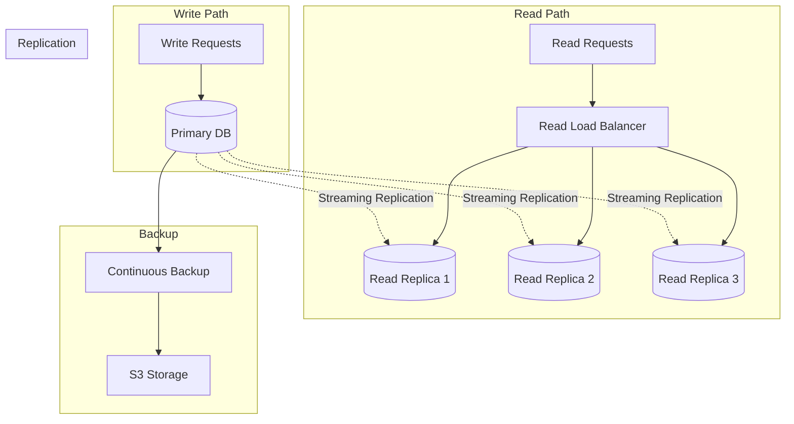

### Caching Strategy

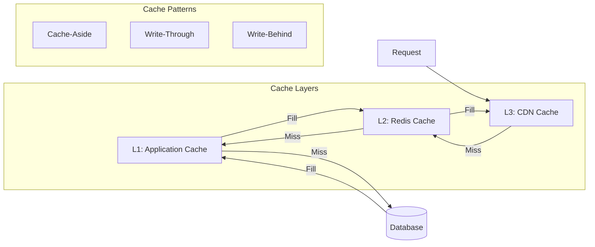

## Security Architecture

### Defense in Depth

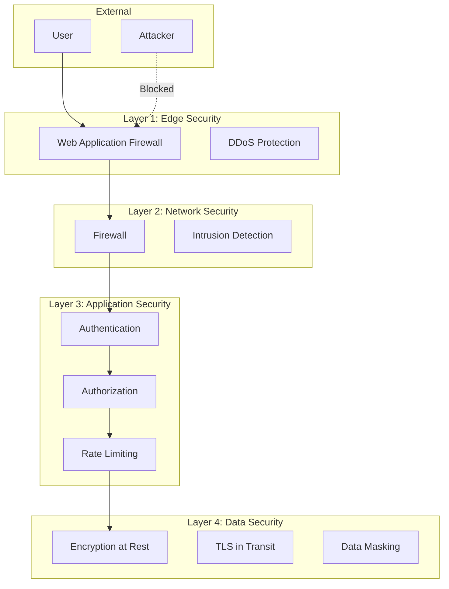

### Zero Trust Architecture

```yaml
# Zero Trust principles
zero_trust:
  identity_verification:
    - multi_factor_auth: required
    - device_trust: enabled
    - continuous_verification: true
  
  least_privilege:
    - role_based_access: true
    - just_in_time_access: true
    - privilege_escalation_monitoring: true
  
  micro_segmentation:
    - network_policies: enforced
    - service_mesh: enabled
    - east_west_traffic_inspection: true
  
  encryption:
    - data_at_rest: AES-256
    - data_in_transit: TLS 1.3
    - key_rotation: automated
```

## Scalability Patterns

### Horizontal Scaling

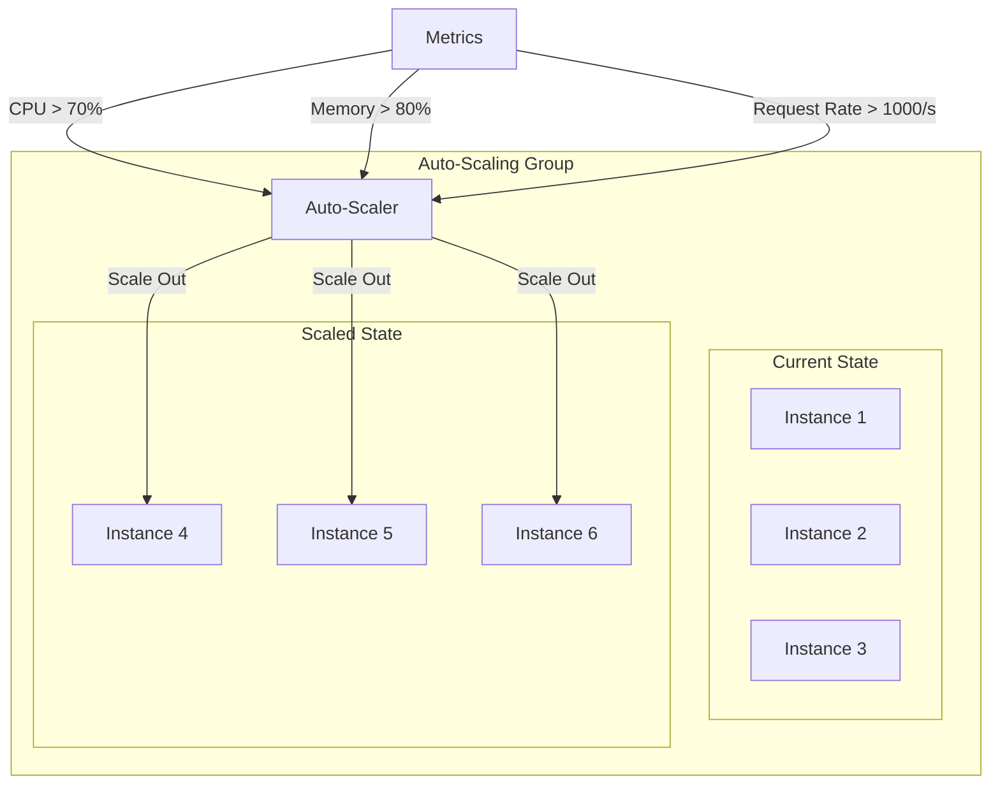

### Database Sharding

```mermaid
graph TB
    subgraph "Shard Router"
        SR[Shard Router]
    end
    
    subgraph "Shards"
        subgraph "Shard 1 (Users A-F)"
            S1[(Shard 1 Primary)]
            S1R[(Shard 1 Replica)]
        end
        
        subgraph "Shard 2 (Users G-M)"
            S2[(Shard 2 Primary)]
            S2R[(Shard 2 Replica)]
        end
        
        subgraph "Shard 3 (Users N-S)"
            S3[(Shard 3 Primary)]
            S3R[(Shard 3 Replica)]
        end
        
        subgraph "Shard 4 (Users T-Z)"
            S4[(Shard 4 Primary)]
            S4R[(Shard 4 Replica)]
        end
    end
    
    REQ[Request] --> SR
    
    SR -->|Hash(UserID)| S1
    SR -->|Hash(UserID)| S2
    SR -->|Hash(UserID)| S3
    SR -->|Hash(UserID)| S4
```

## Resilience Patterns

### Circuit Breaker

```rust
// Circuit breaker states
enum CircuitState {
    Closed,      // Normal operation
    Open,        // Failing, reject requests
    HalfOpen,    // Testing recovery
}

struct CircuitBreaker {
    failure_threshold: u32,
    recovery_timeout: Duration,
    success_threshold: u32,
}
```

### Bulkhead Pattern

```yaml
# Resource isolation
bulkheads:
  api_pool:
    max_connections: 100
    max_pending: 1000
    timeout: 30s
  
  database_pool:
    max_connections: 50
    max_idle: 10
    idle_timeout: 300s
  
  external_api_pool:
    max_connections: 20
    retry_attempts: 3
    circuit_breaker: enabled
```

### Retry Pattern

```yaml
# Retry configuration
retry_policy:
  max_attempts: 3
  backoff:
    type: exponential
    initial_interval: 100ms
    max_interval: 10s
    multiplier: 2
  retryable_errors:
    - connection_timeout
    - service_unavailable
    - too_many_requests
```

## Performance Optimization

### Connection Pooling

```toml
# Database connection pool
[database]
max_connections = 100
min_connections = 10
connection_timeout = 30
idle_timeout = 600
max_lifetime = 1800

# Redis connection pool
[redis]
pool_size = 50
connection_timeout = 10
max_idle_time = 300
```

### Request Batching

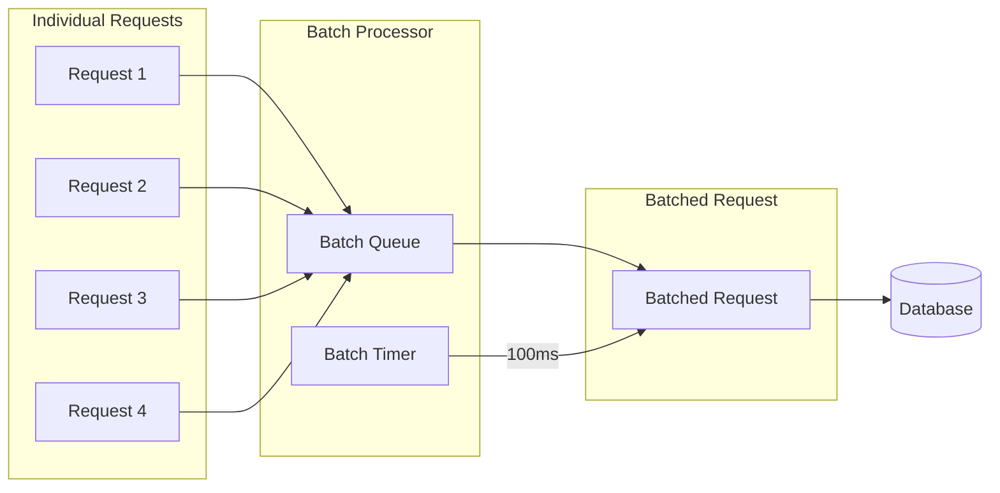

## Deployment Pipeline

### Blue-Green Deployment

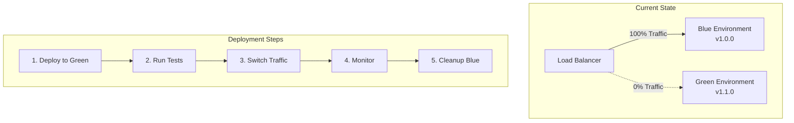

### Canary Deployment

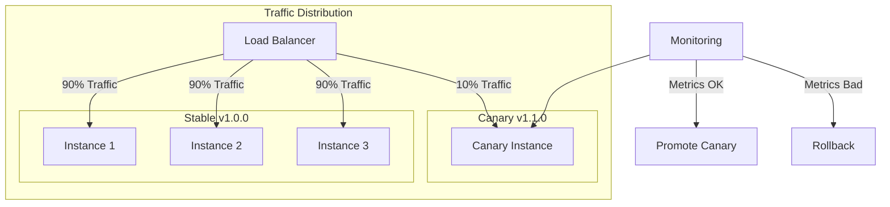

## Monitoring Architecture

### Observability Stack

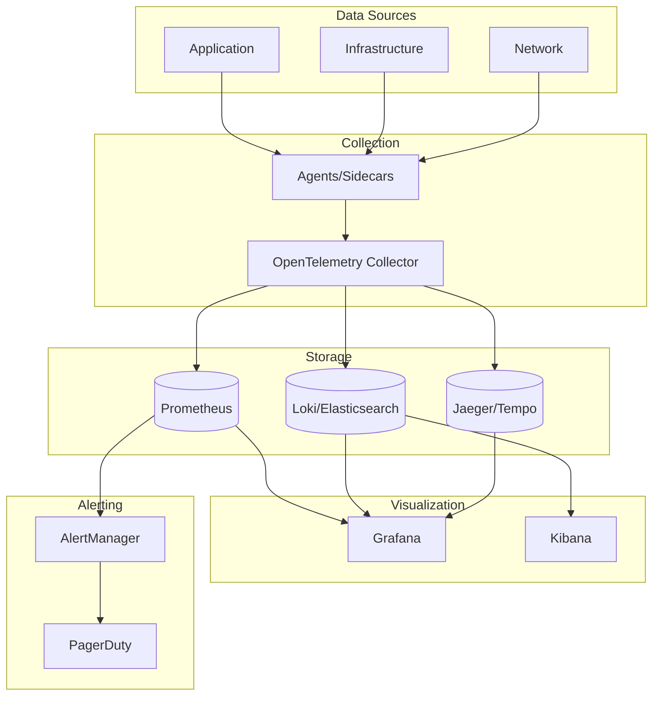

## Best Practices

### 1. Design for Failure
- Assume components will fail
- Implement graceful degradation
- Use circuit breakers and timeouts
- Plan for disaster recovery

### 2. Stateless Services
- Keep application state in external stores
- Enable horizontal scaling
- Simplify deployment and recovery

### 3. Immutable Infrastructure
- Build once, deploy everywhere
- Version everything
- Never modify running instances

### 4. Automation First
- Infrastructure as Code
- Automated testing
- Continuous deployment
- Self-healing systems

### 5. Security by Design
- Defense in depth
- Least privilege access
- Encryption everywhere
- Regular security audits

## Summary

A well-architected deployment considers:
1. **Scalability** - Horizontal and vertical scaling strategies
2. **Reliability** - Redundancy and fault tolerance
3. **Security** - Multiple layers of protection
4. **Performance** - Caching, CDN, and optimization
5. **Observability** - Comprehensive monitoring and alerting
6. **Maintainability** - Clear separation of concerns
7. **Cost Optimization** - Right-sizing and resource efficiency
8. **Disaster Recovery** - Backup and recovery procedures
9. **Compliance** - Regulatory requirements
10. **Documentation** - Architecture decision records
