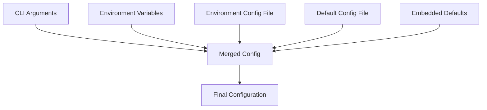

# Configuration Reference

Complete configuration reference for PCF API administrators, covering all configuration options, environment variables, and deployment settings.

<!-- toc -->

## Overview

The PCF API uses a hierarchical configuration system powered by Figment, allowing flexible configuration management across different environments. Configuration can be provided through multiple sources with a clear precedence order.

## Configuration Hierarchy

Configuration sources are merged in the following order (highest to lowest precedence):

1. **Command-line arguments** - Override any other configuration
2. **Environment variables** - Production secrets and deployment-specific settings
3. **Environment-specific files** - `config/{environment}.toml`
4. **Default configuration file** - `config/default.toml`
5. **Embedded defaults** - Hardcoded fallback values



## Complete Configuration Schema

### Root Configuration

```toml
# Environment mode
environment = "development"  # Options: development, staging, production

# Application metadata
[app]
name = "pcf-api"
version = "0.1.0"

# Server configuration
[server]
port = 8080                          # Port to bind (1024-65535)
bind = "127.0.0.1"                   # IP address to bind
shutdown_timeout = 30                # Graceful shutdown timeout (seconds)
request_timeout = 30                 # Request timeout (seconds)
body_limit = "10MB"                  # Maximum request body size
keep_alive = 75                      # Keep-alive timeout (seconds)

# GraphQL configuration
[graphql]
path = "/graphql"                    # GraphQL endpoint path
playground_enabled = true            # Enable GraphQL playground (dev only)
playground_path = "/playground"      # Playground UI path
introspection_enabled = true         # Enable schema introspection (dev only)
max_depth = 15                       # Maximum query depth
max_complexity = 1000                # Maximum query complexity
max_upload_size = "5MB"              # Maximum file upload size
tracing_enabled = true               # Enable query tracing

# Logging configuration
[logging]
level = "info"                       # Log level: trace, debug, info, warn, error
format = "pretty"                    # Format: pretty, json, compact
include_location = true              # Include file/line in logs
include_thread = false               # Include thread info in logs
include_timestamp = true             # Include timestamps
timestamp_format = "rfc3339"         # Timestamp format
target_filters = []                  # Module-specific filters

# Health check configuration
[health]
liveness_path = "/health"            # Liveness probe path
readiness_path = "/health/ready"     # Readiness probe path
startup_path = "/health/startup"     # Startup probe path
include_details = true               # Include detailed status
cache_duration = 5                   # Cache duration (seconds)

# Service configurations
[services]

# Database configuration
[services.database]
enabled = true                       # Enable database service
connection_timeout = 5000            # Connection timeout (ms)
max_connections = 100                # Maximum connection pool size
min_connections = 10                 # Minimum connection pool size
acquire_timeout = 30000              # Connection acquire timeout (ms)
idle_timeout = 600000                # Idle connection timeout (ms)
max_lifetime = 1800000               # Maximum connection lifetime (ms)
retry_attempts = 3                   # Connection retry attempts
retry_delay = 1000                   # Retry delay (ms)

# SurrealDB specific settings
[services.database.surrealdb]
url = "memory"                       # Database URL or "memory" for in-memory
namespace = "development"            # Database namespace
database = "pcf"                     # Database name
username = ""                        # Database username (use env var)
password = ""                        # Database password (use env var)
strict = false                       # Strict mode

# SpiceDB configuration
[services.spicedb]
enabled = false                      # Enable SpiceDB service
endpoint = "localhost:50051"         # SpiceDB endpoint
insecure = true                      # Allow insecure connections (dev only)
token = ""                           # Pre-shared key (use env var)
timeout = 30                         # Request timeout (seconds)
max_retries = 3                      # Maximum retry attempts

# Cache configuration
[services.cache]
enabled = false                      # Enable caching service
backend = "memory"                   # Backend: memory, redis
ttl = 3600                          # Default TTL (seconds)
max_size = 1000                     # Maximum cache entries

# Redis settings (if backend = "redis")
[services.cache.redis]
url = "redis://localhost:6379"      # Redis connection URL
pool_size = 10                      # Connection pool size
timeout = 5                         # Operation timeout (seconds)

# Security configuration
[security]
cors_enabled = true                 # Enable CORS
cors_origins = ["*"]                # Allowed origins (* for any)
cors_methods = ["GET", "POST"]      # Allowed methods
cors_headers = ["*"]                # Allowed headers
cors_credentials = false            # Allow credentials
rate_limit_enabled = false          # Enable rate limiting
rate_limit_requests = 100           # Requests per window
rate_limit_window = 60              # Window duration (seconds)
rate_limit_burst = 10               # Burst capacity

# Authentication configuration
[auth]
enabled = false                     # Enable authentication
provider = "jwt"                    # Auth provider: jwt, oauth2
session_duration = 3600             # Session duration (seconds)
refresh_enabled = true              # Enable token refresh
refresh_duration = 86400            # Refresh token duration (seconds)

# JWT settings
[auth.jwt]
algorithm = "HS256"                 # JWT algorithm
secret = ""                         # JWT secret (use env var)
issuer = "pcf-api"                  # Token issuer
audience = "pcf-users"              # Token audience

# OAuth2 settings
[auth.oauth2]
client_id = ""                      # OAuth2 client ID (use env var)
client_secret = ""                  # OAuth2 client secret (use env var)
authorize_url = ""                  # Authorization endpoint
token_url = ""                      # Token endpoint
redirect_url = ""                   # Redirect URL

# Monitoring configuration
[monitoring]
metrics_enabled = true              # Enable metrics collection
metrics_path = "/metrics"           # Metrics endpoint path
tracing_enabled = false             # Enable distributed tracing
trace_sampling = 0.1                # Trace sampling rate (0.0-1.0)

# OpenTelemetry settings
[monitoring.otel]
endpoint = "localhost:4317"         # OTLP endpoint
protocol = "grpc"                   # Protocol: grpc, http
timeout = 10                        # Export timeout (seconds)
service_name = "pcf-api"            # Service name for traces

# Feature flags
[features]
demo_mode = false                   # Enable demo mode (dev only)
maintenance_mode = false            # Enable maintenance mode
read_only = false                   # Enable read-only mode
experimental = false                # Enable experimental features
```

## Environment Variables

All configuration values can be overridden using environment variables with the `PCF_API__` prefix. Nested values use double underscores:

### Core Settings

```bash
# Application settings
PCF_API__ENVIRONMENT=production
PCF_API__APP__NAME=pcf-api
PCF_API__APP__VERSION=1.0.0

# Server settings
PCF_API__SERVER__PORT=8080
PCF_API__SERVER__BIND=0.0.0.0
PCF_API__SERVER__SHUTDOWN_TIMEOUT=30

# GraphQL settings
PCF_API__GRAPHQL__PLAYGROUND_ENABLED=false
PCF_API__GRAPHQL__INTROSPECTION_ENABLED=false
PCF_API__GRAPHQL__MAX_DEPTH=10
PCF_API__GRAPHQL__MAX_COMPLEXITY=500

# Logging settings
PCF_API__LOGGING__LEVEL=info
PCF_API__LOGGING__FORMAT=json
```

### Service Configuration

```bash
# Database settings
PCF_API__SERVICES__DATABASE__ENABLED=true
PCF_API__SERVICES__DATABASE__SURREALDB__URL=surrealdb://db.example.com:8000
PCF_API__SERVICES__DATABASE__SURREALDB__USERNAME=admin
PCF_API__SERVICES__DATABASE__SURREALDB__PASSWORD=secret-password
PCF_API__SERVICES__DATABASE__MAX_CONNECTIONS=50

# SpiceDB settings
PCF_API__SERVICES__SPICEDB__ENABLED=true
PCF_API__SERVICES__SPICEDB__ENDPOINT=spicedb.example.com:50051
PCF_API__SERVICES__SPICEDB__TOKEN=preshared-key
PCF_API__SERVICES__SPICEDB__INSECURE=false

# Cache settings
PCF_API__SERVICES__CACHE__ENABLED=true
PCF_API__SERVICES__CACHE__BACKEND=redis
PCF_API__SERVICES__CACHE__REDIS__URL=redis://cache.example.com:6379
```

### Security Settings

```bash
# CORS settings
PCF_API__SECURITY__CORS_ORIGINS=["https://app.example.com"]
PCF_API__SECURITY__CORS_CREDENTIALS=true

# Rate limiting
PCF_API__SECURITY__RATE_LIMIT_ENABLED=true
PCF_API__SECURITY__RATE_LIMIT_REQUESTS=1000
PCF_API__SECURITY__RATE_LIMIT_WINDOW=60

# Authentication
PCF_API__AUTH__ENABLED=true
PCF_API__AUTH__JWT__SECRET=your-secret-key
PCF_API__AUTH__SESSION_DURATION=7200
```

## Environment Profiles

### Development Profile

```toml
# config/development.toml
environment = "development"

[server]
port = 8080
bind = "127.0.0.1"

[graphql]
playground_enabled = true
introspection_enabled = true
max_depth = 15
max_complexity = 1000

[logging]
level = "debug"
format = "pretty"
include_location = true

[services.database.surrealdb]
url = "memory"
namespace = "development"

[features]
demo_mode = true
```

### Staging Profile

```toml
# config/staging.toml
environment = "staging"

[server]
port = 8080
bind = "0.0.0.0"

[graphql]
playground_enabled = true
introspection_enabled = true
max_depth = 12
max_complexity = 750

[logging]
level = "info"
format = "json"

[services.database.surrealdb]
namespace = "staging"

[security]
cors_origins = ["https://staging.example.com"]
rate_limit_enabled = true
```

### Production Profile

```toml
# config/production.toml
environment = "production"

[server]
port = 8080
bind = "0.0.0.0"
shutdown_timeout = 60

[graphql]
playground_enabled = false
introspection_enabled = false
max_depth = 10
max_complexity = 500

[logging]
level = "warn"
format = "json"
include_location = false

[services.database]
max_connections = 200
min_connections = 20

[services.database.surrealdb]
namespace = "production"
strict = true

[security]
cors_origins = ["https://app.example.com"]
cors_credentials = true
rate_limit_enabled = true
rate_limit_requests = 100
rate_limit_window = 60

[auth]
enabled = true
session_duration = 3600

[monitoring]
metrics_enabled = true
tracing_enabled = true
trace_sampling = 0.01
```

## Configuration Validation

The API validates configuration on startup:

### Required Settings

1. **Valid port range**: 1024-65535
2. **Valid bind address**: IPv4 or IPv6
3. **Positive timeouts**: All timeouts > 0
4. **Valid log level**: trace, debug, info, warn, error
5. **Valid environment**: development, staging, production

### Security Validations

1. **Production checks**:
   - GraphQL playground must be disabled
   - Introspection must be disabled
   - Demo mode must be disabled
   - CORS origins should be specific (not "*")
   - Database should not use in-memory mode

2. **Authentication checks**:
   - JWT secret required if auth enabled
   - OAuth2 URLs required if OAuth2 provider

3. **Service checks**:
   - Database URL accessible
   - SpiceDB endpoint reachable
   - Redis connection valid

### Validation Errors

```bash
# Example validation errors
Error: Invalid configuration
  - server.port: 80 is below minimum value 1024
  - graphql.playground_enabled: Must be false in production
  - auth.jwt.secret: Required when auth.enabled is true
```

## Configuration Best Practices

### 1. Security First

```bash
# Never commit secrets to version control
PCF_API__AUTH__JWT__SECRET=$(vault read -field=secret secret/pcf-api/jwt)
PCF_API__SERVICES__DATABASE__SURREALDB__PASSWORD=$(vault read -field=password secret/pcf-api/db)
```

### 2. Environment Separation

```toml
# Use environment-specific files
config/
├── default.toml      # Shared defaults
├── development.toml  # Local development
├── staging.toml      # Staging environment
└── production.toml   # Production settings
```

### 3. Progressive Override

```bash
# Start with defaults, override as needed
PCF_API__ENVIRONMENT=production \
PCF_API__SERVER__PORT=3000 \
PCF_API__LOGGING__LEVEL=info \
./pcf-api
```

### 4. Monitoring Configuration

```toml
# Always enable monitoring in production
[monitoring]
metrics_enabled = true
tracing_enabled = true

[logging]
level = "info"  # Balance verbosity and performance
format = "json" # Structured logs for analysis
```

### 5. Resource Limits

```toml
# Set appropriate limits
[server]
body_limit = "10MB"      # Prevent memory exhaustion
request_timeout = 30     # Prevent hanging requests

[services.database]
max_connections = 100    # Based on load testing
acquire_timeout = 30000  # Fail fast on issues
```

## Dynamic Reloading

Currently, configuration is loaded once at startup. For configuration changes:

1. **Graceful restart**: Recommended approach
   ```bash
   kill -TERM $(pgrep pcf-api)  # Triggers graceful shutdown
   ./pcf-api                     # Start with new config
   ```

2. **Rolling update**: For zero-downtime
   ```bash
   # Deploy new instance with updated config
   # Update load balancer
   # Terminate old instance
   ```

3. **Future enhancement**: Hot reload support planned
   ```toml
   [config]
   watch_enabled = true
   reload_on_change = ["logging", "security.rate_limit"]
   ```

## Troubleshooting Configuration

### Debug Configuration Loading

```bash
# Enable trace logging for config details
PCF_API__LOGGING__LEVEL=trace ./pcf-api

# Dry run to validate config
./pcf-api --validate-config
```

### Common Issues

1. **Port binding errors**
   ```bash
   # Check if port is in use
   lsof -i :8080
   
   # Use alternative port
   PCF_API__SERVER__PORT=8081 ./pcf-api
   ```

2. **Database connection failures**
   ```bash
   # Test connection
   surreal sql --conn http://localhost:8000 --user root --pass root
   
   # Check URL format
   PCF_API__SERVICES__DATABASE__SURREALDB__URL=surrealdb://localhost:8000
   ```

3. **Missing environment variables**
   ```bash
   # List current config
   ./pcf-api --print-config
   
   # Export required vars
   export PCF_API__AUTH__JWT__SECRET="your-secret"
   ```

## Configuration Examples

### Minimal Production Config

```bash
#!/bin/bash
# Production startup script

export PCF_API__ENVIRONMENT=production
export PCF_API__SERVER__BIND=0.0.0.0
export PCF_API__GRAPHQL__PLAYGROUND_ENABLED=false
export PCF_API__GRAPHQL__INTROSPECTION_ENABLED=false
export PCF_API__LOGGING__FORMAT=json
export PCF_API__AUTH__JWT__SECRET="${JWT_SECRET}"
export PCF_API__SERVICES__DATABASE__SURREALDB__URL="${DATABASE_URL}"
export PCF_API__SERVICES__DATABASE__SURREALDB__PASSWORD="${DATABASE_PASSWORD}"

exec ./pcf-api
```

### Docker Configuration

```dockerfile
# Dockerfile configuration
ENV PCF_API__ENVIRONMENT=production
ENV PCF_API__SERVER__BIND=0.0.0.0
ENV PCF_API__LOGGING__FORMAT=json

# Runtime secrets from orchestrator
# PCF_API__AUTH__JWT__SECRET
# PCF_API__SERVICES__DATABASE__SURREALDB__PASSWORD
```

### Kubernetes ConfigMap

```yaml
apiVersion: v1
kind: ConfigMap
metadata:
  name: pcf-api-config
data:
  PCF_API__ENVIRONMENT: "production"
  PCF_API__SERVER__PORT: "8080"
  PCF_API__GRAPHQL__MAX_DEPTH: "10"
  PCF_API__GRAPHQL__MAX_COMPLEXITY: "500"
  PCF_API__LOGGING__LEVEL: "info"
  PCF_API__LOGGING__FORMAT: "json"
```

## Next Steps

- Review [Environment Variables](./environment-variables.md) for detailed variable reference
- See [Profiles](./profiles.md) for environment-specific configurations
- Check [Validation](./validation.md) for configuration validation rules
- Read [Secrets Management](./secrets.md) for secure configuration practices