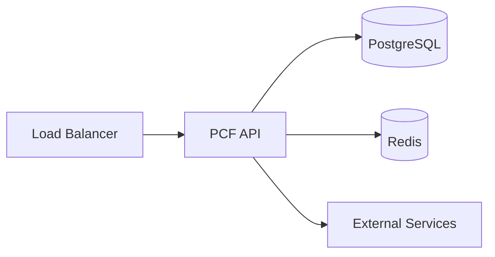
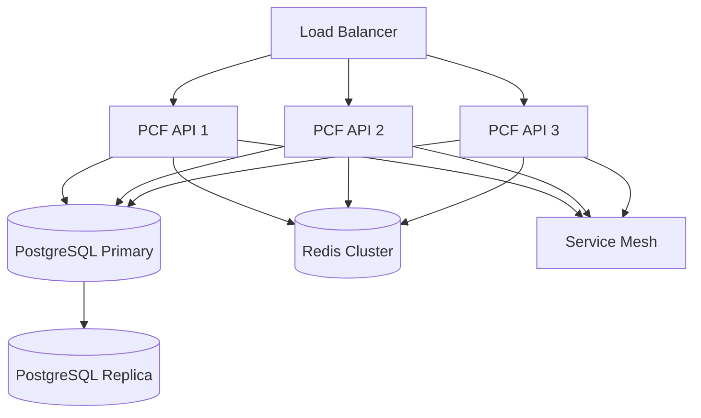
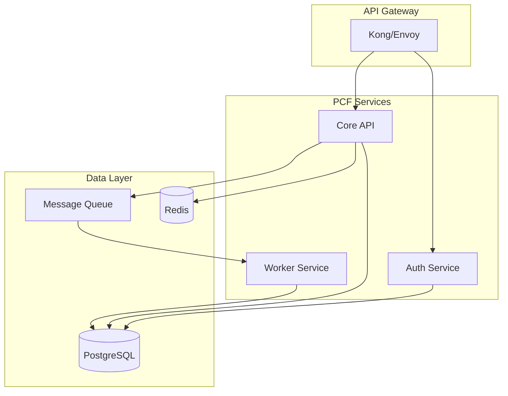

# Deployment Overview

Comprehensive guide to deploying the PCF API in various environments, from local development to production-grade cloud deployments.

<!-- toc -->

## Overview

The PCF API is designed to be deployed in multiple environments with support for containers, orchestration platforms, and cloud providers. This guide covers deployment strategies, infrastructure requirements, and best practices for running the API at scale.

## Deployment Options

### 1. Local Development

**Purpose**: Development and testing  
**Complexity**: Low  
**Requirements**: Rust toolchain, Docker (optional)

```bash
# Direct execution
cargo run --release

# With environment configuration
PCF_API__ENVIRONMENT=development cargo run
```

### 2. Docker Container

**Purpose**: Consistent deployments across environments  
**Complexity**: Low-Medium  
**Requirements**: Docker, Docker Compose (optional)

```bash
# Build and run
docker build -t pcf-api .
docker run -p 8080:8080 pcf-api
```

### 3. Kubernetes

**Purpose**: Production workloads with auto-scaling  
**Complexity**: Medium-High  
**Requirements**: Kubernetes cluster, kubectl, Helm (optional)

```bash
# Deploy with kubectl
kubectl apply -f k8s/

# Deploy with Helm
helm install pcf-api ./helm/pcf-api
```

### 4. Cloud Platforms

**Purpose**: Managed infrastructure with cloud services  
**Complexity**: Medium  
**Options**: AWS ECS/EKS, GCP Cloud Run/GKE, Azure Container Instances/AKS

## Architecture Patterns

### Single Instance



### High Availability



### Microservices Architecture



## Infrastructure Requirements

### Minimum Requirements

| Component | Development | Production |
|-----------|-------------|------------|
| CPU | 1 core | 2+ cores |
| Memory | 512MB | 2GB+ |
| Storage | 1GB | 10GB+ |
| Network | - | 100Mbps+ |

### Recommended Production Setup

| Component | Specification | Notes |
|-----------|--------------|-------|
| CPU | 4-8 cores | Auto-scaling enabled |
| Memory | 4-8GB | Monitor for OOM |
| Storage | 50GB SSD | Logs and temp files |
| Instances | 3+ | High availability |
| Database | Managed service | Automated backups |
| Cache | Redis cluster | Persistence optional |

## Deployment Process

### 1. Pre-deployment Checklist

- [ ] Infrastructure provisioned
- [ ] Security groups configured
- [ ] SSL certificates obtained
- [ ] Database initialized
- [ ] Secrets configured
- [ ] Monitoring enabled
- [ ] Backup strategy defined

### 2. Configuration Management

```yaml
# Environment-specific configs
configs/
├── base.toml          # Shared configuration
├── development.toml   # Development overrides
├── staging.toml       # Staging environment
└── production.toml    # Production settings
```

### 3. Deployment Steps

1. **Build the application**
   ```bash
   cargo build --release
   # or
   docker build -t pcf-api:v1.0.0 .
   ```

2. **Run database migrations**
   ```bash
   sqlx migrate run
   ```

3. **Deploy application**
   ```bash
   # Kubernetes
   kubectl apply -f k8s/deployment.yaml
   
   # Docker Swarm
   docker stack deploy -c docker-compose.yml pcf
   ```

4. **Verify deployment**
   ```bash
   curl https://api.example.com/health
   ```

### 4. Post-deployment

- [ ] Health checks passing
- [ ] Metrics being collected
- [ ] Logs aggregating properly
- [ ] Alerts configured
- [ ] Performance baseline established

## Security Considerations

### Network Security

```yaml
# Example security group rules
ingress:
  - port: 443
    protocol: tcp
    source: 0.0.0.0/0  # HTTPS from anywhere
  - port: 8080
    protocol: tcp
    source: 10.0.0.0/8  # Internal only
  - port: 9090
    protocol: tcp
    source: 10.0.1.0/24  # Metrics from monitoring subnet

egress:
  - port: 5432
    protocol: tcp
    destination: db.internal  # PostgreSQL
  - port: 443
    protocol: tcp
    destination: 0.0.0.0/0   # External APIs
```

### Secret Management

```bash
# Kubernetes secrets
kubectl create secret generic pcf-api-secrets \
  --from-literal=database-url='postgresql://...' \
  --from-literal=jwt-secret='...'

# AWS Secrets Manager
aws secretsmanager create-secret \
  --name pcf-api/production \
  --secret-string file://secrets.json

# HashiCorp Vault
vault kv put secret/pcf-api \
  database_url='postgresql://...' \
  jwt_secret='...'
```

## Scaling Strategies

### Horizontal Scaling

```yaml
# Kubernetes HPA
apiVersion: autoscaling/v2
kind: HorizontalPodAutoscaler
metadata:
  name: pcf-api-hpa
spec:
  scaleTargetRef:
    apiVersion: apps/v1
    kind: Deployment
    name: pcf-api
  minReplicas: 3
  maxReplicas: 10
  metrics:
  - type: Resource
    resource:
      name: cpu
      target:
        type: Utilization
        averageUtilization: 70
  - type: Resource
    resource:
      name: memory
      target:
        type: Utilization
        averageUtilization: 80
```

### Vertical Scaling

```yaml
# Kubernetes VPA
apiVersion: autoscaling.k8s.io/v1
kind: VerticalPodAutoscaler
metadata:
  name: pcf-api-vpa
spec:
  targetRef:
    apiVersion: apps/v1
    kind: Deployment
    name: pcf-api
  updatePolicy:
    updateMode: "Auto"
  resourcePolicy:
    containerPolicies:
    - containerName: api
      maxAllowed:
        cpu: 2
        memory: 4Gi
```

## Deployment Environments

### Development

```toml
# config/development.toml
[server]
port = 8080
workers = 1

[graphql]
playground_enabled = true
introspection_enabled = true

[database]
max_connections = 5
```

### Staging

```toml
# config/staging.toml
[server]
port = 8080
workers = 2

[graphql]
playground_enabled = true
introspection_enabled = true

[database]
max_connections = 20
```

### Production

```toml
# config/production.toml
[server]
port = 8080
workers = 0  # Use all CPU cores

[graphql]
playground_enabled = false
introspection_enabled = false

[database]
max_connections = 100
```

## Zero-Downtime Deployment

### Blue-Green Deployment

```bash
# Deploy green version
kubectl apply -f k8s/deployment-green.yaml

# Test green version
curl http://pcf-api-green/health

# Switch traffic
kubectl patch service pcf-api -p '{"spec":{"selector":{"version":"green"}}}'

# Remove blue version
kubectl delete deployment pcf-api-blue
```

### Rolling Updates

```yaml
# Kubernetes deployment strategy
spec:
  replicas: 3
  strategy:
    type: RollingUpdate
    rollingUpdate:
      maxSurge: 1
      maxUnavailable: 0
```

### Canary Deployments

```yaml
# Istio VirtualService
apiVersion: networking.istio.io/v1beta1
kind: VirtualService
metadata:
  name: pcf-api
spec:
  http:
  - match:
    - headers:
        x-canary:
          exact: "true"
    route:
    - destination:
        host: pcf-api
        subset: canary
      weight: 100
  - route:
    - destination:
        host: pcf-api
        subset: stable
      weight: 90
    - destination:
        host: pcf-api
        subset: canary
      weight: 10
```

## Monitoring Deployment

### Key Metrics

- Deployment frequency
- Lead time for changes
- Mean time to recovery (MTTR)
- Change failure rate
- Rollback frequency

### Deployment Tracking

```bash
# Annotate deployments in monitoring
curl -X POST http://grafana/api/annotations \
  -H "Authorization: Bearer $GRAFANA_TOKEN" \
  -d '{
    "text": "Deployed v1.2.3",
    "tags": ["deployment", "production"],
    "time": '$(date +%s000)'
  }'
```

## Troubleshooting

### Common Issues

1. **Container fails to start**
   ```bash
   # Check logs
   kubectl logs -f deployment/pcf-api
   docker logs pcf-api
   
   # Check events
   kubectl describe pod pcf-api-xxx
   ```

2. **Database connection errors**
   ```bash
   # Test connectivity
   kubectl exec -it pcf-api-xxx -- nc -zv postgres 5432
   
   # Check credentials
   kubectl get secret pcf-api-secrets -o yaml
   ```

3. **Performance issues**
   ```bash
   # Check resource usage
   kubectl top pods
   kubectl top nodes
   
   # Review metrics
   curl http://pcf-api:9090/metrics | grep -E '(cpu|memory|http)'
   ```

## CI/CD Integration

### GitHub Actions Example

```yaml
name: Deploy
on:
  push:
    branches: [main]

jobs:
  deploy:
    runs-on: ubuntu-latest
    steps:
      - uses: actions/checkout@v3
      
      - name: Build and push Docker image
        run: |
          docker build -t pcf-api:${{ github.sha }} .
          docker push pcf-api:${{ github.sha }}
      
      - name: Deploy to Kubernetes
        run: |
          kubectl set image deployment/pcf-api \
            api=pcf-api:${{ github.sha }}
          kubectl rollout status deployment/pcf-api
```

## Best Practices

1. **Use Infrastructure as Code**
   - Terraform for cloud resources
   - Kubernetes manifests in Git
   - Automated provisioning

2. **Implement Health Checks**
   - Liveness probes
   - Readiness probes
   - Startup probes

3. **Enable Observability**
   - Structured logging
   - Distributed tracing
   - Metrics collection

4. **Security First**
   - Least privilege access
   - Network policies
   - Secret rotation

5. **Plan for Failure**
   - Graceful shutdowns
   - Circuit breakers
   - Retry logic

## Next Steps

1. **[Docker](./docker.md)** - Container deployment guide
2. **[Kubernetes](./kubernetes.md)** - K8s deployment patterns
3. **[Cloud Providers](./cloud.md)** - AWS, GCP, Azure guides
4. **[CI/CD](./cicd.md)** - Automation pipelines
5. **[Production Checklist](./production.md)** - Launch readiness
