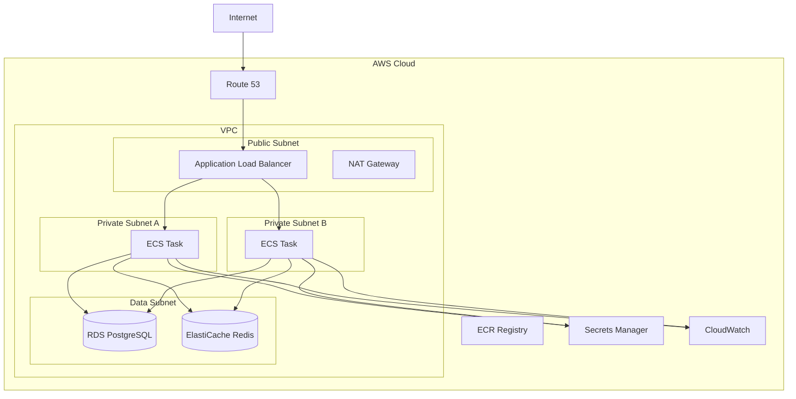
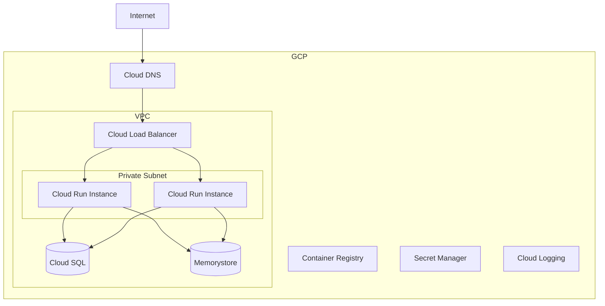
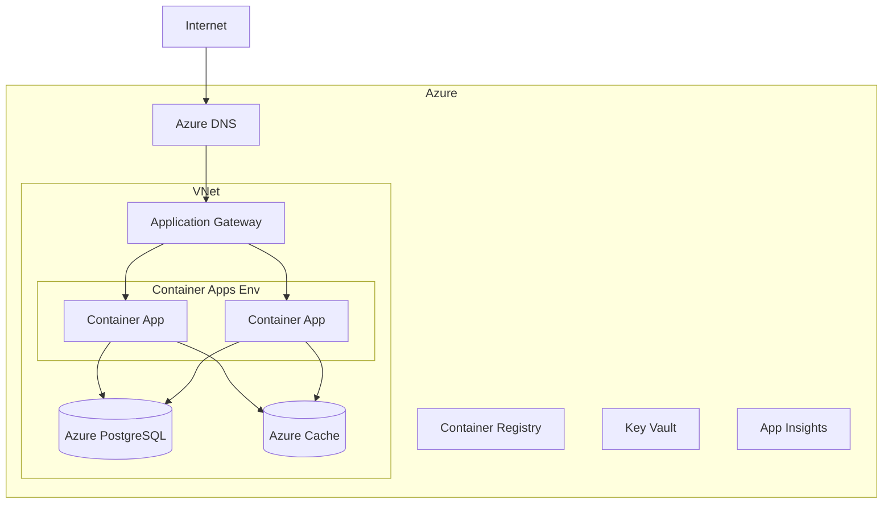

# Cloud Provider Deployment

Detailed guides for deploying the PCF API on major cloud providers including AWS, Google Cloud Platform, and Microsoft Azure.

<!-- toc -->

## Overview

Cloud providers offer managed services that simplify deployment, scaling, and maintenance of the PCF API. This guide covers platform-specific deployment patterns, managed services integration, and cost optimization strategies.

## AWS Deployment

### Architecture Overview



### ECS Fargate Deployment

#### Task Definition

```json
{
  "family": "pcf-api",
  "networkMode": "awsvpc",
  "requiresCompatibilities": ["FARGATE"],
  "cpu": "1024",
  "memory": "2048",
  "executionRoleArn": "arn:aws:iam::123456789012:role/ecsTaskExecutionRole",
  "taskRoleArn": "arn:aws:iam::123456789012:role/pcf-api-task-role",
  "containerDefinitions": [
    {
      "name": "api",
      "image": "123456789012.dkr.ecr.us-east-1.amazonaws.com/pcf-api:latest",
      "portMappings": [
        {
          "containerPort": 8080,
          "protocol": "tcp"
        },
        {
          "containerPort": 9090,
          "protocol": "tcp"
        }
      ],
      "environment": [
        {
          "name": "PCF_API__ENVIRONMENT",
          "value": "production"
        },
        {
          "name": "PCF_API__SERVER__PORT",
          "value": "8080"
        }
      ],
      "secrets": [
        {
          "name": "DATABASE_URL",
          "valueFrom": "arn:aws:secretsmanager:us-east-1:123456789012:secret:pcf-api/db-url"
        },
        {
          "name": "REDIS_URL",
          "valueFrom": "arn:aws:secretsmanager:us-east-1:123456789012:secret:pcf-api/redis-url"
        },
        {
          "name": "PCF_API__AUTH__JWT__SECRET",
          "valueFrom": "arn:aws:secretsmanager:us-east-1:123456789012:secret:pcf-api/jwt-secret"
        }
      ],
      "logConfiguration": {
        "logDriver": "awslogs",
        "options": {
          "awslogs-group": "/ecs/pcf-api",
          "awslogs-region": "us-east-1",
          "awslogs-stream-prefix": "ecs"
        }
      },
      "healthCheck": {
        "command": ["CMD-SHELL", "curl -f http://localhost:8080/health || exit 1"],
        "interval": 30,
        "timeout": 5,
        "retries": 3,
        "startPeriod": 60
      }
    }
  ]
}
```

#### Service Definition

```yaml
# ecs-service.yaml
apiVersion: v1
kind: Service
metadata:
  name: pcf-api
spec:
  cluster: pcf-cluster
  taskDefinition: pcf-api:latest
  desiredCount: 3
  launchType: FARGATE
  platformVersion: LATEST
  deploymentConfiguration:
    maximumPercent: 200
    minimumHealthyPercent: 100
    deploymentCircuitBreaker:
      enable: true
      rollback: true
  networkConfiguration:
    awsvpcConfiguration:
      subnets:
        - subnet-12345678
        - subnet-87654321
      securityGroups:
        - sg-pcf-api
      assignPublicIp: DISABLED
  loadBalancers:
    - targetGroupArn: arn:aws:elasticloadbalancing:...:targetgroup/pcf-api
      containerName: api
      containerPort: 8080
  serviceRegistries:
    - registryArn: arn:aws:servicediscovery:...:service/pcf-api
```

### EKS Deployment

#### Cluster Setup

```yaml
# eksctl-config.yaml
apiVersion: eksctl.io/v1alpha5
kind: ClusterConfig

metadata:
  name: pcf-cluster
  region: us-east-1
  version: "1.28"

vpc:
  nat:
    gateway: HighlyAvailable

managedNodeGroups:
  - name: pcf-nodes
    instanceType: t3.large
    minSize: 3
    maxSize: 10
    desiredCapacity: 3
    volumeSize: 100
    privateNetworking: true
    iam:
      withAddonPolicies:
        imageBuilder: true
        autoScaler: true
        cloudWatch: true
        albIngress: true

iam:
  withOIDC: true
  serviceAccounts:
    - metadata:
        name: pcf-api
        namespace: pcf-system
      attachPolicyARNs:
        - arn:aws:iam::aws:policy/AmazonRDSDataFullAccess
        - arn:aws:iam::aws:policy/SecretsManagerReadWrite
```

#### Deploy with Kubectl

```bash
# Create cluster
eksctl create cluster -f eksctl-config.yaml

# Update kubeconfig
aws eks update-kubeconfig --name pcf-cluster --region us-east-1

# Deploy application
kubectl apply -f k8s/
```

### Infrastructure as Code (Terraform)

```hcl
# main.tf
module "vpc" {
  source = "terraform-aws-modules/vpc/aws"
  version = "5.0.0"
  
  name = "pcf-vpc"
  cidr = "10.0.0.0/16"
  
  azs             = ["us-east-1a", "us-east-1b", "us-east-1c"]
  private_subnets = ["10.0.1.0/24", "10.0.2.0/24", "10.0.3.0/24"]
  public_subnets  = ["10.0.101.0/24", "10.0.102.0/24", "10.0.103.0/24"]
  database_subnets = ["10.0.201.0/24", "10.0.202.0/24", "10.0.203.0/24"]
  
  enable_nat_gateway = true
  enable_vpn_gateway = false
  enable_dns_hostnames = true
  
  tags = {
    Environment = "production"
    Application = "pcf-api"
  }
}

module "rds" {
  source = "terraform-aws-modules/rds/aws"
  
  identifier = "pcf-api-db"
  
  engine            = "postgres"
  engine_version    = "15.4"
  instance_class    = "db.r6g.large"
  allocated_storage = 100
  storage_encrypted = true
  
  db_name  = "pcf_prod"
  username = "pcf_admin"
  port     = "5432"
  
  vpc_security_group_ids = [module.security_group.rds_sg_id]
  db_subnet_group_name   = module.vpc.database_subnet_group_name
  
  backup_retention_period = 30
  backup_window          = "03:00-06:00"
  maintenance_window     = "Mon:00:00-Mon:03:00"
  
  enabled_cloudwatch_logs_exports = ["postgresql"]
  
  create_db_parameter_group = true
  parameter_group_name      = "pcf-api-pg15"
  
  deletion_protection = true
}

module "elasticache" {
  source = "terraform-aws-modules/elasticache/aws"
  
  cluster_id           = "pcf-api-cache"
  engine              = "redis"
  node_type           = "cache.r6g.large"
  num_cache_nodes     = 1
  engine_version      = "7.0"
  port                = 6379
  
  subnet_ids          = module.vpc.private_subnets
  security_group_ids  = [module.security_group.redis_sg_id]
  
  at_rest_encryption_enabled = true
  transit_encryption_enabled = true
  
  automatic_failover_enabled = true
  multi_az_enabled          = true
  
  snapshot_retention_limit = 7
  snapshot_window         = "03:00-05:00"
}
```

### AWS Best Practices

1. **Use Parameter Store/Secrets Manager**
   ```bash
   aws secretsmanager create-secret \
     --name pcf-api/production \
     --secret-string file://secrets.json
   ```

2. **Enable CloudWatch Insights**
   ```json
   {
     "logConfiguration": {
       "logDriver": "awslogs",
       "options": {
         "awslogs-group": "/ecs/pcf-api",
         "awslogs-region": "us-east-1",
         "awslogs-stream-prefix": "ecs",
         "awslogs-datetime-format": "%Y-%m-%d %H:%M:%S"
       }
     }
   }
   ```

3. **Set up Auto Scaling**
   ```bash
   aws application-autoscaling register-scalable-target \
     --service-namespace ecs \
     --resource-id service/pcf-cluster/pcf-api \
     --scalable-dimension ecs:service:DesiredCount \
     --min-capacity 3 \
     --max-capacity 20
   ```

## Google Cloud Platform

### Architecture Overview



### Cloud Run Deployment

```yaml
# service.yaml
apiVersion: serving.knative.dev/v1
kind: Service
metadata:
  name: pcf-api
  annotations:
    run.googleapis.com/ingress: internal-and-cloud-load-balancing
spec:
  template:
    metadata:
      annotations:
        run.googleapis.com/execution-environment: gen2
        run.googleapis.com/startup-cpu-boost: true
        autoscaling.knative.dev/minScale: "3"
        autoscaling.knative.dev/maxScale: "100"
    spec:
      containerConcurrency: 1000
      timeoutSeconds: 300
      serviceAccountName: pcf-api@project.iam.gserviceaccount.com
      containers:
      - image: gcr.io/project/pcf-api:latest
        ports:
        - name: http1
          containerPort: 8080
        env:
        - name: PCF_API__ENVIRONMENT
          value: production
        - name: DATABASE_URL
          valueFrom:
            secretKeyRef:
              name: pcf-api-secrets
              key: database-url
        resources:
          limits:
            cpu: "2"
            memory: 2Gi
          requests:
            cpu: "1"
            memory: 1Gi
        livenessProbe:
          httpGet:
            path: /health
            port: 8080
          initialDelaySeconds: 30
          periodSeconds: 30
        startupProbe:
          httpGet:
            path: /health/startup
            port: 8080
          initialDelaySeconds: 0
          periodSeconds: 10
          failureThreshold: 30
```

### GKE Autopilot

```yaml
# gke-autopilot.yaml
apiVersion: v1
kind: Namespace
metadata:
  name: pcf-system
---
apiVersion: apps/v1
kind: Deployment
metadata:
  name: pcf-api
  namespace: pcf-system
spec:
  replicas: 3
  selector:
    matchLabels:
      app: pcf-api
  template:
    metadata:
      labels:
        app: pcf-api
    spec:
      serviceAccountName: pcf-api-ksa
      containers:
      - name: api
        image: gcr.io/project/pcf-api:latest
        ports:
        - containerPort: 8080
        env:
        - name: PCF_API__ENVIRONMENT
          value: production
        - name: DATABASE_URL
          valueFrom:
            secretKeyRef:
              name: pcf-api-secrets
              key: database-url
        resources:
          requests:
            cpu: 500m
            memory: 1Gi
            ephemeral-storage: 1Gi
          limits:
            cpu: 2000m
            memory: 2Gi
            ephemeral-storage: 2Gi
```

### Terraform for GCP

```hcl
# gcp-infrastructure.tf
resource "google_cloud_run_service" "pcf_api" {
  name     = "pcf-api"
  location = "us-central1"
  
  template {
    spec {
      containers {
        image = "gcr.io/${var.project_id}/pcf-api:latest"
        
        resources {
          limits = {
            cpu    = "2000m"
            memory = "2Gi"
          }
        }
        
        env {
          name  = "PCF_API__ENVIRONMENT"
          value = "production"
        }
        
        env {
          name = "DATABASE_URL"
          value_from {
            secret_key_ref {
              name = google_secret_manager_secret.database_url.secret_id
              key  = "latest"
            }
          }
        }
      }
      
      service_account_name = google_service_account.pcf_api.email
    }
    
    metadata {
      annotations = {
        "autoscaling.knative.dev/maxScale"      = "100"
        "autoscaling.knative.dev/minScale"      = "3"
        "run.googleapis.com/startup-cpu-boost"   = "true"
      }
    }
  }
  
  traffic {
    percent         = 100
    latest_revision = true
  }
}

resource "google_sql_database_instance" "pcf_db" {
  name             = "pcf-api-db"
  database_version = "POSTGRES_15"
  region           = "us-central1"
  
  settings {
    tier = "db-n1-standard-2"
    
    backup_configuration {
      enabled                        = true
      point_in_time_recovery_enabled = true
      start_time                     = "03:00"
    }
    
    ip_configuration {
      ipv4_enabled    = false
      private_network = google_compute_network.vpc.id
    }
    
    database_flags {
      name  = "max_connections"
      value = "200"
    }
  }
  
  deletion_protection = true
}
```

## Microsoft Azure

### Architecture Overview



### Azure Container Apps

```yaml
# container-app.yaml
apiVersion: apps/v1
kind: ContainerApp
metadata:
  name: pcf-api
  location: eastus
spec:
  environment:
    name: pcf-environment
  configuration:
    ingress:
      external: true
      targetPort: 8080
      transport: http
      traffic:
        - latestRevision: true
          weight: 100
    secrets:
      - name: database-url
        keyVaultUrl: https://pcf-kv.vault.azure.net/secrets/database-url
      - name: redis-url
        keyVaultUrl: https://pcf-kv.vault.azure.net/secrets/redis-url
    registries:
      - server: pcfregistry.azurecr.io
        identity: system
  template:
    containers:
      - name: api
        image: pcfregistry.azurecr.io/pcf-api:latest
        resources:
          cpu: 2
          memory: 4Gi
        env:
          - name: PCF_API__ENVIRONMENT
            value: production
          - name: DATABASE_URL
            secretRef: database-url
          - name: REDIS_URL
            secretRef: redis-url
        probes:
          - type: liveness
            httpGet:
              path: /health
              port: 8080
            periodSeconds: 30
          - type: readiness
            httpGet:
              path: /health/ready
              port: 8080
            periodSeconds: 10
    scale:
      minReplicas: 3
      maxReplicas: 30
      rules:
        - name: http-rule
          http:
            metadata:
              concurrentRequests: 100
```

### AKS Deployment

```bash
# Create AKS cluster
az aks create \
  --resource-group pcf-rg \
  --name pcf-aks \
  --node-count 3 \
  --node-vm-size Standard_D4s_v3 \
  --enable-managed-identity \
  --network-plugin azure \
  --enable-addons monitoring \
  --generate-ssh-keys

# Get credentials
az aks get-credentials --resource-group pcf-rg --name pcf-aks

# Deploy application
kubectl apply -f k8s/
```

### Bicep Infrastructure

```bicep
// main.bicep
param location string = resourceGroup().location
param environment string = 'production'

resource containerRegistry 'Microsoft.ContainerRegistry/registries@2021-09-01' = {
  name: 'pcfregistry'
  location: location
  sku: {
    name: 'Premium'
  }
  properties: {
    adminUserEnabled: false
    dataEndpointEnabled: true
  }
}

resource postgreSQL 'Microsoft.DBforPostgreSQL/flexibleServers@2021-06-01' = {
  name: 'pcf-api-db'
  location: location
  sku: {
    name: 'Standard_D4s_v3'
    tier: 'GeneralPurpose'
  }
  properties: {
    version: '15'
    administratorLogin: 'pcfadmin'
    administratorLoginPassword: keyVault.getSecret('db-admin-password')
    storage: {
      storageSizeGB: 128
    }
    backup: {
      backupRetentionDays: 30
      geoRedundantBackup: 'Enabled'
    }
    highAvailability: {
      mode: 'ZoneRedundant'
    }
  }
}

resource redis 'Microsoft.Cache/redis@2021-06-01' = {
  name: 'pcf-api-cache'
  location: location
  properties: {
    sku: {
      name: 'Premium'
      family: 'P'
      capacity: 1
    }
    enableNonSslPort: false
    redisConfiguration: {
      'maxmemory-policy': 'allkeys-lru'
    }
  }
}

resource keyVault 'Microsoft.KeyVault/vaults@2021-06-01-preview' = {
  name: 'pcf-kv'
  location: location
  properties: {
    sku: {
      family: 'A'
      name: 'standard'
    }
    tenantId: subscription().tenantId
    enabledForTemplateDeployment: true
    enableRbacAuthorization: true
  }
}
```

## Multi-Cloud Considerations

### 1. Container Registry Strategy

```yaml
# Multi-registry support
registries:
  aws: 123456789012.dkr.ecr.us-east-1.amazonaws.com/pcf-api
  gcp: gcr.io/project/pcf-api
  azure: pcfregistry.azurecr.io/pcf-api
  dockerhub: pcfplatform/api
```

### 2. Secrets Management

```bash
# AWS
aws secretsmanager get-secret-value --secret-id pcf-api/production

# GCP
gcloud secrets versions access latest --secret="pcf-api-production"

# Azure
az keyvault secret show --vault-name pcf-kv --name pcf-api-production
```

### 3. Monitoring Integration

```yaml
# OpenTelemetry configuration for multi-cloud
exporters:
  awsxray:
    region: us-east-1
  googlecloud:
    project: gcp-project
  azuremonitor:
    instrumentation_key: ${AZURE_APP_INSIGHTS_KEY}
```

## Cost Optimization

### 1. Right-sizing Resources

```bash
# AWS
aws compute-optimizer get-ecs-task-recommendations

# GCP
gcloud recommender recommendations list --project=PROJECT_ID

# Azure
az advisor recommendation list --category Cost
```

### 2. Spot/Preemptible Instances

```yaml
# Use spot instances for non-critical workloads
node_groups:
  - name: spot-nodes
    spot: true
    spot_price: 0.5
    instance_types: ["t3.large", "t3a.large"]
```

### 3. Auto-scaling Policies

```yaml
# Scale down during off-hours
schedule:
  - name: night-scale-down
    schedule: "0 20 * * *"
    minReplicas: 1
    maxReplicas: 3
  - name: day-scale-up
    schedule: "0 8 * * *"
    minReplicas: 3
    maxReplicas: 20
```

## Disaster Recovery

### Multi-Region Setup

```yaml
# Primary region
primary:
  region: us-east-1
  database: 
    endpoint: pcf-db.us-east-1.rds.amazonaws.com
    read_replicas:
      - pcf-db-read1.us-east-1.rds.amazonaws.com
      - pcf-db-read2.us-east-1.rds.amazonaws.com

# DR region
dr:
  region: us-west-2
  database:
    endpoint: pcf-db-dr.us-west-2.rds.amazonaws.com
    promotion_tier: 1
```

### Backup Strategy

```bash
# Automated backups
0 3 * * * /scripts/backup-database.sh
0 4 * * * /scripts/backup-configs.sh
0 5 * * * /scripts/verify-backups.sh
```

## Summary

Cloud provider deployment best practices:
1. **Use managed services** - Reduce operational overhead
2. **Implement auto-scaling** - Handle variable load efficiently
3. **Enable monitoring** - Use cloud-native observability tools
4. **Secure secrets** - Use provider secret management
5. **Design for failure** - Multi-AZ/region deployment
6. **Optimize costs** - Right-size and use spot instances
7. **Automate everything** - Infrastructure as Code
8. **Regular backups** - Automated backup and recovery
9. **Network security** - VPC, security groups, WAF
10. **Compliance** - Follow cloud provider best practices
