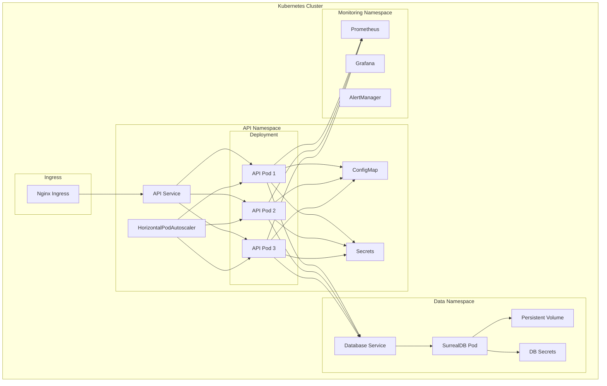

# Kubernetes Architecture

This guide details the Kubernetes deployment architecture for the PCF API, including resource organization, networking, and storage considerations.

## Deployment Overview



<!-- Future Enhancement: Interactive Kubernetes Diagram
When mdbook-interactive-diagrams plugin is available:
- Click on any resource to see its YAML definition
- Hover for resource details and current status
- Expand namespaces to see all resources
-->

## Resource Descriptions

### Ingress Layer
- **Nginx Ingress Controller**: Handles external traffic routing, SSL termination, and load balancing
- **Configuration**: Rate limiting, CORS, and security headers

### API Namespace Resources

#### Deployment
- **Replicas**: 3 (minimum for high availability)
- **Update Strategy**: RollingUpdate with maxSurge=1, maxUnavailable=0
- **Resource Limits**: CPU: 1000m, Memory: 1Gi per pod
- **Resource Requests**: CPU: 100m, Memory: 256Mi per pod

#### Service
- **Type**: ClusterIP
- **Port**: 8080 (HTTP), 9090 (Metrics)
- **Session Affinity**: None (stateless API)

#### ConfigMap
Stores non-sensitive configuration:
```yaml
apiVersion: v1
kind: ConfigMap
metadata:
  name: pcf-api-config
  namespace: api
data:
  config.yaml: |
    server:
      host: 0.0.0.0
      port: 8080
    log:
      level: info
      format: json
```

#### Secrets
Stores sensitive configuration:
```yaml
apiVersion: v1
kind: Secret
metadata:
  name: pcf-api-secrets
  namespace: api
type: Opaque
stringData:
  database-url: "surreal://..."
  jwt-secret: "..."
```

#### HorizontalPodAutoscaler
Automatically scales pods based on metrics:
```yaml
apiVersion: autoscaling/v2
kind: HorizontalPodAutoscaler
metadata:
  name: pcf-api-hpa
  namespace: api
spec:
  scaleTargetRef:
    apiVersion: apps/v1
    kind: Deployment
    name: pcf-api
  minReplicas: 3
  maxReplicas: 10
  metrics:
  - type: Resource
    resource:
      name: cpu
      target:
        type: Utilization
        averageUtilization: 70
  - type: Resource
    resource:
      name: memory
      target:
        type: Utilization
        averageUtilization: 80
```

### Data Namespace Resources

#### Database Service
- **Type**: ClusterIP (internal only)
- **Port**: 8000 (SurrealDB)

#### Persistent Volume
- **Storage Class**: Fast SSD recommended
- **Size**: 100Gi (adjust based on needs)
- **Access Mode**: ReadWriteOnce
- **Backup**: Daily snapshots

## Network Policies

Secure network communication between namespaces:

```yaml
apiVersion: networking.k8s.io/v1
kind: NetworkPolicy
metadata:
  name: api-to-database
  namespace: api
spec:
  podSelector:
    matchLabels:
      app: pcf-api
  policyTypes:
  - Egress
  egress:
  - to:
    - namespaceSelector:
        matchLabels:
          name: data
      podSelector:
        matchLabels:
          app: surrealdb
    ports:
    - protocol: TCP
      port: 8000
```

## Security Considerations

### Pod Security
- **Security Context**: Run as non-root user
- **Read-only Root Filesystem**: Enabled
- **Capabilities**: Drop all unnecessary capabilities

### RBAC
Minimal permissions for service account:
```yaml
apiVersion: rbac.authorization.k8s.io/v1
kind: Role
metadata:
  name: pcf-api-role
  namespace: api
rules:
- apiGroups: [""]
  resources: ["configmaps", "secrets"]
  verbs: ["get", "list", "watch"]
```

## Monitoring Integration

### Prometheus Scraping
Pods expose metrics on port 9090:
```yaml
metadata:
  annotations:
    prometheus.io/scrape: "true"
    prometheus.io/port: "9090"
    prometheus.io/path: "/metrics"
```

### Grafana Dashboards
- API Performance Dashboard
- Resource Usage Dashboard
- Error Rate Dashboard

## Deployment Commands

### Initial Deployment
```bash
# Create namespaces
kubectl create namespace api
kubectl create namespace data
kubectl create namespace monitoring

# Apply configurations
kubectl apply -f k8s/configmap.yaml
kubectl apply -f k8s/secrets.yaml
kubectl apply -f k8s/deployment.yaml
kubectl apply -f k8s/service.yaml
kubectl apply -f k8s/hpa.yaml
kubectl apply -f k8s/ingress.yaml
```

### Rolling Update
```bash
# Update image
kubectl set image deployment/pcf-api pcf-api=pcf-api:v2.0.0 -n api

# Check rollout status
kubectl rollout status deployment/pcf-api -n api

# Rollback if needed
kubectl rollout undo deployment/pcf-api -n api
```

## Troubleshooting

### Common Issues

1. **Pods not starting**
   - Check logs: `kubectl logs -n api deployment/pcf-api`
   - Check events: `kubectl describe pod -n api`

2. **Database connection failures**
   - Verify network policy allows egress
   - Check database service is running
   - Validate secrets are correctly mounted

3. **High memory usage**
   - Review HPA metrics
   - Consider increasing resource limits
   - Check for memory leaks in application

<!-- mdbook-interactive-diagrams:
  features:
    - resource_details: true
    - yaml_preview: true
    - kubectl_commands: true
  navigation_map:
    "Nginx Ingress": "/admin/deployment/ingress.md"
    "API Service": "/admin/deployment/service.md"
    "ConfigMap": "/admin/configuration/kubernetes.md"
    "Secrets": "/admin/configuration/secrets.md"
    "HorizontalPodAutoscaler": "/admin/deployment/scaling.md"
    "Persistent Volume": "/admin/deployment/storage.md"
-->