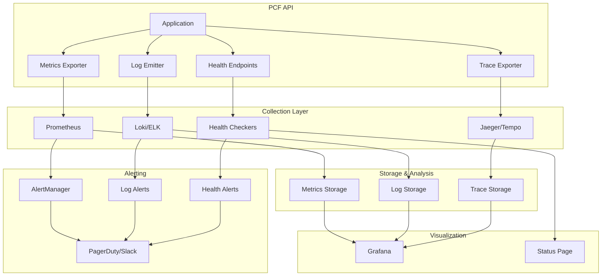

# Monitoring Overview

Comprehensive guide to monitoring the PCF API in production, covering metrics, logging, tracing, health checks, and alerting strategies.

<!-- toc -->

## Overview

Effective monitoring is crucial for maintaining the reliability, performance, and security of the PCF API. This guide covers the complete observability stack including metrics collection, distributed tracing, structured logging, health monitoring, and alerting.

## Monitoring Architecture



## Key Monitoring Components

### 1. Metrics

Real-time numerical data about system performance:

- **System Metrics**: CPU, memory, disk, network usage
- **Application Metrics**: Request rates, latencies, error rates
- **Business Metrics**: User activity, feature usage, API calls
- **Custom Metrics**: Application-specific measurements

### 2. Logging

Structured event data for debugging and audit:

- **Application Logs**: Info, warnings, errors from the API
- **Access Logs**: HTTP requests and responses
- **Audit Logs**: Security-relevant events
- **System Logs**: OS and infrastructure events

### 3. Tracing

Distributed request flow tracking:

- **Request Traces**: End-to-end request journey
- **Span Data**: Individual operation timing
- **Context Propagation**: Cross-service correlation
- **Performance Analysis**: Bottleneck identification

### 4. Health Checks

Service availability monitoring:

- **Liveness Probes**: Is the service running?
- **Readiness Probes**: Can the service handle requests?
- **Startup Probes**: Is the service initializing?
- **Dependency Checks**: Are external services available?

### 5. Alerting

Proactive notification system:

- **Threshold Alerts**: Metric-based triggers
- **Anomaly Detection**: Unusual pattern alerts
- **Log-based Alerts**: Error pattern matching
- **Escalation Policies**: Alert routing rules

## Implementation Stack

### Recommended Tools

1. **Metrics**: Prometheus + Grafana
2. **Logging**: Loki or ELK Stack
3. **Tracing**: Jaeger or Tempo
4. **Visualization**: Grafana (unified dashboards)
5. **Alerting**: AlertManager + PagerDuty

### Alternative Stacks

#### Cloud-Native (AWS)
- CloudWatch Metrics
- CloudWatch Logs
- X-Ray (tracing)
- CloudWatch Alarms

#### Cloud-Native (GCP)
- Cloud Monitoring
- Cloud Logging
- Cloud Trace
- Cloud Alerting

#### Cloud-Native (Azure)
- Azure Monitor
- Application Insights
- Log Analytics
- Azure Alerts

## Configuration

### Basic Monitoring Configuration

```toml
# config/production.toml
[monitoring]
metrics_enabled = true
metrics_path = "/metrics"
metrics_port = 9090

tracing_enabled = true
trace_sampling = 0.01  # 1% sampling

[monitoring.otel]
endpoint = "otel-collector:4317"
protocol = "grpc"
service_name = "pcf-api"
environment = "production"

[logging]
level = "info"
format = "json"
include_timestamp = true
include_trace_id = true
```

### Environment Variables

```bash
# Metrics configuration
PCF_API__MONITORING__METRICS_ENABLED=true
PCF_API__MONITORING__METRICS_PATH=/metrics

# Tracing configuration
PCF_API__MONITORING__TRACING_ENABLED=true
PCF_API__MONITORING__TRACE_SAMPLING=0.01

# OpenTelemetry configuration
PCF_API__MONITORING__OTEL__ENDPOINT=otel-collector:4317
PCF_API__MONITORING__OTEL__SERVICE_NAME=pcf-api
```

## Quick Start

### 1. Enable Monitoring

```bash
# Set monitoring configuration
export PCF_API__MONITORING__METRICS_ENABLED=true
export PCF_API__MONITORING__TRACING_ENABLED=true
export PCF_API__LOGGING__FORMAT=json

# Start the API
./pcf-api
```

### 2. Deploy Monitoring Stack

```yaml
# docker-compose.monitoring.yml
version: '3.8'

services:
  prometheus:
    image: prom/prometheus:latest
    ports:
      - "9090:9090"
    volumes:
      - ./prometheus.yml:/etc/prometheus/prometheus.yml
      - prometheus_data:/prometheus

  grafana:
    image: grafana/grafana:latest
    ports:
      - "3000:3000"
    environment:
      - GF_SECURITY_ADMIN_PASSWORD=admin
    volumes:
      - grafana_data:/var/lib/grafana

  loki:
    image: grafana/loki:latest
    ports:
      - "3100:3100"
    volumes:
      - ./loki-config.yml:/etc/loki/loki-config.yml
      - loki_data:/loki

  jaeger:
    image: jaegertracing/all-in-one:latest
    ports:
      - "16686:16686"
      - "14268:14268"
    environment:
      - COLLECTOR_OTLP_ENABLED=true

volumes:
  prometheus_data:
  grafana_data:
  loki_data:
```

### 3. Configure Prometheus

```yaml
# prometheus.yml
global:
  scrape_interval: 15s
  evaluation_interval: 15s

scrape_configs:
  - job_name: 'pcf-api'
    static_configs:
      - targets: ['pcf-api:9090']
    metrics_path: '/metrics'
```

### 4. Import Dashboards

Download and import pre-built dashboards:
- PCF API Overview Dashboard
- GraphQL Performance Dashboard
- Error Analysis Dashboard
- Resource Utilization Dashboard

## Monitoring Best Practices

### 1. Use the Four Golden Signals

Monitor these key metrics for every service:

1. **Latency**: How long requests take
2. **Traffic**: How many requests per second
3. **Errors**: Rate of failed requests
4. **Saturation**: Resource utilization

### 2. Implement SLIs/SLOs

Define Service Level Indicators and Objectives:

```yaml
# Example SLOs
availability:
  target: 99.9%  # Three nines
  window: 30d

latency:
  p99: 500ms     # 99th percentile
  p95: 200ms     # 95th percentile
  
error_rate:
  target: < 0.1%
  window: 5m
```

### 3. Use Structured Logging

```rust
// Good: Structured logging
info!(
    request_id = %request_id,
    user_id = %user_id,
    operation = "create_note",
    duration_ms = elapsed.as_millis(),
    "Request completed successfully"
);

// Bad: Unstructured logging
info!("Request {} from user {} took {} ms", request_id, user_id, elapsed);
```

### 4. Implement Trace Sampling

```toml
# Sampling strategies
[monitoring.sampling]
# Sample 100% of errors
error_sampling = 1.0

# Sample 1% of normal traffic
default_sampling = 0.01

# Sample 10% of slow requests
slow_request_sampling = 0.1
slow_request_threshold_ms = 1000
```

### 5. Set Up Effective Alerts

```yaml
# Example alert rules
groups:
  - name: pcf-api
    rules:
      - alert: HighErrorRate
        expr: rate(http_requests_total{status=~"5.."}[5m]) > 0.05
        for: 5m
        annotations:
          summary: "High error rate detected"
          
      - alert: HighLatency
        expr: histogram_quantile(0.99, http_request_duration_seconds) > 0.5
        for: 10m
        annotations:
          summary: "P99 latency above 500ms"
```

## Key Metrics to Monitor

### Application Metrics

| Metric | Type | Description |
|--------|------|-------------|
| `http_requests_total` | Counter | Total HTTP requests |
| `http_request_duration_seconds` | Histogram | Request latency |
| `http_requests_in_flight` | Gauge | Concurrent requests |
| `graphql_query_duration_seconds` | Histogram | GraphQL query time |
| `graphql_query_complexity` | Histogram | Query complexity scores |

### System Metrics

| Metric | Type | Description |
|--------|------|-------------|
| `process_cpu_seconds_total` | Counter | CPU usage |
| `process_resident_memory_bytes` | Gauge | Memory usage |
| `process_open_fds` | Gauge | Open file descriptors |
| `process_threads` | Gauge | Thread count |

### Business Metrics

| Metric | Type | Description |
|--------|------|-------------|
| `api_calls_total` | Counter | API calls by endpoint |
| `user_sessions_active` | Gauge | Active user sessions |
| `feature_usage_total` | Counter | Feature usage tracking |
| `database_queries_total` | Counter | Database query count |

## Common Monitoring Scenarios

### 1. Performance Degradation

```promql
# Check p99 latency trend
histogram_quantile(0.99, 
  rate(http_request_duration_seconds_bucket[5m])
)

# Compare with baseline
(histogram_quantile(0.99, rate(http_request_duration_seconds_bucket[5m])) 
  / histogram_quantile(0.99, rate(http_request_duration_seconds_bucket[5m] offset 1h))) > 1.5
```

### 2. Error Spike Detection

```promql
# 5xx error rate
rate(http_requests_total{status=~"5.."}[5m]) > 0.01

# Error rate change
rate(http_requests_total{status=~"5.."}[5m]) 
  / rate(http_requests_total{status=~"5.."}[5m] offset 1h) > 2
```

### 3. Resource Exhaustion

```promql
# Memory usage approaching limit
process_resident_memory_bytes / process_max_memory_bytes > 0.8

# Connection pool saturation
database_connections_active / database_connections_max > 0.9
```

## Monitoring Checklist

### Initial Setup
- [ ] Enable metrics endpoint
- [ ] Configure structured logging
- [ ] Set up distributed tracing
- [ ] Deploy monitoring infrastructure
- [ ] Import standard dashboards

### Metrics Configuration
- [ ] Application metrics enabled
- [ ] System metrics collected
- [ ] Custom business metrics defined
- [ ] Metric labels properly configured
- [ ] Retention policies set

### Logging Setup
- [ ] JSON logging enabled
- [ ] Log levels appropriate
- [ ] Sensitive data sanitization
- [ ] Log aggregation configured
- [ ] Search indices created

### Tracing Configuration
- [ ] Trace sampling configured
- [ ] Context propagation working
- [ ] Service dependencies mapped
- [ ] Performance baselines established

### Alerting Rules
- [ ] Critical alerts defined
- [ ] Warning thresholds set
- [ ] Notification channels configured
- [ ] Escalation policies created
- [ ] Alert documentation written

### Dashboards
- [ ] Overview dashboard created
- [ ] Service-specific dashboards
- [ ] SLO tracking dashboard
- [ ] Custom dashboards as needed

## Troubleshooting

### Metrics Not Appearing

```bash
# Check metrics endpoint
curl http://localhost:9090/metrics

# Verify Prometheus scraping
curl http://prometheus:9090/api/v1/targets

# Check for errors
docker logs prometheus
```

### Missing Traces

```bash
# Verify trace export
PCF_API__LOGGING__LEVEL=trace ./pcf-api

# Check OTEL collector
curl http://otel-collector:13133/

# Validate sampling rate
echo "Sampling rate: $PCF_API__MONITORING__TRACE_SAMPLING"
```

### High Cardinality Issues

```promql
# Find high cardinality metrics
topk(10, count by (__name__)({__name__=~".+"}))

# Check label cardinality
count(count by (label_name) (metric_name))
```

## Next Steps

1. **[Metrics](./metrics.md)** - Deep dive into metrics collection
2. **[Logging](./logging.md)** - Structured logging implementation
3. **[Tracing](./tracing.md)** - Distributed tracing setup
4. **[Health Checks](./health-checks.md)** - Service health monitoring
5. **[Alerting](./alerting.md)** - Alert configuration and management

## Additional Resources

- [Prometheus Best Practices](https://prometheus.io/docs/practices/)
- [OpenTelemetry Documentation](https://opentelemetry.io/docs/)
- [Grafana Dashboard Examples](https://grafana.com/grafana/dashboards/)
- [SRE Workbook](https://sre.google/workbook/)