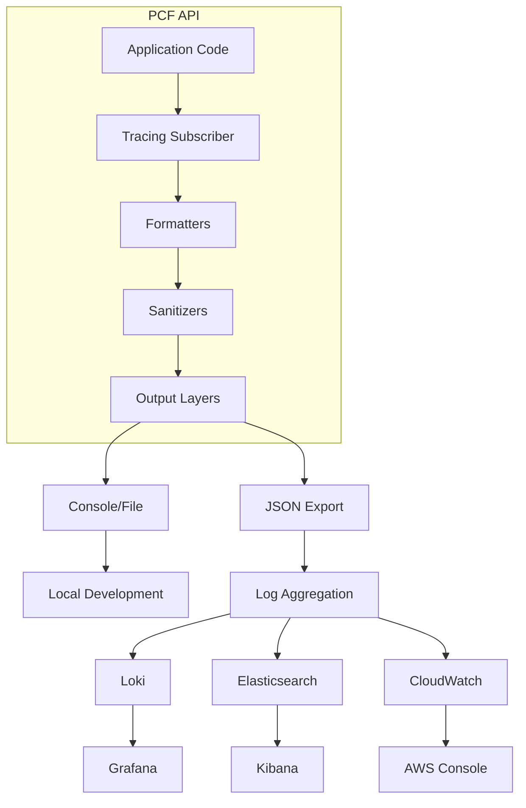

# Logging

Comprehensive guide to implementing structured logging for the PCF API, including configuration, best practices, and integration with log aggregation systems.

<!-- toc -->

## Overview

The PCF API implements structured logging using the `tracing` crate ecosystem, providing rich contextual information, automatic PII sanitization, and seamless integration with modern log aggregation platforms.

## Logging Architecture



## Configuration

### Basic Configuration

```toml
# config/production.toml
[logging]
level = "info"                    # Log level: trace, debug, info, warn, error
format = "json"                   # Format: json, pretty, compact
include_location = false          # Include file/line info
include_thread = false            # Include thread names
include_timestamp = true          # Include timestamps
timestamp_format = "rfc3339"      # Timestamp format

# Target-specific filters
target_filters = [
    "hyper=warn",                 # Reduce noise from HTTP library
    "tower=info",                 # Middleware logging
    "sqlx=debug",                 # Database query logging
]

# Sanitization settings
[logging.sanitization]
enabled = true
redact_emails = true
redact_ips = true
redact_tokens = true
custom_patterns = [
    "password=.*",
    "secret=.*"
]
```

### Environment Variables

```bash
# Basic settings
export PCF_API__LOGGING__LEVEL=info
export PCF_API__LOGGING__FORMAT=json

# Development settings
export PCF_API__LOGGING__LEVEL=debug
export PCF_API__LOGGING__FORMAT=pretty
export PCF_API__LOGGING__INCLUDE_LOCATION=true

# Fine-grained control
export RUST_LOG="pcf_api=debug,hyper=warn,tower=info"
```

## Implementation

### Setting Up Tracing

```rust
use tracing::{info, warn, error, debug, trace};
use tracing_subscriber::{
    fmt, prelude::*, EnvFilter, Registry,
    layer::SubscriberExt, util::SubscriberInitExt,
};

pub fn init_logging(config: &LoggingConfig) -> Result<()> {
    // Create env filter
    let env_filter = EnvFilter::try_from_default_env()
        .or_else(|_| EnvFilter::try_new(&config.level))
        .unwrap_or_else(|_| EnvFilter::new("info"));
    
    // Apply target filters
    let env_filter = config.target_filters.iter()
        .fold(env_filter, |filter, rule| {
            filter.add_directive(rule.parse().unwrap())
        });
    
    // Create formatter
    let fmt_layer = match config.format.as_str() {
        "json" => fmt::layer()
            .json()
            .with_current_span(true)
            .with_span_list(true)
            .boxed(),
        "pretty" => fmt::layer()
            .pretty()
            .with_thread_names(config.include_thread)
            .with_line_number(config.include_location)
            .boxed(),
        _ => fmt::layer()
            .compact()
            .boxed(),
    };
    
    // Build subscriber
    Registry::default()
        .with(env_filter)
        .with(fmt_layer)
        .with(SanitizationLayer::new(&config.sanitization))
        .init();
    
    info!(
        environment = %config.environment,
        version = %env!("CARGO_PKG_VERSION"),
        "PCF API starting"
    );
    
    Ok(())
}
```

### Structured Logging

```rust
use tracing::{info, instrument, field};
use uuid::Uuid;

#[instrument(
    name = "handle_request",
    skip(body),
    fields(
        request_id = %Uuid::new_v4(),
        method = %req.method(),
        path = %req.uri().path(),
        user_id = field::Empty,
    )
)]
pub async fn handle_request(req: Request<Body>) -> Result<Response> {
    // Set user_id if authenticated
    if let Some(user_id) = extract_user_id(&req) {
        tracing::Span::current().record("user_id", &user_id);
    }
    
    info!("Processing request");
    
    let start = Instant::now();
    let result = process_request(req).await;
    let duration = start.elapsed();
    
    match &result {
        Ok(response) => {
            info!(
                status = response.status().as_u16(),
                duration_ms = duration.as_millis(),
                "Request completed successfully"
            );
        }
        Err(error) => {
            error!(
                error = %error,
                duration_ms = duration.as_millis(),
                "Request failed"
            );
        }
    }
    
    result
}
```

### Log Levels and Usage

```rust
// TRACE: Very detailed debugging information
trace!(
    query = %sql_query,
    params = ?query_params,
    "Executing database query"
);

// DEBUG: Detailed information for debugging
debug!(
    cache_key = %key,
    hit = cache_result.is_some(),
    "Cache lookup"
);

// INFO: General informational messages
info!(
    user_id = %user_id,
    action = "login",
    "User logged in successfully"
);

// WARN: Warning messages for potentially harmful situations
warn!(
    retry_count = attempts,
    max_retries = config.max_retries,
    "Operation failed, retrying"
);

// ERROR: Error messages for serious problems
error!(
    error = %e,
    user_id = %user_id,
    "Failed to process user request"
);
```

## Sanitization

### Automatic PII Redaction

```rust
use regex::Regex;
use tracing_subscriber::Layer;

pub struct SanitizationLayer {
    email_regex: Regex,
    ip_regex: Regex,
    token_regex: Regex,
    custom_patterns: Vec<Regex>,
}

impl SanitizationLayer {
    pub fn new(config: &SanitizationConfig) -> Self {
        Self {
            email_regex: Regex::new(r"\b[A-Za-z0-9._%+-]+@[A-Za-z0-9.-]+\.[A-Z|a-z]{2,}\b").unwrap(),
            ip_regex: Regex::new(r"\b(?:[0-9]{1,3}\.){3}[0-9]{1,3}\b").unwrap(),
            token_regex: Regex::new(r"\b(Bearer\s+)[A-Za-z0-9\-._~\+\/]+=*\b").unwrap(),
            custom_patterns: config.custom_patterns.iter()
                .map(|p| Regex::new(p).unwrap())
                .collect(),
        }
    }
    
    fn sanitize(&self, message: &str) -> String {
        let mut result = message.to_string();
        
        // Redact emails
        if self.config.redact_emails {
            result = self.email_regex.replace_all(&result, "***@***.***").to_string();
        }
        
        // Redact IPs (keep subnet)
        if self.config.redact_ips {
            result = self.ip_regex.replace_all(&result, |caps: &Captures| {
                let ip = caps.get(0).unwrap().as_str();
                let parts: Vec<&str> = ip.split('.').collect();
                format!("{}.{}.x.x", parts[0], parts[1])
            }).to_string();
        }
        
        // Redact tokens
        if self.config.redact_tokens {
            result = self.token_regex.replace_all(&result, "$1[REDACTED]").to_string();
        }
        
        // Apply custom patterns
        for pattern in &self.custom_patterns {
            result = pattern.replace_all(&result, "[REDACTED]").to_string();
        }
        
        result
    }
}
```

### Safe Logging Macros

```rust
// Macro for sanitized logging
macro_rules! info_sanitized {
    ($($arg:tt)*) => {{
        let message = format!($($arg)*);
        let sanitized = $crate::logging::sanitize(&message);
        tracing::info!("{}", sanitized);
    }};
}

// Usage
info_sanitized!(
    "User {} logged in from IP {}",
    user_email,  // Will be redacted
    client_ip    // Will be partially redacted
);
```

## Context and Correlation

### Request Correlation

```rust
use tracing::{Instrument, Span};
use uuid::Uuid;

pub struct RequestId(pub String);

impl RequestId {
    pub fn new() -> Self {
        Self(Uuid::new_v4().to_string())
    }
}

// Middleware to add request ID
pub async fn request_id_middleware(
    mut req: Request,
    next: Next,
) -> Response {
    let request_id = RequestId::new();
    
    // Add to request extensions
    req.extensions_mut().insert(request_id.clone());
    
    // Create span with request ID
    let span = tracing::info_span!(
        "request",
        request_id = %request_id.0,
        method = %req.method(),
        path = %req.uri().path(),
    );
    
    // Process request within span
    async move {
        info!("Request started");
        let response = next.run(req).await;
        info!(status = %response.status(), "Request completed");
        response
    }
    .instrument(span)
    .await
}
```

### Distributed Tracing Context

```rust
use opentelemetry::trace::{TraceContextExt, Tracer};
use tracing_opentelemetry::OpenTelemetrySpanExt;

pub fn extract_trace_context(headers: &HeaderMap) -> Option<TraceContext> {
    // Extract W3C Trace Context headers
    let traceparent = headers.get("traceparent")?;
    let tracestate = headers.get("tracestate");
    
    // Parse and create context
    TraceContext::from_headers(traceparent, tracestate)
}

pub async fn handle_with_trace_context(
    req: Request,
    trace_context: Option<TraceContext>,
) -> Response {
    let span = tracing::Span::current();
    
    // Set OpenTelemetry context if available
    if let Some(context) = trace_context {
        span.set_parent(context);
    }
    
    // Add trace ID to logs
    let trace_id = span.context().span().span_context().trace_id();
    span.record("trace_id", &trace_id.to_string());
    
    // Process request
    process_request(req).await
}
```

## Log Aggregation

### Loki Integration

```yaml
# loki-config.yaml
auth_enabled: false

server:
  http_listen_port: 3100

ingester:
  lifecycler:
    address: 127.0.0.1
    ring:
      kvstore:
        store: inmemory
      replication_factor: 1

schema_config:
  configs:
    - from: 2020-10-24
      store: boltdb-shipper
      object_store: filesystem
      schema: v11
      index:
        prefix: index_
        period: 24h
```

### Promtail Configuration

```yaml
# promtail-config.yaml
server:
  http_listen_port: 9080
  grpc_listen_port: 0

positions:
  filename: /tmp/positions.yaml

clients:
  - url: http://loki:3100/loki/api/v1/push

scrape_configs:
  - job_name: pcf-api
    static_configs:
      - targets:
          - localhost
        labels:
          job: pcf-api
          __path__: /var/log/pcf-api/*.log
    
    pipeline_stages:
      # Parse JSON logs
      - json:
          expressions:
            timestamp: timestamp
            level: level
            message: message
            request_id: request_id
            user_id: user_id
            trace_id: trace_id
      
      # Set timestamp
      - timestamp:
          source: timestamp
          format: RFC3339
      
      # Set labels
      - labels:
          level:
          request_id:
      
      # Drop debug logs in production
      - match:
          selector: '{job="pcf-api"} |= "level":"debug"'
          action: drop
```

### Elasticsearch/Logstash

```ruby
# logstash.conf
input {
  file {
    path => "/var/log/pcf-api/*.log"
    start_position => "beginning"
    codec => "json"
  }
}

filter {
  # Parse JSON
  json {
    source => "message"
  }
  
  # Extract fields
  mutate {
    add_field => {
      "[@metadata][target_index]" => "pcf-api-%{+YYYY.MM.dd}"
    }
  }
  
  # Parse timestamp
  date {
    match => [ "timestamp", "ISO8601" ]
    target => "@timestamp"
  }
  
  # Add GeoIP for IPs
  geoip {
    source => "client_ip"
    target => "geoip"
  }
}

output {
  elasticsearch {
    hosts => ["elasticsearch:9200"]
    index => "%{[@metadata][target_index]}"
  }
}
```

## Querying Logs

### Loki Queries (LogQL)

```promql
# All errors in the last hour
{job="pcf-api"} |= "level":"error" | json

# Specific user's activity
{job="pcf-api"} | json | user_id="user123"

# Slow requests (>1s)
{job="pcf-api"} 
  | json 
  | duration_ms > 1000

# Error rate by endpoint
sum by (path) (
  rate({job="pcf-api"} |= "level":"error" | json | __error__="" [5m])
)

# Trace specific request
{job="pcf-api"} | json | request_id="abc-123-def"
```

### Elasticsearch Queries

```json
// Find all errors
{
  "query": {
    "bool": {
      "must": [
        { "term": { "level": "error" } },
        { "range": { "@timestamp": { "gte": "now-1h" } } }
      ]
    }
  }
}

// User activity tracking
{
  "query": {
    "bool": {
      "must": [
        { "term": { "user_id": "user123" } },
        { "range": { "@timestamp": { "gte": "now-24h" } } }
      ]
    }
  },
  "aggs": {
    "actions": {
      "terms": { "field": "action.keyword" }
    }
  }
}

// Trace distributed request
{
  "query": {
    "term": { "trace_id": "1234567890abcdef" }
  },
  "sort": [{ "@timestamp": "asc" }]
}
```

## Log Analysis

### Error Patterns

```rust
// Track error patterns
lazy_static! {
    static ref ERROR_PATTERNS: Mutex<HashMap<String, u64>> = 
        Mutex::new(HashMap::new());
}

#[instrument(skip(error))]
pub fn analyze_error(error: &AppError) {
    let pattern = match error {
        AppError::Database(_) => "database_error",
        AppError::Validation(_) => "validation_error",
        AppError::Authentication(_) => "auth_error",
        AppError::RateLimit(_) => "rate_limit_error",
        _ => "other_error",
    };
    
    let mut patterns = ERROR_PATTERNS.lock().unwrap();
    *patterns.entry(pattern.to_string()).or_insert(0) += 1;
    
    // Log pattern analysis periodically
    if patterns.values().sum::<u64>() % 100 == 0 {
        info!(
            patterns = ?patterns,
            "Error pattern analysis"
        );
    }
}
```

### Performance Analysis

```promql
# P95 latency by endpoint
histogram_quantile(0.95,
  sum by (path, le) (
    rate({job="pcf-api"} 
      | json 
      | duration_ms != "" 
      | __error__="" [5m]
    )
  )
)

# Request volume by status
sum by (status) (
  rate({job="pcf-api"} | json [5m])
)
```

## Best Practices

### 1. Use Structured Fields

```rust
// Good: Structured fields
info!(
    user_id = %user_id,
    action = "create_note",
    note_id = %note_id,
    duration_ms = elapsed.as_millis(),
    "Note created successfully"
);

// Bad: String interpolation
info!("User {} created note {} in {} ms", user_id, note_id, elapsed);
```

### 2. Consistent Field Names

```rust
// Define common fields
pub mod fields {
    pub const USER_ID: &str = "user_id";
    pub const REQUEST_ID: &str = "request_id";
    pub const DURATION_MS: &str = "duration_ms";
    pub const ERROR_CODE: &str = "error_code";
    pub const TRACE_ID: &str = "trace_id";
}

// Use consistently
info!(
    fields::USER_ID = %user_id,
    fields::DURATION_MS = duration.as_millis(),
    "Operation completed"
);
```

### 3. Appropriate Log Levels

```rust
// Log level guidelines
pub fn log_operation_result<T, E>(result: &Result<T, E>, operation: &str) 
where 
    E: std::fmt::Display,
{
    match result {
        Ok(_) => {
            // INFO for successful operations
            info!(operation = %operation, "Operation succeeded");
        }
        Err(e) => {
            // ERROR for failures that need attention
            error!(
                operation = %operation,
                error = %e,
                "Operation failed"
            );
        }
    }
}
```

### 4. Avoid Sensitive Data

```rust
// Bad: Logging sensitive data
error!(
    password = %user_password,
    credit_card = %card_number,
    "Authentication failed"
);

// Good: Log identifiers only
error!(
    user_id = %user_id,
    auth_method = "password",
    "Authentication failed"
);
```

### 5. Context Preservation

```rust
// Preserve context across async boundaries
async fn process_with_context(
    user_id: String,
    request_id: String,
) -> Result<()> {
    let span = info_span!(
        "process",
        %user_id,
        %request_id,
    );
    
    async move {
        info!("Starting processing");
        
        // Context is preserved in spawned tasks
        tokio::spawn(
            async move {
                info!("Background task started");
                // user_id and request_id are available
            }
            .instrument(info_span!("background_task"))
        );
        
        Ok(())
    }
    .instrument(span)
    .await
}
```

## Monitoring and Alerting

### Log-based Metrics

```yaml
# Prometheus rules for log metrics
groups:
  - name: log_metrics
    rules:
      - record: log_error_rate
        expr: |
          sum(rate({job="pcf-api"} |= "level":"error" [5m]))
      
      - alert: HighErrorRate
        expr: log_error_rate > 10
        for: 5m
        annotations:
          summary: "High error rate in logs"
```

### Log Retention

```yaml
# Loki retention config
limits_config:
  retention_period: 30d
  retention_stream:
    - selector: '{level="debug"}'
      period: 24h
    - selector: '{level="info"}'
      period: 7d
    - selector: '{level="warn"}'
      period: 30d
    - selector: '{level="error"}'
      period: 90d
```

## Troubleshooting

### Common Issues

1. **Missing Logs**
   ```bash
   # Check log level
   echo $PCF_API__LOGGING__LEVEL
   
   # Check if logs are being written
   tail -f /var/log/pcf-api/app.log
   
   # Verify log aggregation
   curl http://loki:3100/ready
   ```

2. **Performance Impact**
   ```rust
   // Use sampling for high-volume logs
   if rand::random::<f32>() < 0.01 {  // 1% sampling
       debug!("High frequency event");
   }
   ```

3. **Large Log Volume**
   ```yaml
   # Add filters in promtail
   - match:
       selector: '{job="pcf-api"}'
       stages:
         - drop:
             expression: '.*health check.*'
   ```

## Summary

Effective logging requires:
1. **Structured format** - Use JSON with consistent fields
2. **Appropriate levels** - Match severity to importance
3. **Rich context** - Include request IDs and trace IDs
4. **PII protection** - Automatic sanitization
5. **Efficient aggregation** - Proper indexing and retention