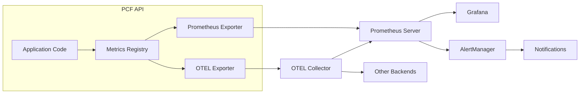

# Metrics Monitoring

Comprehensive guide to implementing and managing metrics collection for the PCF API using Prometheus and OpenTelemetry.

<!-- toc -->

## Overview

Metrics provide real-time numerical measurements of system performance and behavior. The PCF API exposes metrics in Prometheus format and supports OpenTelemetry for advanced observability scenarios.

## Metrics Architecture



## Metric Types

### 1. Counter

Monotonically increasing values (only goes up):

```rust
use prometheus::{Counter, register_counter};

lazy_static! {
    static ref HTTP_REQUESTS_TOTAL: Counter = register_counter!(
        "http_requests_total",
        "Total number of HTTP requests"
    ).unwrap();
}

// Usage
HTTP_REQUESTS_TOTAL.inc();
```

### 2. Gauge

Values that can go up or down:

```rust
use prometheus::{Gauge, register_gauge};

lazy_static! {
    static ref ACTIVE_CONNECTIONS: Gauge = register_gauge!(
        "active_connections",
        "Number of active connections"
    ).unwrap();
}

// Usage
ACTIVE_CONNECTIONS.inc();  // Connection opened
ACTIVE_CONNECTIONS.dec();  // Connection closed
ACTIVE_CONNECTIONS.set(42.0);  // Set specific value
```

### 3. Histogram

Distribution of values with buckets:

```rust
use prometheus::{Histogram, HistogramOpts, register_histogram};

lazy_static! {
    static ref HTTP_DURATION: Histogram = register_histogram!(
        HistogramOpts::new(
            "http_request_duration_seconds",
            "HTTP request latency"
        ).buckets(vec![0.005, 0.01, 0.025, 0.05, 0.1, 0.25, 0.5, 1.0, 2.5, 5.0])
    ).unwrap();
}

// Usage
let timer = HTTP_DURATION.start_timer();
// ... handle request ...
timer.observe_duration();
```

### 4. Summary

Similar to histogram but calculates quantiles:

```rust
use prometheus::{Summary, SummaryOpts, register_summary};

lazy_static! {
    static ref QUERY_DURATION: Summary = register_summary!(
        SummaryOpts::new(
            "graphql_query_duration_seconds",
            "GraphQL query execution time"
        ).quantile(0.5, 0.01)
         .quantile(0.9, 0.01)
         .quantile(0.99, 0.001)
    ).unwrap();
}
```

## Core Metrics Implementation

### HTTP Metrics

```rust
use prometheus::{
    register_counter_vec, register_histogram_vec, register_gauge,
    CounterVec, HistogramVec, Gauge
};

lazy_static! {
    // Request counter with labels
    static ref HTTP_REQUESTS: CounterVec = register_counter_vec!(
        "http_requests_total",
        "Total HTTP requests",
        &["method", "endpoint", "status"]
    ).unwrap();
    
    // Request duration histogram
    static ref HTTP_DURATION: HistogramVec = register_histogram_vec!(
        "http_request_duration_seconds",
        "HTTP request duration",
        &["method", "endpoint", "status"],
        vec![0.001, 0.005, 0.01, 0.05, 0.1, 0.5, 1.0, 5.0]
    ).unwrap();
    
    // In-flight requests
    static ref HTTP_IN_FLIGHT: Gauge = register_gauge!(
        "http_requests_in_flight",
        "Number of in-flight HTTP requests"
    ).unwrap();
}

// Middleware implementation
pub async fn metrics_middleware(
    req: Request,
    next: Next,
) -> Response {
    let method = req.method().to_string();
    let path = req.uri().path().to_string();
    
    HTTP_IN_FLIGHT.inc();
    let timer = Instant::now();
    
    let response = next.run(req).await;
    
    let status = response.status().as_u16().to_string();
    let labels = [method.as_str(), path.as_str(), status.as_str()];
    
    HTTP_REQUESTS.with_label_values(&labels).inc();
    HTTP_DURATION
        .with_label_values(&labels)
        .observe(timer.elapsed().as_secs_f64());
    
    HTTP_IN_FLIGHT.dec();
    
    response
}
```

### GraphQL Metrics

```rust
use async_graphql::extensions::{Extension, ExtensionContext, ExtensionFactory, NextResolve};

pub struct MetricsExtension;

impl ExtensionFactory for MetricsExtension {
    fn create(&self) -> Arc<dyn Extension> {
        Arc::new(MetricsExtensionImpl::default())
    }
}

#[derive(Default)]
struct MetricsExtensionImpl {
    query_counter: CounterVec,
    query_duration: HistogramVec,
    query_complexity: Histogram,
    field_resolver_duration: HistogramVec,
}

#[async_trait::async_trait]
impl Extension for MetricsExtensionImpl {
    async fn resolve(
        &self,
        ctx: &ExtensionContext<'_>,
        info: ResolveInfo<'_>,
        next: NextResolve<'_>,
    ) -> ServerResult<Option<Value>> {
        let field_name = info.path_node.field_name();
        let parent_type = info.parent_type.name();
        
        let timer = self.field_resolver_duration
            .with_label_values(&[parent_type, field_name])
            .start_timer();
        
        let result = next.run(ctx, info).await;
        
        timer.observe_duration();
        
        result
    }
    
    async fn execute(
        &self,
        ctx: &ExtensionContext<'_>,
        operation_name: Option<&str>,
        next: NextExecute<'_>,
    ) -> Response {
        let op_name = operation_name.unwrap_or("unnamed");
        let op_type = ctx.schema_env.registry.query_type.name();
        
        self.query_counter
            .with_label_values(&[op_type, op_name])
            .inc();
        
        let timer = self.query_duration
            .with_label_values(&[op_type, op_name])
            .start_timer();
        
        let complexity = calculate_query_complexity(ctx);
        self.query_complexity.observe(complexity as f64);
        
        let result = next.run(ctx, operation_name).await;
        
        timer.observe_duration();
        
        result
    }
}
```

### Database Metrics

```rust
lazy_static! {
    // Connection pool metrics
    static ref DB_CONNECTIONS_ACTIVE: Gauge = register_gauge!(
        "database_connections_active",
        "Active database connections"
    ).unwrap();
    
    static ref DB_CONNECTIONS_IDLE: Gauge = register_gauge!(
        "database_connections_idle",
        "Idle database connections"
    ).unwrap();
    
    // Query metrics
    static ref DB_QUERIES: CounterVec = register_counter_vec!(
        "database_queries_total",
        "Total database queries",
        &["operation", "table", "status"]
    ).unwrap();
    
    static ref DB_QUERY_DURATION: HistogramVec = register_histogram_vec!(
        "database_query_duration_seconds",
        "Database query duration",
        &["operation", "table"],
        vec![0.001, 0.01, 0.1, 1.0, 10.0]
    ).unwrap();
}

// Database instrumentation
impl DatabaseService {
    pub async fn query<T>(&self, query: Query) -> Result<T> {
        let operation = query.operation_type();
        let table = query.table_name();
        
        let timer = DB_QUERY_DURATION
            .with_label_values(&[operation, table])
            .start_timer();
        
        let result = self.execute_query(query).await;
        
        timer.observe_duration();
        
        let status = if result.is_ok() { "success" } else { "error" };
        DB_QUERIES
            .with_label_values(&[operation, table, status])
            .inc();
        
        // Update connection pool metrics
        let pool_state = self.pool.state();
        DB_CONNECTIONS_ACTIVE.set(pool_state.active as f64);
        DB_CONNECTIONS_IDLE.set(pool_state.idle as f64);
        
        result
    }
}
```

### Business Metrics

```rust
lazy_static! {
    // User activity
    static ref USER_LOGINS: CounterVec = register_counter_vec!(
        "user_logins_total",
        "Total user logins",
        &["auth_method", "status"]
    ).unwrap();
    
    static ref ACTIVE_SESSIONS: Gauge = register_gauge!(
        "user_sessions_active",
        "Number of active user sessions"
    ).unwrap();
    
    // Feature usage
    static ref FEATURE_USAGE: CounterVec = register_counter_vec!(
        "feature_usage_total",
        "Feature usage tracking",
        &["feature", "user_type"]
    ).unwrap();
    
    // API usage
    static ref API_CALLS: CounterVec = register_counter_vec!(
        "api_calls_total",
        "API calls by operation",
        &["operation", "client_type"]
    ).unwrap();
}

// Track user login
pub async fn track_login(auth_method: &str, success: bool) {
    let status = if success { "success" } else { "failure" };
    USER_LOGINS
        .with_label_values(&[auth_method, status])
        .inc();
    
    if success {
        ACTIVE_SESSIONS.inc();
    }
}

// Track feature usage
pub fn track_feature_usage(feature: &str, user_type: &str) {
    FEATURE_USAGE
        .with_label_values(&[feature, user_type])
        .inc();
}
```

## Metrics Endpoint

### Configuration

```toml
[monitoring]
metrics_enabled = true
metrics_path = "/metrics"
metrics_port = 9090  # Separate port for metrics

[monitoring.metrics]
include_process_metrics = true
include_go_metrics = false  # Not applicable for Rust
namespace = "pcf_api"
```

### Implementation

```rust
use prometheus::{Encoder, TextEncoder};
use axum::{routing::get, Router};

pub fn metrics_router() -> Router {
    Router::new()
        .route("/metrics", get(metrics_handler))
}

async fn metrics_handler() -> impl IntoResponse {
    let encoder = TextEncoder::new();
    let metric_families = prometheus::gather();
    
    let mut buffer = Vec::new();
    encoder.encode(&metric_families, &mut buffer)
        .expect("Failed to encode metrics");
    
    Response::builder()
        .header(CONTENT_TYPE, encoder.format_type())
        .body(buffer)
        .unwrap()
}

// Separate metrics server
pub async fn start_metrics_server(config: &Config) {
    let app = metrics_router();
    
    let addr = SocketAddr::from(([0, 0, 0, 0], config.monitoring.metrics_port));
    
    info!("Metrics server listening on {}", addr);
    
    axum::Server::bind(&addr)
        .serve(app.into_make_service())
        .await
        .expect("Failed to start metrics server");
}
```

## Custom Metrics

### Creating Custom Metrics

```rust
use prometheus::{register_histogram_opts, register_int_counter_vec};

// Custom histogram with specific buckets
lazy_static! {
    static ref CACHE_HIT_RATIO: Histogram = register_histogram_opts!(
        histogram_opts!(
            "cache_hit_ratio",
            "Cache hit ratio",
            vec![0.0, 0.1, 0.2, 0.3, 0.4, 0.5, 0.6, 0.7, 0.8, 0.9, 1.0]
        )
    ).unwrap();
    
    // Custom counter with multiple labels
    static ref VALIDATION_ERRORS: IntCounterVec = register_int_counter_vec!(
        "validation_errors_total",
        "Input validation errors",
        &["field", "error_type", "endpoint"]
    ).unwrap();
}

// Usage
pub fn record_cache_access(hit: bool, total: u64) {
    let ratio = if total > 0 {
        hit as f64 / total as f64
    } else {
        0.0
    };
    CACHE_HIT_RATIO.observe(ratio);
}

pub fn record_validation_error(field: &str, error_type: &str, endpoint: &str) {
    VALIDATION_ERRORS
        .with_label_values(&[field, error_type, endpoint])
        .inc();
}
```

### Metric Naming Conventions

Follow Prometheus naming best practices:

```rust
// Good metric names
http_requests_total                    // Counter suffix: _total
http_request_duration_seconds          // Unit suffix: _seconds
process_resident_memory_bytes          // Unit suffix: _bytes
database_connections_active            // Gauge: descriptive name

// Bad metric names
httpRequests                          // Use snake_case
request_time                          // Missing unit
db_conns                             // Too abbreviated
api.requests.count                   // Don't use dots
```

## Prometheus Configuration

### Basic Scrape Config

```yaml
# prometheus.yml
global:
  scrape_interval: 15s
  evaluation_interval: 15s
  external_labels:
    environment: 'production'
    region: 'us-east-1'

scrape_configs:
  - job_name: 'pcf-api'
    static_configs:
      - targets: ['pcf-api-1:9090', 'pcf-api-2:9090']
        labels:
          service: 'pcf-api'
          
    # Scrape main metrics endpoint
    metrics_path: '/metrics'
    
    # Additional parameters
    params:
      format: ['prometheus']
    
    # Scrape timeout
    scrape_timeout: 10s
    
    # Honor timestamps
    honor_timestamps: true
```

### Service Discovery

```yaml
# Kubernetes service discovery
scrape_configs:
  - job_name: 'pcf-api-k8s'
    kubernetes_sd_configs:
      - role: pod
        namespaces:
          names: ['production']
    
    relabel_configs:
      - source_labels: [__meta_kubernetes_pod_annotation_prometheus_io_scrape]
        action: keep
        regex: true
      - source_labels: [__meta_kubernetes_pod_annotation_prometheus_io_path]
        action: replace
        target_label: __metrics_path__
        regex: (.+)
      - source_labels: [__address__, __meta_kubernetes_pod_annotation_prometheus_io_port]
        action: replace
        regex: ([^:]+)(?::\d+)?;(\d+)
        replacement: $1:$2
        target_label: __address__
```

## Grafana Dashboards

### API Overview Dashboard

```json
{
  "dashboard": {
    "title": "PCF API Overview",
    "panels": [
      {
        "title": "Request Rate",
        "targets": [{
          "expr": "sum(rate(http_requests_total[5m])) by (method)"
        }]
      },
      {
        "title": "Error Rate",
        "targets": [{
          "expr": "sum(rate(http_requests_total{status=~\"5..\"}[5m])) / sum(rate(http_requests_total[5m]))"
        }]
      },
      {
        "title": "P99 Latency",
        "targets": [{
          "expr": "histogram_quantile(0.99, rate(http_request_duration_seconds_bucket[5m]))"
        }]
      },
      {
        "title": "Active Connections",
        "targets": [{
          "expr": "http_requests_in_flight"
        }]
      }
    ]
  }
}
```

### GraphQL Performance Dashboard

```json
{
  "panels": [
    {
      "title": "Query Rate by Type",
      "targets": [{
        "expr": "sum(rate(graphql_queries_total[5m])) by (operation_type)"
      }]
    },
    {
      "title": "Query Complexity Distribution",
      "targets": [{
        "expr": "histogram_quantile(0.99, graphql_query_complexity_bucket)"
      }]
    },
    {
      "title": "Field Resolver Performance",
      "targets": [{
        "expr": "topk(10, sum(rate(graphql_field_duration_seconds_sum[5m])) by (field))"
      }]
    }
  ]
}
```

## Alerting Rules

### Prometheus Alert Rules

```yaml
# alerts.yml
groups:
  - name: pcf-api
    interval: 30s
    rules:
      # High error rate
      - alert: HighErrorRate
        expr: |
          (sum(rate(http_requests_total{status=~"5.."}[5m])) 
           / sum(rate(http_requests_total[5m]))) > 0.05
        for: 5m
        labels:
          severity: critical
          service: pcf-api
        annotations:
          summary: "High error rate on {{ $labels.instance }}"
          description: "Error rate is {{ $value | humanizePercentage }}"
      
      # High latency
      - alert: HighLatency
        expr: |
          histogram_quantile(0.99, 
            sum(rate(http_request_duration_seconds_bucket[5m])) by (le)
          ) > 1.0
        for: 10m
        labels:
          severity: warning
        annotations:
          summary: "High P99 latency"
          description: "P99 latency is {{ $value }}s"
      
      # Database connection pool exhaustion
      - alert: DatabasePoolExhaustion
        expr: |
          (database_connections_active / database_connections_max) > 0.9
        for: 5m
        labels:
          severity: critical
        annotations:
          summary: "Database connection pool near exhaustion"
          description: "{{ $value | humanizePercentage }} of connections in use"
```

## Performance Optimization

### Metric Cardinality Management

```rust
// Limit label cardinality
lazy_static! {
    static ref PATH_NORMALIZER: HashMap<&'static str, &'static str> = {
        let mut m = HashMap::new();
        m.insert("/api/user/123", "/api/user/{id}");
        m.insert("/api/notes/456", "/api/notes/{id}");
        m
    };
}

fn normalize_path(path: &str) -> &str {
    PATH_NORMALIZER.get(path).unwrap_or(&path)
}

// Use normalized paths in metrics
let normalized_path = normalize_path(req.uri().path());
HTTP_REQUESTS
    .with_label_values(&[method, normalized_path, status])
    .inc();
```

### Metric Batching

```rust
use prometheus::core::{AtomicU64, GenericCounter};

// Batch counter updates
pub struct BatchedCounter {
    counter: GenericCounter<AtomicU64>,
    local_count: AtomicU64,
    flush_interval: Duration,
}

impl BatchedCounter {
    pub fn inc(&self) {
        self.local_count.fetch_add(1, Ordering::Relaxed);
    }
    
    async fn flush_loop(self: Arc<Self>) {
        let mut interval = tokio::time::interval(self.flush_interval);
        
        loop {
            interval.tick().await;
            
            let count = self.local_count.swap(0, Ordering::Relaxed);
            if count > 0 {
                self.counter.inc_by(count);
            }
        }
    }
}
```

## Monitoring Best Practices

### 1. Use Appropriate Metric Types

```rust
// Counter for cumulative values
static ref REQUESTS_TOTAL: Counter = register_counter!(...);

// Gauge for current state
static ref QUEUE_SIZE: Gauge = register_gauge!(...);

// Histogram for distributions
static ref RESPONSE_TIME: Histogram = register_histogram!(...);
```

### 2. Label Best Practices

```rust
// Good: Low cardinality labels
.with_label_values(&["GET", "/api/users", "200"])

// Bad: High cardinality labels
.with_label_values(&[user_id, timestamp, session_id])

// Good: Bounded label values
let status_class = match status {
    200..=299 => "2xx",
    300..=399 => "3xx",
    400..=499 => "4xx",
    500..=599 => "5xx",
    _ => "unknown"
};
```

### 3. Resource Monitoring

```rust
// Monitor resource usage
lazy_static! {
    static ref MEMORY_USAGE: Gauge = register_gauge!(
        "process_resident_memory_bytes",
        "Resident memory in bytes"
    ).unwrap();
}

// Update periodically
tokio::spawn(async {
    let mut interval = tokio::time::interval(Duration::from_secs(10));
    
    loop {
        interval.tick().await;
        
        if let Ok(memory) = sys_info::mem_info() {
            MEMORY_USAGE.set((memory.total - memory.free) as f64);
        }
    }
});
```

## Troubleshooting

### Common Issues

1. **Metrics not appearing in Prometheus**
   ```bash
   # Check if metrics endpoint is accessible
   curl http://pcf-api:9090/metrics
   
   # Check Prometheus targets
   curl http://prometheus:9090/api/v1/targets
   ```

2. **High cardinality warnings**
   ```promql
   # Find high cardinality metrics
   topk(10, count by (__name__)({__name__=~".+"}))
   ```

3. **Missing labels**
   ```rust
   // Ensure all label values are provided
   let labels = [
       method.as_deref().unwrap_or("unknown"),
       path.as_deref().unwrap_or("unknown"),
       status.as_deref().unwrap_or("unknown"),
   ];
   ```

## Summary

Effective metrics monitoring requires:
1. **Comprehensive coverage** - Monitor all critical paths
2. **Appropriate granularity** - Balance detail with cardinality
3. **Consistent naming** - Follow Prometheus conventions
4. **Efficient implementation** - Minimize performance impact
5. **Actionable alerts** - Focus on user-impacting issues