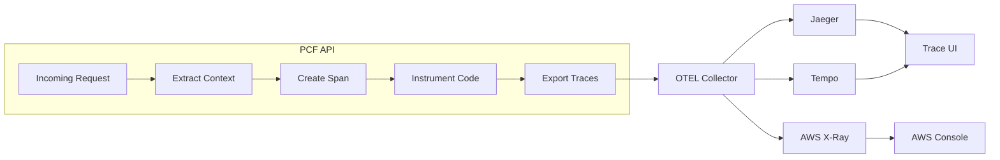

# Distributed Tracing

Comprehensive guide to implementing distributed tracing for the PCF API using OpenTelemetry and integration with various tracing backends.

<!-- toc -->

## Overview

Distributed tracing provides end-to-end visibility into requests as they flow through the PCF API and its dependencies. Using OpenTelemetry (OTEL) standards, the API can export traces to various backends like Jaeger, Tempo, or cloud-native solutions.

## Tracing Architecture



## Core Concepts

### Traces
A trace represents the entire journey of a request through the system, consisting of multiple spans.

### Spans
A span represents a single operation within a trace, containing:
- Operation name
- Start and end timestamps
- Attributes (key-value pairs)
- Events (timestamped annotations)
- Links to other spans
- Status (ok/error)

### Context Propagation
Trace context is propagated between services using W3C Trace Context headers:
- `traceparent`: Contains trace ID, span ID, and flags
- `tracestate`: Vendor-specific trace information

## Implementation

### Setting Up OpenTelemetry

```rust
use opentelemetry::{
    global, sdk::{propagation::TraceContextPropagator, trace, Resource},
    KeyValue, runtime::Tokio,
};
use opentelemetry_otlp::{WithExportConfig, ExportConfig};
use tracing_subscriber::{layer::SubscriberExt, util::SubscriberInitExt};

pub fn init_tracing(config: &TracingConfig) -> Result<()> {
    // Configure trace propagation
    global::set_text_map_propagator(TraceContextPropagator::new());
    
    // Create OTLP exporter
    let otlp_exporter = opentelemetry_otlp::new_exporter()
        .tonic()
        .with_endpoint(&config.otel.endpoint)
        .with_timeout(Duration::from_secs(config.otel.timeout))
        .with_metadata(MetadataMap::from_headers(config.otel.headers.clone()));
    
    // Configure trace provider
    let trace_config = trace::config()
        .with_sampler(create_sampler(&config.sampling))
        .with_resource(Resource::new(vec![
            KeyValue::new("service.name", config.otel.service_name.clone()),
            KeyValue::new("service.version", env!("CARGO_PKG_VERSION")),
            KeyValue::new("deployment.environment", config.environment.clone()),
        ]));
    
    // Build tracer
    let tracer = opentelemetry_otlp::new_pipeline()
        .tracing()
        .with_exporter(otlp_exporter)
        .with_trace_config(trace_config)
        .install_batch(Tokio)?;
    
    // Create tracing layer
    let telemetry = tracing_opentelemetry::layer().with_tracer(tracer);
    
    // Initialize subscriber
    tracing_subscriber::registry()
        .with(telemetry)
        .with(tracing_subscriber::fmt::layer())
        .init();
    
    Ok(())
}
```

### Creating a Custom Sampler

```rust
use opentelemetry::sdk::trace::{Sampler, SamplingDecision, SamplingResult};
use opentelemetry::trace::{TraceContextExt, TraceFlags, TraceId};

pub struct AdaptiveSampler {
    default_rate: f64,
    error_rate: f64,
    slow_request_rate: f64,
    slow_threshold_ms: u64,
}

impl Sampler for AdaptiveSampler {
    fn should_sample(
        &self,
        parent_context: Option<&Context>,
        trace_id: TraceId,
        _name: &str,
        _span_kind: &SpanKind,
        attributes: &[KeyValue],
        _links: &[Link],
    ) -> SamplingResult {
        // Always sample if parent was sampled
        if let Some(parent) = parent_context {
            if parent.span().span_context().is_sampled() {
                return SamplingResult {
                    decision: SamplingDecision::RecordAndSample,
                    attributes: vec![],
                    trace_state: parent.span().span_context().trace_state().clone(),
                };
            }
        }
        
        // Sample errors at higher rate
        if attributes.iter().any(|kv| kv.key.as_str() == "error" && kv.value.as_bool() == Some(true)) {
            if should_sample_probability(trace_id, self.error_rate) {
                return SamplingResult {
                    decision: SamplingDecision::RecordAndSample,
                    attributes: vec![KeyValue::new("sampling.reason", "error")],
                    trace_state: Default::default(),
                };
            }
        }
        
        // Sample slow requests
        if let Some(duration) = attributes.iter()
            .find(|kv| kv.key.as_str() == "duration_ms")
            .and_then(|kv| kv.value.as_i64())
        {
            if duration as u64 > self.slow_threshold_ms {
                if should_sample_probability(trace_id, self.slow_request_rate) {
                    return SamplingResult {
                        decision: SamplingDecision::RecordAndSample,
                        attributes: vec![KeyValue::new("sampling.reason", "slow")],
                        trace_state: Default::default(),
                    };
                }
            }
        }
        
        // Default sampling
        if should_sample_probability(trace_id, self.default_rate) {
            SamplingResult {
                decision: SamplingDecision::RecordAndSample,
                attributes: vec![KeyValue::new("sampling.reason", "default")],
                trace_state: Default::default(),
            }
        } else {
            SamplingResult {
                decision: SamplingDecision::Drop,
                attributes: vec![],
                trace_state: Default::default(),
            }
        }
    }
}

fn should_sample_probability(trace_id: TraceId, rate: f64) -> bool {
    if rate >= 1.0 {
        return true;
    }
    if rate <= 0.0 {
        return false;
    }
    
    // Use trace ID for consistent sampling
    let bytes = trace_id.to_bytes();
    let hash = u64::from_be_bytes([
        bytes[0], bytes[1], bytes[2], bytes[3],
        bytes[4], bytes[5], bytes[6], bytes[7],
    ]);
    
    (hash as f64 / u64::MAX as f64) < rate
}
```

### Instrumenting HTTP Requests

```rust
use axum::{extract::Request, middleware::Next, response::Response};
use opentelemetry::trace::{Span, StatusCode, TraceContextExt};
use tracing::{field, Instrument};

pub async fn tracing_middleware(
    request: Request,
    next: Next,
) -> Response {
    // Extract trace context from headers
    let parent_context = extract_context(request.headers());
    
    // Create span
    let span = tracing::info_span!(
        "http.request",
        otel.name = %format!("{} {}", request.method(), request.uri().path()),
        http.method = %request.method(),
        http.target = %request.uri().path(),
        http.host = ?request.headers().get("host"),
        http.scheme = "http",
        http.status_code = field::Empty,
        http.request.body.size = field::Empty,
        http.response.body.size = field::Empty,
        otel.kind = "server",
        otel.status_code = field::Empty,
    );
    
    // Record request size if available
    if let Some(content_length) = request.headers()
        .get("content-length")
        .and_then(|v| v.to_str().ok())
        .and_then(|v| v.parse::<i64>().ok())
    {
        span.record("http.request.body.size", content_length);
    }
    
    // Process request
    let response = async move {
        let start = Instant::now();
        
        // Add trace context to request extensions
        request.extensions_mut().insert(parent_context.clone());
        
        // Call next middleware
        let response = next.run(request).await;
        
        // Record response details
        let status = response.status();
        span.record("http.status_code", status.as_u16());
        
        if status.is_server_error() {
            span.record("otel.status_code", "ERROR");
        } else {
            span.record("otel.status_code", "OK");
        }
        
        // Record response size
        if let Some(size) = response.headers()
            .get("content-length")
            .and_then(|v| v.to_str().ok())
            .and_then(|v| v.parse::<i64>().ok())
        {
            span.record("http.response.body.size", size);
        }
        
        // Add server timing header
        let duration = start.elapsed();
        response.headers_mut().insert(
            "server-timing",
            format!("app;dur={}", duration.as_millis()).parse().unwrap(),
        );
        
        response
    }
    .instrument(span.clone())
    .with_current_context()
    .await;
    
    response
}
```

### Instrumenting GraphQL Operations

```rust
use async_graphql::{
    extensions::{Extension, ExtensionContext, ExtensionFactory},
    Value, Variables,
};
use opentelemetry::trace::{Span, Tracer};

pub struct TracingExtension;

impl ExtensionFactory for TracingExtension {
    fn create(&self) -> Arc<dyn Extension> {
        Arc::new(TracingExtensionImpl {
            tracer: global::tracer("graphql"),
        })
    }
}

struct TracingExtensionImpl {
    tracer: global::BoxedTracer,
}

#[async_trait]
impl Extension for TracingExtensionImpl {
    async fn parse_query(
        &self,
        ctx: &ExtensionContext<'_>,
        query: &str,
        variables: &Variables,
        next: NextParseQuery<'_>,
    ) -> ServerResult<ExecutableDocument> {
        let span = self.tracer
            .span_builder("graphql.parse")
            .with_attributes(vec![
                KeyValue::new("graphql.document", query.to_string()),
                KeyValue::new("graphql.variables", serde_json::to_string(variables).unwrap()),
            ])
            .start(&self.tracer);
        
        let _guard = Context::current().with_span(span);
        
        next.run(ctx, query, variables).await
    }
    
    async fn execute(
        &self,
        ctx: &ExtensionContext<'_>,
        operation_name: Option<&str>,
        next: NextExecute<'_>,
    ) -> Response {
        let span = self.tracer
            .span_builder("graphql.execute")
            .with_attributes(vec![
                KeyValue::new("graphql.operation.name", operation_name.unwrap_or("anonymous")),
                KeyValue::new("graphql.operation.type", ctx.operation.node.ty.to_string()),
            ])
            .start(&self.tracer);
        
        let _guard = Context::current().with_span(span);
        
        let start = Instant::now();
        let response = next.run(ctx, operation_name).await;
        let duration = start.elapsed();
        
        // Record metrics
        if response.errors.is_empty() {
            span.set_status(StatusCode::Ok, "");
        } else {
            span.set_status(StatusCode::Error, "GraphQL errors");
            span.set_attribute(KeyValue::new(
                "graphql.errors",
                serde_json::to_string(&response.errors).unwrap(),
            ));
        }
        
        span.set_attribute(KeyValue::new("graphql.duration_ms", duration.as_millis() as i64));
        
        response
    }
    
    async fn resolve(
        &self,
        ctx: &ExtensionContext<'_>,
        info: ResolveInfo<'_>,
        next: NextResolve<'_>,
    ) -> ServerResult<Option<Value>> {
        let span = self.tracer
            .span_builder(&format!("graphql.resolve.{}", info.path_node))
            .with_attributes(vec![
                KeyValue::new("graphql.field.name", info.field_name.to_string()),
                KeyValue::new("graphql.field.type", info.return_type.to_string()),
                KeyValue::new("graphql.field.path", info.path_node.to_string()),
            ])
            .start(&self.tracer);
        
        let _guard = Context::current().with_span(span);
        
        next.run(ctx, info).await
    }
}
```

### Instrumenting Database Operations

```rust
use sqlx::{Executor, Postgres};
use opentelemetry::trace::{Span, StatusCode};

pub struct TracedDatabase {
    pool: PgPool,
}

impl TracedDatabase {
    pub async fn query<'a, T>(&self, query: &'a str, args: &'a [&'a dyn ToSql]) -> Result<Vec<T>> 
    where
        T: for<'r> FromRow<'r, PgRow> + Send + Unpin,
    {
        let tracer = global::tracer("database");
        let mut span = tracer
            .span_builder("db.query")
            .with_attributes(vec![
                KeyValue::new("db.system", "postgresql"),
                KeyValue::new("db.statement", sanitize_query(query)),
                KeyValue::new("db.operation", extract_operation(query)),
            ])
            .start(&tracer);
        
        let start = Instant::now();
        let result = sqlx::query_as::<_, T>(query)
            .fetch_all(&self.pool)
            .await;
        
        let duration = start.elapsed();
        span.set_attribute(KeyValue::new("db.duration_ms", duration.as_millis() as i64));
        
        match &result {
            Ok(rows) => {
                span.set_status(StatusCode::Ok, "");
                span.set_attribute(KeyValue::new("db.rows_affected", rows.len() as i64));
            }
            Err(e) => {
                span.set_status(StatusCode::Error, e.to_string());
                span.record_error(&e);
            }
        }
        
        result
    }
}

fn sanitize_query(query: &str) -> String {
    // Remove sensitive values from query
    let mut sanitized = query.to_string();
    
    // Replace string literals
    sanitized = regex::Regex::new(r"'[^']*'")
        .unwrap()
        .replace_all(&sanitized, "'?'")
        .to_string();
    
    // Replace numeric literals
    sanitized = regex::Regex::new(r"\b\d+\b")
        .unwrap()
        .replace_all(&sanitized, "?")
        .to_string();
    
    sanitized
}

fn extract_operation(query: &str) -> &'static str {
    let query_lower = query.to_lowercase();
    if query_lower.starts_with("select") {
        "SELECT"
    } else if query_lower.starts_with("insert") {
        "INSERT"
    } else if query_lower.starts_with("update") {
        "UPDATE"
    } else if query_lower.starts_with("delete") {
        "DELETE"
    } else {
        "OTHER"
    }
}
```

### Context Propagation

```rust
use opentelemetry::propagation::{Extractor, Injector, TextMapPropagator};
use axum::http::HeaderMap;

// Extract trace context from incoming request
pub fn extract_context(headers: &HeaderMap) -> Context {
    let extractor = HeaderExtractor(headers);
    global::get_text_map_propagator(|propagator| {
        propagator.extract(&extractor)
    })
}

// Inject trace context into outgoing request
pub fn inject_context(context: &Context, headers: &mut HeaderMap) {
    let mut injector = HeaderInjector(headers);
    global::get_text_map_propagator(|propagator| {
        propagator.inject_context(context, &mut injector)
    });
}

struct HeaderExtractor<'a>(&'a HeaderMap);

impl<'a> Extractor for HeaderExtractor<'a> {
    fn get(&self, key: &str) -> Option<&str> {
        self.0.get(key).and_then(|v| v.to_str().ok())
    }
    
    fn keys(&self) -> Vec<&str> {
        self.0.keys().map(|k| k.as_str()).collect()
    }
}

struct HeaderInjector<'a>(&'a mut HeaderMap);

impl<'a> Injector for HeaderInjector<'a> {
    fn set(&mut self, key: &str, value: String) {
        if let Ok(header_name) = HeaderName::from_str(key) {
            if let Ok(header_value) = HeaderValue::from_str(&value) {
                self.0.insert(header_name, header_value);
            }
        }
    }
}
```

## Configuration

### Basic Configuration

```toml
[monitoring]
tracing_enabled = true
trace_sampling = 0.01  # 1% default sampling

[monitoring.sampling]
default_rate = 0.01
error_rate = 1.0      # 100% sampling for errors
slow_request_rate = 0.1
slow_threshold_ms = 1000

[monitoring.otel]
endpoint = "http://otel-collector:4317"
protocol = "grpc"
timeout = 10
service_name = "pcf-api"
environment = "production"

[monitoring.otel.headers]
authorization = "Bearer ${OTEL_AUTH_TOKEN}"
```

### Environment Variables

```bash
# Basic OTEL configuration
export OTEL_EXPORTER_OTLP_ENDPOINT=http://otel-collector:4317
export OTEL_EXPORTER_OTLP_PROTOCOL=grpc
export OTEL_SERVICE_NAME=pcf-api
export OTEL_RESOURCE_ATTRIBUTES="deployment.environment=production,service.version=1.0.0"

# Sampling configuration
export PCF_API__MONITORING__TRACE_SAMPLING=0.01
export PCF_API__MONITORING__SAMPLING__ERROR_RATE=1.0
```

## Collector Configuration

### OpenTelemetry Collector

```yaml
# otel-collector-config.yaml
receivers:
  otlp:
    protocols:
      grpc:
        endpoint: 0.0.0.0:4317
      http:
        endpoint: 0.0.0.0:4318

processors:
  batch:
    timeout: 1s
    send_batch_size: 1024
    
  memory_limiter:
    check_interval: 1s
    limit_mib: 512
    
  attributes:
    actions:
      - key: environment
        from_context: "deployment.environment"
        action: insert
      - key: http.user_agent
        action: delete  # Remove sensitive data
        
  tail_sampling:
    policies:
      - name: errors-policy
        type: status_code
        status_code: {status_codes: [ERROR]}
      - name: slow-traces-policy
        type: latency
        latency: {threshold_ms: 1000}
      - name: probabilistic-policy
        type: probabilistic
        probabilistic: {sampling_percentage: 1}

exporters:
  jaeger:
    endpoint: jaeger:14250
    tls:
      insecure: true
      
  tempo:
    endpoint: tempo:4317
    tls:
      insecure: true
      
  otlp/aws:
    endpoint: aws-otel-collector:4317
    
  prometheus:
    endpoint: "0.0.0.0:8889"

service:
  pipelines:
    traces:
      receivers: [otlp]
      processors: [memory_limiter, batch, attributes, tail_sampling]
      exporters: [jaeger, tempo]
      
    metrics:
      receivers: [otlp]
      processors: [memory_limiter, batch]
      exporters: [prometheus]
```

## Jaeger Setup

### Docker Compose

```yaml
version: '3.8'

services:
  jaeger:
    image: jaegertracing/all-in-one:latest
    environment:
      COLLECTOR_OTLP_ENABLED: true
      SPAN_STORAGE_TYPE: elasticsearch
      ES_SERVER_URLS: http://elasticsearch:9200
    ports:
      - "16686:16686"  # Jaeger UI
      - "14250:14250"  # gRPC
    depends_on:
      - elasticsearch
      
  elasticsearch:
    image: elasticsearch:7.17.0
    environment:
      - discovery.type=single-node
      - ES_JAVA_OPTS=-Xms512m -Xmx512m
    volumes:
      - es_data:/usr/share/elasticsearch/data
      
volumes:
  es_data:
```

### Production Configuration

```yaml
# jaeger-production.yaml
apiVersion: jaegertracing.io/v1
kind: Jaeger
metadata:
  name: pcf-api-tracing
spec:
  strategy: production
  
  collector:
    replicas: 3
    resources:
      limits:
        memory: 2Gi
        cpu: 1000m
    options:
      collector.num-workers: 100
      collector.queue-size: 5000
      
  storage:
    type: elasticsearch
    options:
      es.server-urls: http://elasticsearch:9200
      es.index-prefix: pcf-traces
      es.num-shards: 5
      es.num-replicas: 1
      
  query:
    replicas: 2
    resources:
      limits:
        memory: 1Gi
        cpu: 500m
```

## Querying Traces

### Finding Slow Requests

```promql
# Jaeger UI query
service="pcf-api" AND duration>1000ms

# With specific operation
service="pcf-api" AND operation="POST /graphql" AND duration>500ms
```

### Error Traces

```promql
# Find all error traces
service="pcf-api" AND error=true

# Specific error type
service="pcf-api" AND tags.error.type="DatabaseError"
```

### Trace Analysis

```python
# analyze_traces.py
import requests
from datetime import datetime, timedelta

def analyze_traces(service, hours=24):
    end_time = datetime.now()
    start_time = end_time - timedelta(hours=hours)
    
    # Query Jaeger API
    response = requests.get(
        "http://jaeger:16686/api/traces",
        params={
            "service": service,
            "start": int(start_time.timestamp() * 1000000),
            "end": int(end_time.timestamp() * 1000000),
            "limit": 10000,
        }
    )
    
    traces = response.json()["data"]
    
    # Analyze performance
    durations = []
    error_count = 0
    
    for trace in traces:
        duration = sum(span["duration"] for span in trace["spans"]) / 1000  # ms
        durations.append(duration)
        
        if any(span.get("tags", {}).get("error") for span in trace["spans"]):
            error_count += 1
    
    # Calculate percentiles
    durations.sort()
    p50 = durations[len(durations) // 2]
    p95 = durations[int(len(durations) * 0.95)]
    p99 = durations[int(len(durations) * 0.99)]
    
    print(f"Traces analyzed: {len(traces)}")
    print(f"Error rate: {error_count / len(traces) * 100:.2f}%")
    print(f"P50 latency: {p50:.2f}ms")
    print(f"P95 latency: {p95:.2f}ms")
    print(f"P99 latency: {p99:.2f}ms")
```

## Best Practices

### 1. Meaningful Span Names

```rust
// Good: Specific and descriptive
span!("database.query.get_user_by_id")
span!("http.request.POST./api/users")
span!("cache.redis.get")

// Bad: Too generic
span!("query")
span!("request")
span!("operation")
```

### 2. Rich Span Attributes

```rust
span.set_attributes(vec![
    KeyValue::new("user.id", user_id),
    KeyValue::new("order.total", order_total),
    KeyValue::new("cache.hit", cache_hit),
    KeyValue::new("db.rows_returned", row_count),
]);
```

### 3. Error Recording

```rust
if let Err(e) = operation() {
    span.record_error(&e);
    span.set_status(StatusCode::Error, e.to_string());
    span.set_attribute(KeyValue::new("error.type", classify_error(&e)));
}
```

### 4. Baggage for Cross-Service Context

```rust
use opentelemetry::baggage;

// Set baggage
let context = Context::current()
    .with_baggage(vec![
        KeyValue::new("user.id", user_id),
        KeyValue::new("session.id", session_id),
    ]);

// Extract baggage in another service
let user_id = baggage::get("user.id")
    .map(|v| v.to_string())
    .unwrap_or_default();
```

### 5. Sampling Strategies

```yaml
# Tail-based sampling rules
tail_sampling:
  policies:
    # Always sample errors
    - name: errors
      type: status_code
      status_code: {status_codes: [ERROR]}
      
    # Sample slow traces
    - name: slow
      type: latency
      latency: {threshold_ms: 1000}
      
    # Sample by operation
    - name: important-ops
      type: string_attribute
      string_attribute:
        key: operation
        values: ["checkout", "payment", "login"]
        
    # Default probabilistic
    - name: default
      type: probabilistic
      probabilistic: {sampling_percentage: 1}
```

## Performance Optimization

### 1. Batch Span Export

```rust
let tracer = opentelemetry_otlp::new_pipeline()
    .tracing()
    .with_batch_config(
        BatchConfig::default()
            .with_max_queue_size(2048)
            .with_scheduled_delay(Duration::from_secs(5))
            .with_max_export_batch_size(512)
    )
    .install_batch(Tokio)?;
```

### 2. Reduce Span Creation

```rust
// Only create spans for significant operations
if operation.is_significant() {
    let span = tracer.start("operation");
    // ...
} else {
    // Add event to current span instead
    Span::current().add_event(
        "minor_operation",
        vec![KeyValue::new("type", operation_type)],
    );
}
```

### 3. Attribute Limits

```rust
// Limit attribute size
fn truncate_attribute(key: &str, value: String) -> KeyValue {
    const MAX_LENGTH: usize = 1024;
    
    if value.len() > MAX_LENGTH {
        KeyValue::new(key, format!("{}...", &value[..MAX_LENGTH]))
    } else {
        KeyValue::new(key, value)
    }
}
```

## Troubleshooting

### Missing Traces

```bash
# Check OTEL collector is receiving data
curl http://otel-collector:13133/

# Verify exporter configuration
OTEL_LOG_LEVEL=debug ./pcf-api

# Check sampling rate
echo "Current sampling: $PCF_API__MONITORING__TRACE_SAMPLING"
```

### High Memory Usage

```yaml
# Add memory limiter to collector
processors:
  memory_limiter:
    check_interval: 1s
    limit_percentage: 80
    spike_limit_percentage: 10
```

### Trace Correlation

```rust
// Ensure trace ID is logged
let trace_id = Span::current()
    .span_context()
    .trace_id()
    .to_string();

info!(trace_id = %trace_id, "Operation completed");
```

## Summary

Effective distributed tracing requires:
1. **Comprehensive instrumentation** - Cover all significant operations
2. **Smart sampling** - Balance visibility with overhead
3. **Rich context** - Include relevant attributes and events
4. **Proper propagation** - Maintain context across services
5. **Efficient collection** - Optimize for performance