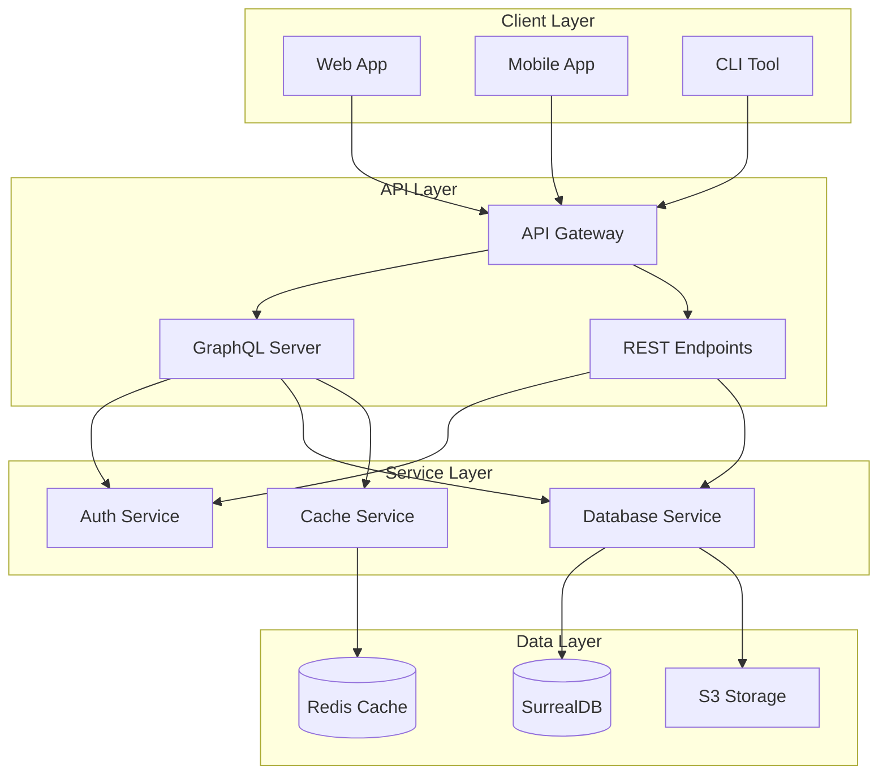

# System Architecture

The PCF API is built with a modular, service-oriented architecture designed for scalability, maintainability, and observability.

## High-Level Architecture

<!-- Future Enhancement: Interactive Features
When mdbook-interactive-diagrams plugin is available:
- Click on any component to navigate to its documentation
- Hover for component descriptions  
- Expand/collapse subgraphs for detail control

For now: Static diagram with clear labels and a legend below
-->

### Component Navigation Guide

- **API Gateway**: Handles request routing, rate limiting, and authentication - See [Gateway Configuration](/admin/deployment/gateway.md)
- **GraphQL Server**: Processes GraphQL queries, mutations, and subscriptions - See [GraphQL Module](/developer/modules/graphql/README.md)
- **REST Endpoints**: Provides RESTful API access - See [REST API](/developer/api/rest.md)
- **Auth Service**: Manages authentication and authorization - See [Security Module](/developer/security/README.md)
- **Database Service**: Handles all database operations - See [Services Module](/developer/modules/services/README.md)
- **Cache Service**: Provides caching layer for performance - See [Performance Guide](/developer/performance/README.md)

## Key Architectural Principles

### 1. Modular Design
Each component is self-contained with clear interfaces, allowing for independent development, testing, and deployment.

### 2. Service Separation
- **API Layer**: Handles external communication and protocol translation
- **Service Layer**: Contains business logic and orchestration
- **Data Layer**: Manages persistence and caching

### 3. Scalability
- Horizontal scaling at the API layer
- Connection pooling for database efficiency
- Distributed caching for performance

### 4. Observability
- Structured logging throughout
- Distributed tracing with OpenTelemetry
- Comprehensive metrics collection

## Data Flow

The typical request flow through the system:

1. Client makes request to API Gateway
2. Gateway performs authentication and rate limiting
3. Request routed to appropriate handler (GraphQL or REST)
4. Handler validates request and checks authorization
5. Business logic executed in service layer
6. Data retrieved/stored via database service
7. Response cached if appropriate
8. Response returned to client

## Technology Stack

- **Runtime**: Rust with Tokio async runtime
- **Web Framework**: Axum
- **GraphQL**: async-graphql
- **Database**: SurrealDB
- **Cache**: Redis
- **Configuration**: Figment
- **Observability**: OpenTelemetry, Prometheus, Grafana

<!-- mdbook-interactive-diagrams:
  features:
    - click_navigation: true
    - tooltips: true
    - zoom_pan: true
    - export: ["svg", "png"]
    - animations: true
  navigation_map:
    "API Gateway": "/admin/deployment/gateway.md"
    "GraphQL Server": "/developer/modules/graphql/README.md"
    "Database Service": "/developer/modules/services/README.md"
    "Auth Service": "/developer/security/authentication.md"
    "Cache Service": "/developer/performance/caching.md"
  tooltips:
    "API Gateway": "Entry point for all client requests"
    "GraphQL Server": "Handles GraphQL query execution"
    "Database Service": "Manages database connections and queries"
    "Auth Service": "Handles authentication and authorization"
    "Cache Service": "Provides high-speed data caching"
-->
