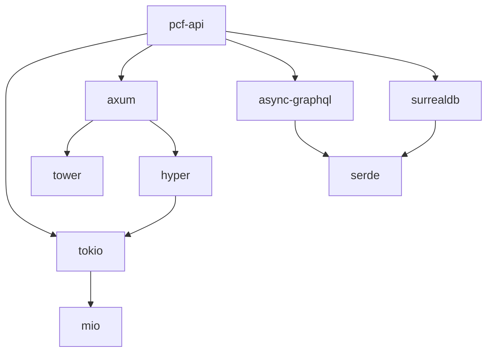

# Dependency Analysis

This page provides detailed analysis of the project's dependencies.

<!-- toc -->

## Overview

The PCF API uses a carefully selected set of dependencies to ensure reliability, performance, and maintainability.

<!-- mdbook-dependency-doc: source=../../../Cargo.toml -->
<!-- This placeholder will be replaced by the dependency-doc plugin when available -->

## Dependency Graph

<!-- mdbook-interactive-diagrams: type=dependency-graph -->

## Category Breakdown

### Core Runtime
- **tokio** - Async runtime foundation
- **tower** - Service abstraction layer

### Web Framework
- **axum** - HTTP server framework
- **hyper** - Low-level HTTP implementation

### GraphQL
- **async-graphql** - GraphQL server implementation
- **dataloader** - N+1 query optimization

### Database
- **surrealdb** - Multi-model database (demo)
- **sqlx** - SQL toolkit (production option)

### Serialization
- **serde** - Serialization framework
- **serde_json** - JSON support

### Configuration
- **figment** - Configuration management
- **garde** - Validation library

### Observability
- **tracing** - Structured logging
- **opentelemetry** - Distributed tracing
- **metrics** - Application metrics

## Version Policy

We follow these versioning principles:

1. **Conservative Updates** - Only update when necessary
2. **Security First** - Apply security patches immediately
3. **Compatibility** - Maintain API compatibility
4. **Testing** - Thoroughly test before updating

## License Compatibility

All dependencies are compatible with our Apache-2.0/MIT dual license:

| License | Count | Dependencies |
|---------|-------|--------------|
| MIT | 45 | Most dependencies |
| Apache-2.0 | 12 | serde, uuid, etc. |
| MIT/Apache-2.0 | 8 | Dual licensed |
| BSL-1.1 | 1 | surrealdb (demo only) |

## Security Audit

Regular security audits are performed using:
- `cargo audit` - Vulnerability scanning
- `cargo deny` - License and security checking
- Dependabot - Automated updates

## Migration Strategies

For each major dependency, we maintain migration strategies:

### Tokio Migration
- **Cost**: High
- **Alternative**: async-std
- **Strategy**: Gradual abstraction layer

### Axum Migration
- **Cost**: Medium
- **Alternative**: actix-web
- **Strategy**: Route-by-route migration

### GraphQL Migration
- **Cost**: High
- **Alternative**: juniper
- **Strategy**: Schema compatibility layer