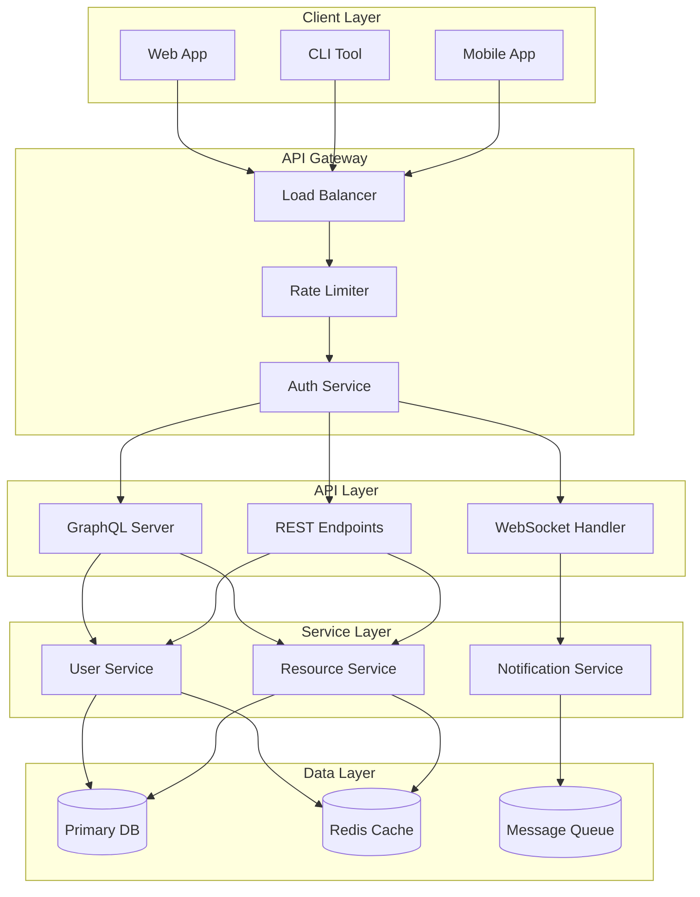
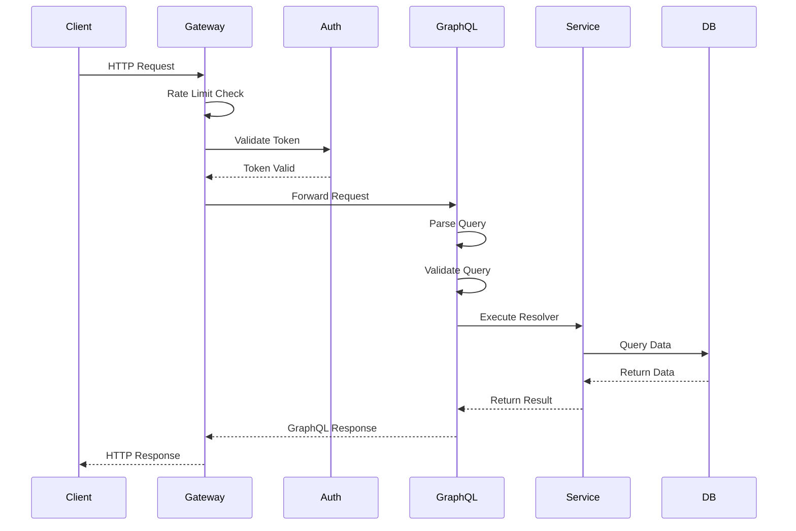
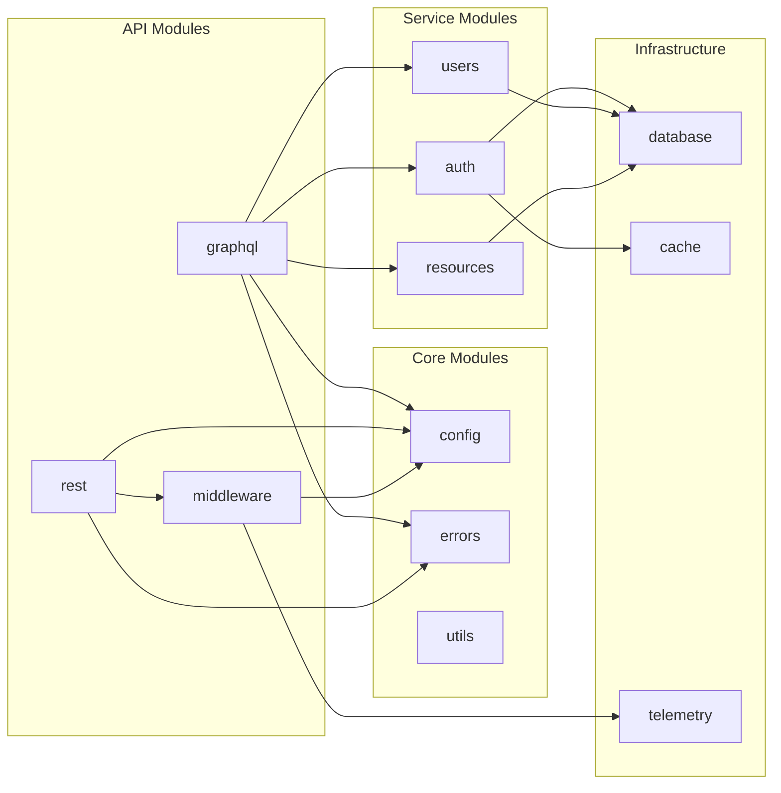
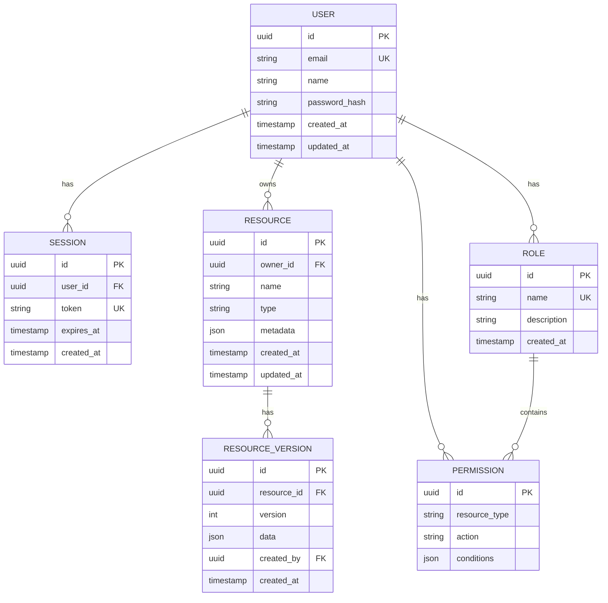
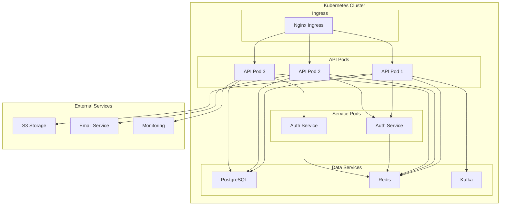
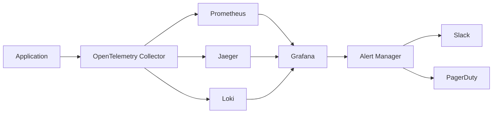

# Architecture Diagrams

Interactive architecture diagrams for the PCF API.

<!-- toc -->

## System Overview

<!-- mdbook-interactive-diagrams: id=system-overview, collapsible=true -->

## Request Flow

<!-- mdbook-interactive-diagrams: id=request-flow, animated=true -->

## Module Dependencies

<!-- mdbook-interactive-diagrams: id=module-deps, interactive=true -->

## Database Schema

<!-- mdbook-interactive-diagrams: id=db-schema, expandable=true -->

## Deployment Architecture

<!-- mdbook-interactive-diagrams: id=deployment, zoomable=true -->

## Performance Metrics Flow

<!-- mdbook-interactive-diagrams: id=metrics-flow -->
