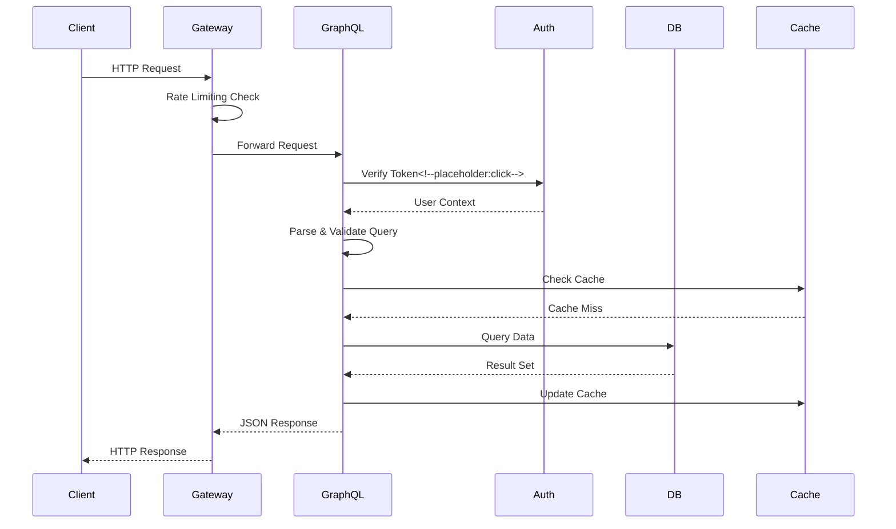
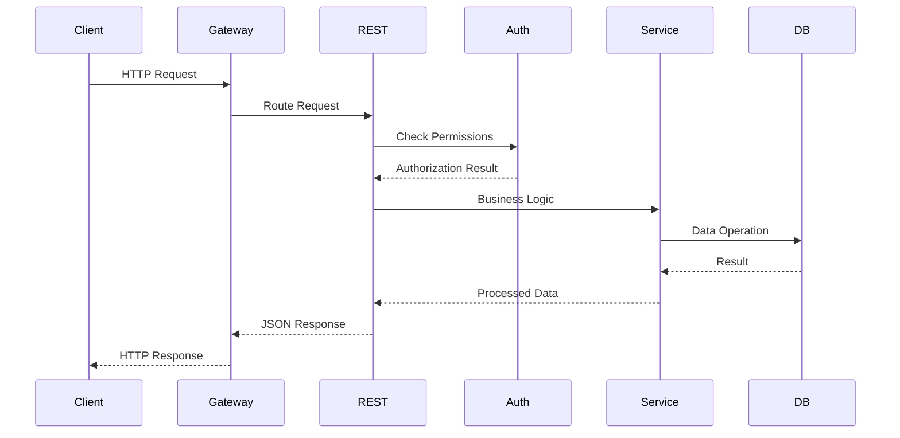
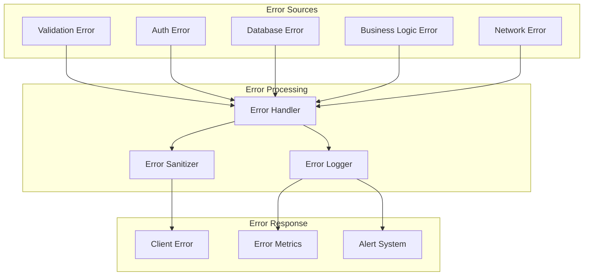
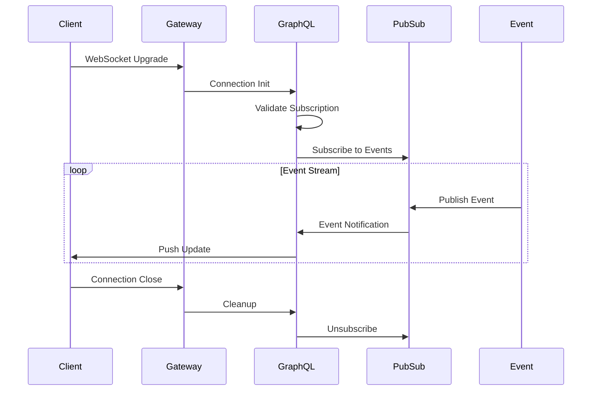

# Request Flow

Understanding how requests flow through the PCF API system is crucial for debugging, performance optimization, and system design.

## GraphQL Request Flow

The following diagram shows the complete lifecycle of a GraphQL request:

<!-- Future Enhancement: Interactive Sequence Diagrams
When mdbook-interactive-diagrams is available:
- Click on any step to see detailed documentation
- Hover for timing information
- Expand to see error handling flows
-->

### Request Stages

1. **Client Request**
   - Client sends HTTP request with GraphQL query
   - Includes authentication headers
   - May include variables and operation name

2. **Gateway Processing**
   - Rate limiting enforcement
   - Request logging
   - Basic validation
   - Load balancing (if multiple instances)

3. **Authentication**
   - Token extraction from headers
   - Token validation
   - User context creation
   - Permission loading

4. **Query Processing**
   - Query parsing
   - Schema validation
   - Complexity analysis
   - Field authorization

5. **Data Resolution**
   - Cache lookup
   - Database query execution
   - N+1 query prevention via DataLoader
   - Result aggregation

6. **Response Building**
   - Result formatting
   - Error handling
   - Cache updates
   - Response compression

## REST Request Flow

REST endpoints follow a similar but simplified flow:

## Error Handling Flow

How errors propagate through the system:

### Error Categories

- **4xx Errors**: Client errors (validation, authentication, authorization)
- **5xx Errors**: Server errors (database, internal logic, dependencies)

## Subscription Flow

Real-time subscriptions use WebSocket connections:

## Performance Considerations

### Request Timing Targets

| Stage | Target Time | Max Time |
|-------|------------|----------|
| Gateway Processing | <5ms | 10ms |
| Authentication | <10ms | 20ms |
| Query Parsing | <2ms | 5ms |
| Cache Lookup | <5ms | 10ms |
| Database Query | <50ms | 200ms |
| Response Building | <5ms | 10ms |
| **Total** | **<77ms** | **255ms** |

### Optimization Points

1. **Caching**
   - Query result caching
   - Parsed query caching
   - Permission caching

2. **Batching**
   - DataLoader for N+1 prevention
   - Database connection pooling
   - Bulk operations

3. **Monitoring**
   - Request tracing
   - Performance metrics
   - Slow query logging

<!-- mdbook-interactive-diagrams:
  features:
    - step_details: true
    - timing_overlay: true
    - error_flows: true
  navigation_map:
    "Verify Token": "/developer/security/authentication.md"
    "Error Handler": "/developer/modules/errors/README.md"
    "Error Logger": "/developer/observability/logging.md"
    "Error Sanitizer": "/developer/security/error-handling.md"
-->