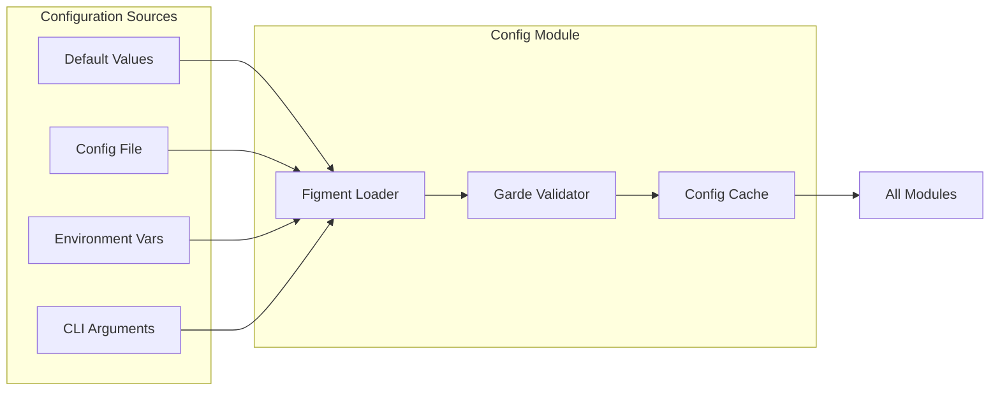

# Configuration Module

The Configuration module provides a robust, type-safe configuration management system using Figment, supporting multiple configuration sources with validation, environment-specific overrides, and secure secret handling.

<!-- toc -->

## Overview

The PCF API configuration module implements a 4-tier hierarchical configuration system built on [Figment](https://github.com/SergioBenitez/Figment), providing:

- **Type Safety**: Strongly typed configuration with compile-time guarantees
- **Multi-Source Loading**: Support for defaults, files, environment variables, and CLI args
- **Validation**: Comprehensive validation using Garde
- **Environment Support**: Development, staging, and production configurations
- **Secret Management**: Secure handling of sensitive values
- **Hot Reloading**: Configuration changes without restarts (future)

## Quick Example

```rust
use pcf_api::config::{AppConfig, load_config};

// Load configuration from all sources
let config = load_config()?;

// Access configuration values
println!("Server: {}:{}", config.server.host, config.server.port);
println!("Log level: {}", config.log.level);

// Use in application
let server = Server::new(config.server);
let logger = init_logging(config.log);
```

## Architecture

The configuration module follows a layered loading approach:



<!-- Future Enhancement: Interactive Configuration Flow
When mdbook-interactive-diagrams plugin is available:
- Click on Figment Loader to see merging strategy details
- Click on Garde Validator to see validation rules
- Hover for configuration precedence information
-->

### Component Details

- **Figment Loader**: Merges configuration from multiple sources with proper precedence
- **Garde Validator**: Ensures all configuration values meet defined constraints
- **Config Cache**: Stores validated configuration for fast access by all modules

### Configuration Hierarchy

1. **Built-in Defaults**: Hard-coded safe defaults
2. **default.toml**: Base configuration file
3. **{environment}.toml**: Environment-specific overrides
4. **Environment Variables**: Runtime overrides
5. **CLI Arguments**: Highest priority overrides

## Public API

### Core Types

```rust
/// Main application configuration
#[derive(Debug, Clone, Deserialize, Serialize, Validate)]
pub struct AppConfig {
    pub server: ServerConfig,
    pub database: DatabaseConfig,
    pub log: LoggingConfig,
    pub health: HealthConfig,
    pub graphql: GraphQLConfig,
    pub security: SecurityConfig,
}

/// Server configuration
#[derive(Debug, Clone, Deserialize, Serialize, Validate)]
pub struct ServerConfig {
    #[garde(ip)]
    pub host: IpAddr,
    
    #[garde(range(min = 1024, max = 65535))]
    pub port: u16,
    
    pub metrics_port: u16,
    pub shutdown_timeout: Duration,
}

/// Database configuration
#[derive(Debug, Clone, Deserialize, Serialize, Validate)]
pub struct DatabaseConfig {
    #[garde(url)]
    pub url: String,
    
    #[garde(range(min = 1, max = 1000))]
    pub max_connections: u32,
    
    #[garde(range(min = 1, max = 100))]
    pub min_connections: u32,
    
    pub connect_timeout: Duration,
    pub idle_timeout: Duration,
}

/// Logging configuration
#[derive(Debug, Clone, Deserialize, Serialize, Validate)]
pub struct LoggingConfig {
    #[garde(custom(validate_log_level))]
    pub level: String,
    
    #[garde(custom(validate_log_format))]
    pub format: String,
    
    pub output: String,
    pub enable_colors: bool,
}
```

### Loading Functions

```rust
/// Load configuration from all sources
pub fn load_config() -> Result<AppConfig, ConfigError> {
    load_config_with_profile(None)
}

/// Load configuration for specific environment
pub fn load_config_with_profile(profile: Option<&str>) -> Result<AppConfig, ConfigError> {
    let figment = build_figment(profile)?;
    let config: AppConfig = figment.extract()?;
    config.validate()?;
    Ok(config)
}

/// Build Figment provider with all sources
pub fn build_figment(profile: Option<&str>) -> Result<Figment, ConfigError> {
    let mut figment = Figment::new()
        .merge(Serialized::defaults(AppConfig::default()))
        .merge(Toml::file("config/default.toml"));
    
    if let Some(profile) = profile {
        figment = figment.merge(Toml::file(format!("config/{}.toml", profile)));
    }
    
    figment = figment
        .merge(Env::prefixed("PCF_API__").split("__"))
        .merge(Env::prefixed("PCF_API_").split("_"));
    
    Ok(figment)
}
```

## Internal Architecture

### Validation Implementation

Custom validators using Garde:

```rust
fn validate_log_level(value: &str, _context: &()) -> garde::Result {
    match value {
        "trace" | "debug" | "info" | "warn" | "error" => Ok(()),
        _ => Err(garde::Error::new("invalid log level")),
    }
}

fn validate_log_format(value: &str, _context: &()) -> garde::Result {
    match value {
        "json" | "pretty" | "compact" => Ok(()),
        _ => Err(garde::Error::new("invalid log format")),
    }
}

fn validate_ip_or_hostname(value: &str, _context: &()) -> garde::Result {
    if value.parse::<IpAddr>().is_ok() || is_valid_hostname(value) {
        Ok(())
    } else {
        Err(garde::Error::new("invalid IP address or hostname"))
    }
}
```

### Environment Variable Mapping

Environment variables follow a nested structure:

```rust
// PCF_API__SERVER__HOST=0.0.0.0
// PCF_API__SERVER__PORT=8080
// PCF_API__DATABASE__URL=postgresql://localhost/pcf
// PCF_API__LOG__LEVEL=debug
// PCF_API__LOG__FORMAT=json
```

### Secret Handling

Sensitive values are handled securely:

```rust
#[derive(Debug, Clone, Deserialize, Serialize)]
pub struct DatabaseConfig {
    #[serde(with = "secret_string")]
    pub url: String,
    
    #[serde(skip_serializing)]
    pub password: Option<String>,
}

impl fmt::Display for DatabaseConfig {
    fn fmt(&self, f: &mut fmt::Formatter<'_>) -> fmt::Result {
        write!(f, "DatabaseConfig {{ url: <redacted>, ... }}")
    }
}
```

## Configuration Options

### Complete Configuration Schema

```toml
# config/default.toml

[server]
host = "127.0.0.1"
port = 8080
metrics_port = 9090
shutdown_timeout = "30s"

[database]
url = "memory://"  # In-memory for demo
max_connections = 100
min_connections = 10
connect_timeout = "30s"
idle_timeout = "10m"

[log]
level = "info"
format = "pretty"
output = "stdout"
enable_colors = true

[health]
enabled = true
startup_delay = "5s"
cache_ttl = "60s"
check_timeout = "5s"

[graphql]
playground = false
introspection = false
max_depth = 10
max_complexity = 1000
query_timeout = "30s"

[security]
cors_enabled = true
cors_origins = ["http://localhost:3000"]
cors_max_age = 3600
rate_limit_enabled = true
rate_limit_requests = 100
rate_limit_window = "60s"
```

### Environment-Specific Overrides

```toml
# config/development.toml
[server]
host = "0.0.0.0"

[log]
level = "debug"
format = "pretty"

[graphql]
playground = true
introspection = true

# config/production.toml
[server]
host = "0.0.0.0"

[database]
url = "${DATABASE_URL}"  # Resolved from environment

[log]
level = "info"
format = "json"
enable_colors = false

[graphql]
playground = false
introspection = false

[security]
cors_origins = ["https://app.example.com"]
rate_limit_requests = 1000
```

## Error Handling

### Configuration Errors

```rust
#[derive(Debug, thiserror::Error)]
pub enum ConfigError {
    #[error("configuration file not found: {0}")]
    FileNotFound(String),
    
    #[error("invalid configuration: {0}")]
    Invalid(String),
    
    #[error("validation failed: {0}")]
    ValidationFailed(#[from] garde::Report),
    
    #[error("environment variable error: {0}")]
    EnvVarError(String),
    
    #[error("parse error: {0}")]
    ParseError(#[from] figment::Error),
}
```

### Common Configuration Issues

1. **Missing required fields**: Ensure all required fields have values
2. **Type mismatches**: Check TOML syntax and types
3. **Validation failures**: Review validation rules
4. **Environment variable format**: Use correct prefix and separators

## Performance

### Configuration Loading Performance

- **Initial Load**: ~5-10ms for typical configuration
- **Validation**: <1ms with Garde
- **Memory Usage**: ~1KB for configuration struct

### Caching Strategy

```rust
// Configuration is loaded once at startup
lazy_static! {
    static ref CONFIG: AppConfig = load_config()
        .expect("Failed to load configuration");
}

// Access cached configuration
pub fn get_config() -> &'static AppConfig {
    &CONFIG
}
```

## Security

### Secret Management

1. **Never Log Secrets**: Use custom Display implementations
2. **Environment Variables**: Prefer env vars for secrets
3. **File Permissions**: Restrict config file access
4. **Encryption**: Support for encrypted values (future)

```rust
// Safe secret handling
impl AppConfig {
    pub fn sanitized(&self) -> SanitizedConfig {
        SanitizedConfig {
            server: self.server.clone(),
            database: DatabaseConfig {
                url: "<redacted>".to_string(),
                ..self.database.clone()
            },
            ..self.clone()
        }
    }
}
```

### Validation Security

- **IP Address Validation**: Prevent binding to invalid addresses
- **Port Range Validation**: Ensure non-privileged ports
- **URL Validation**: Prevent injection through database URLs
- **File Path Validation**: Prevent directory traversal

## Testing

### Unit Testing Configuration

```rust
#[test]
fn test_default_config() {
    let config = AppConfig::default();
    assert_eq!(config.server.port, 8080);
    assert_eq!(config.log.level, "info");
}

#[test]
fn test_config_validation() {
    let mut config = AppConfig::default();
    config.server.port = 80; // Too low
    
    let result = config.validate();
    assert!(result.is_err());
    assert!(result.unwrap_err().to_string().contains("port"));
}
```

### Integration Testing

```rust
#[test]
fn test_config_loading() {
    // Set test environment variables
    env::set_var("PCF_API__SERVER__PORT", "3000");
    env::set_var("PCF_API__LOG__LEVEL", "debug");
    
    let config = load_config().unwrap();
    assert_eq!(config.server.port, 3000);
    assert_eq!(config.log.level, "debug");
}

#[test]
fn test_profile_loading() {
    let dev_config = load_config_with_profile(Some("development")).unwrap();
    assert!(dev_config.graphql.playground);
    
    let prod_config = load_config_with_profile(Some("production")).unwrap();
    assert!(!prod_config.graphql.playground);
}
```

### Testing with Mock Configuration

```rust
pub fn test_config() -> AppConfig {
    AppConfig {
        server: ServerConfig {
            host: "127.0.0.1".parse().unwrap(),
            port: 0, // Random port
            ..Default::default()
        },
        database: DatabaseConfig {
            url: "memory://test".to_string(),
            ..Default::default()
        },
        ..Default::default()
    }
}
```

## Monitoring

### Configuration Metrics

Monitor configuration-related metrics:

- `config_load_duration_seconds`: Time to load configuration
- `config_validation_errors_total`: Validation failure count
- `config_reload_total`: Configuration reload attempts (future)

### Health Checks

```rust
impl HealthCheck for ConfigHealth {
    async fn check(&self) -> HealthStatus {
        match load_config() {
            Ok(_) => HealthStatus::Healthy,
            Err(e) => HealthStatus::Unhealthy(format!("Config error: {}", e)),
        }
    }
}
```

## Troubleshooting

### Common Issues

1. **"Configuration file not found"**
   - **Cause**: Missing config files
   - **Solution**: Ensure `config/default.toml` exists
   - **Check**: Working directory is correct

2. **"Validation failed: port"**
   - **Cause**: Port outside valid range (1024-65535)
   - **Solution**: Use unprivileged port
   - **Example**: Change port to 8080

3. **"Environment variable not found"**
   - **Cause**: Missing required env var
   - **Solution**: Set the environment variable
   - **Format**: `PCF_API__SECTION__KEY=value`

4. **"Invalid TOML syntax"**
   - **Cause**: Malformed configuration file
   - **Solution**: Validate TOML syntax
   - **Tool**: Use TOML validator or IDE plugin

5. **"Type mismatch"**
   - **Cause**: Wrong type in configuration
   - **Solution**: Check expected types in schema
   - **Example**: Quotes around strings, not numbers

### Debug Configuration Loading

```rust
// Enable debug output
env::set_var("RUST_LOG", "pcf_api::config=debug");

// Print loaded configuration
let config = load_config()?;
println!("Loaded config: {:#?}", config.sanitized());

// Validate specific fields
if let Err(e) = config.validate() {
    eprintln!("Validation errors: {:#?}", e);
}
```

## Best Practices

1. **Use Type-Safe Configuration**: Leverage Rust's type system
2. **Validate Early**: Catch configuration errors at startup
3. **Provide Defaults**: Sensible defaults for all values
4. **Document Options**: Clear descriptions for each option
5. **Secure Secrets**: Never commit secrets to version control
6. **Environment Separation**: Use profiles for different environments
7. **Fail Fast**: Exit immediately on configuration errors

## Migration Guide

### From Environment Variables Only

```rust
// Old approach
let port = env::var("PORT")?.parse()?;
let host = env::var("HOST")?;

// New approach
let config = load_config()?;
let port = config.server.port;
let host = config.server.host;
```

### From Hard-Coded Values

```rust
// Old approach
const PORT: u16 = 8080;
const LOG_LEVEL: &str = "info";

// New approach
let config = load_config()?;
let port = config.server.port;
let log_level = &config.log.level;
```

## Further Reading

- [Figment Documentation](https://docs.rs/figment/)
- [Garde Validation](https://docs.rs/garde/)
- [12-Factor App Config](https://12factor.net/config)
- [TOML Specification](https://toml.io/)
