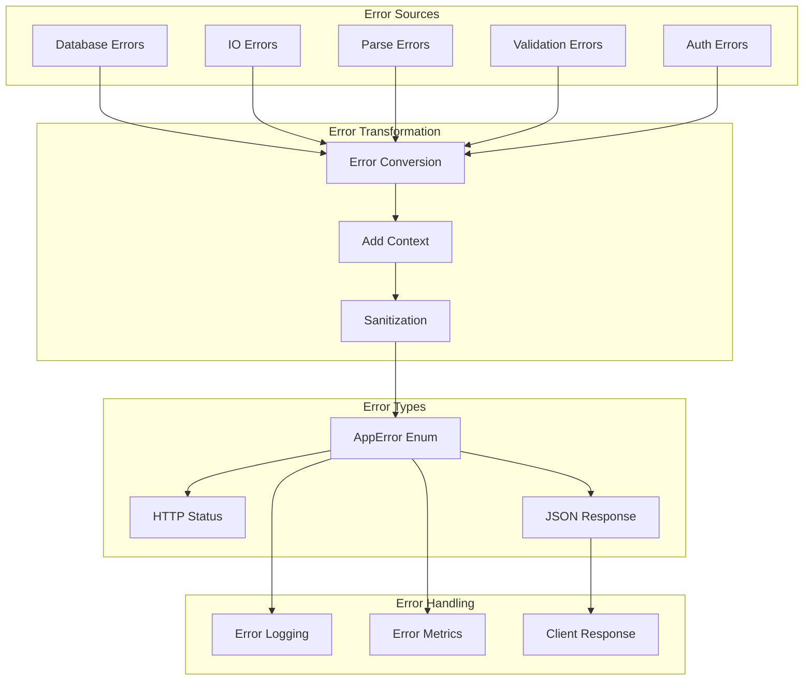

# Error Module

The Error module provides centralized error handling with type-safe error variants, automatic HTTP status mapping, client-safe error messages, and comprehensive error context for debugging.

<!-- toc -->

## Overview

The PCF API error module implements a unified error handling strategy that:

- **Centralizes Error Types**: Single `AppError` enum for all application errors
- **Ensures Security**: Sanitizes internal errors for external consumption
- **Maps to HTTP**: Automatic HTTP status code mapping
- **Provides Context**: Rich error context with trace IDs and metadata
- **Integrates Seamlessly**: Works with `?` operator and Result types
- **Supports Observability**: Structured error logging and metrics

## Quick Example

```rust
use pcf_api::error::{AppError, AppResult};

// Return errors with the ? operator
fn process_note(id: &str) -> AppResult<Note> {
    let uuid = Uuid::parse_str(id)
        .map_err(|_| AppError::InvalidInput("Invalid note ID format".into()))?;
    
    let note = database.get_note(uuid)
        .await
        .map_err(AppError::from)?
        .ok_or_else(|| AppError::NotFound("Note not found".into()))?;
    
    Ok(note)
}

// Create custom errors
fn validate_title(title: &str) -> AppResult<()> {
    if title.is_empty() {
        return Err(AppError::InvalidInput("Title cannot be empty".into()));
    }
    if title.len() > 200 {
        return Err(AppError::InvalidInput("Title too long (max 200 chars)".into()));
    }
    Ok(())
}
```

## Architecture

The error module follows a layered approach:



## Public API

### Core Types

```rust
/// Main application error type
#[derive(Debug, thiserror::Error)]
pub enum AppError {
    /// Configuration errors (500)
    #[error("Configuration error: {0}")]
    Config(String),
    
    /// Client input validation errors (400)
    #[error("Invalid input: {0}")]
    InvalidInput(String),
    
    /// Resource not found errors (404)
    #[error("Not found: {0}")]
    NotFound(String),
    
    /// Authentication required (401)
    #[error("Authentication required")]
    Unauthorized,
    
    /// Insufficient permissions (403)
    #[error("Forbidden: {0}")]
    Forbidden(String),
    
    /// Database errors (500)
    #[error("Database error")]
    Database(#[from] DatabaseError),
    
    /// External service errors (502)
    #[error("External service error: {0}")]
    ExternalService(String),
    
    /// Rate limit exceeded (429)
    #[error("Rate limit exceeded")]
    RateLimitExceeded,
    
    /// Request timeout (408)
    #[error("Request timeout")]
    Timeout,
    
    /// Service unavailable (503)
    #[error("Service temporarily unavailable")]
    ServiceUnavailable,
    
    /// Generic internal error (500)
    #[error("Internal server error")]
    Internal(#[source] anyhow::Error),
}

/// Convenience type alias
pub type AppResult<T> = Result<T, AppError>;
```

### Error Context

```rust
/// Additional error context
#[derive(Debug, Clone, Serialize)]
pub struct ErrorContext {
    pub trace_id: String,
    pub error_code: String,
    pub timestamp: DateTime<Utc>,
    pub details: Option<HashMap<String, Value>>,
}

impl AppError {
    /// Add context to an error
    pub fn with_context(self, key: &str, value: impl Into<Value>) -> Self {
        // Implementation
    }
    
    /// Get error code for external use
    pub fn error_code(&self) -> &'static str {
        match self {
            AppError::InvalidInput(_) => "INVALID_INPUT",
            AppError::NotFound(_) => "NOT_FOUND",
            AppError::Unauthorized => "UNAUTHORIZED",
            AppError::Forbidden(_) => "FORBIDDEN",
            AppError::RateLimitExceeded => "RATE_LIMITED",
            AppError::Timeout => "TIMEOUT",
            AppError::ServiceUnavailable => "SERVICE_UNAVAILABLE",
            _ => "INTERNAL_ERROR",
        }
    }
}
```

### HTTP Status Mapping

```rust
impl AppError {
    /// Get HTTP status code
    pub fn status_code(&self) -> StatusCode {
        match self {
            AppError::InvalidInput(_) => StatusCode::BAD_REQUEST,
            AppError::NotFound(_) => StatusCode::NOT_FOUND,
            AppError::Unauthorized => StatusCode::UNAUTHORIZED,
            AppError::Forbidden(_) => StatusCode::FORBIDDEN,
            AppError::RateLimitExceeded => StatusCode::TOO_MANY_REQUESTS,
            AppError::Timeout => StatusCode::REQUEST_TIMEOUT,
            AppError::ExternalService(_) => StatusCode::BAD_GATEWAY,
            AppError::ServiceUnavailable => StatusCode::SERVICE_UNAVAILABLE,
            _ => StatusCode::INTERNAL_SERVER_ERROR,
        }
    }
}
```

## Error Taxonomy

### Client Errors (4xx)

| Error Type | HTTP Status | Use Case |
|------------|-------------|----------|
| `InvalidInput` | 400 | Validation failures, malformed requests |
| `Unauthorized` | 401 | Missing or invalid authentication |
| `Forbidden` | 403 | Insufficient permissions |
| `NotFound` | 404 | Resource doesn't exist |
| `Timeout` | 408 | Request processing timeout |
| `RateLimitExceeded` | 429 | Too many requests |

### Server Errors (5xx)

| Error Type | HTTP Status | Use Case |
|------------|-------------|----------|
| `Config` | 500 | Configuration problems |
| `Database` | 500 | Database operation failures |
| `Internal` | 500 | Unexpected errors |
| `ExternalService` | 502 | Upstream service failures |
| `ServiceUnavailable` | 503 | Temporary outages |

## Error Propagation

### Using the ? Operator

```rust
// Automatic conversion with From trait
async fn get_user_notes(user_id: Uuid) -> AppResult<Vec<Note>> {
    // Database errors convert automatically
    let notes = db.query("SELECT * FROM notes WHERE user_id = $1")
        .bind(user_id)
        .fetch_all()
        .await?;  // DatabaseError -> AppError
    
    // Parse errors need explicit conversion
    let parsed_notes = notes.into_iter()
        .map(|row| Note::from_row(row))
        .collect::<Result<Vec<_>, _>>()
        .map_err(|e| AppError::Internal(e.into()))?;
    
    Ok(parsed_notes)
}
```

### Error Chaining

```rust
// Chain multiple operations with context
async fn process_request(input: Input) -> AppResult<Output> {
    let validated = validate_input(&input)
        .map_err(|e| AppError::InvalidInput(e.to_string()))?;
    
    let result = database_operation(validated)
        .await
        .map_err(|e| AppError::Database(e))
        .map_err(|e| e.with_context("input", &input))?;
    
    transform_result(result)
        .map_err(|e| AppError::Internal(e.into()))
}
```

## Client Responses

### Error Serialization

```rust
/// Client-safe error response
#[derive(Serialize)]
pub struct ErrorResponse {
    pub error: ErrorDetail,
    pub trace_id: String,
}

#[derive(Serialize)]
pub struct ErrorDetail {
    pub code: String,
    pub message: String,
    #[serde(skip_serializing_if = "Option::is_none")]
    pub details: Option<Value>,
}

impl From<AppError> for ErrorResponse {
    fn from(error: AppError) -> Self {
        let trace_id = get_current_trace_id();
        
        // Log full error internally
        tracing::error!(
            error = ?error,
            trace_id = %trace_id,
            "Request failed"
        );
        
        // Return sanitized error to client
        ErrorResponse {
            error: ErrorDetail {
                code: error.error_code().to_string(),
                message: error.client_message(),
                details: error.client_details(),
            },
            trace_id,
        }
    }
}
```

### Example Responses

```json
// 400 Bad Request
{
  "error": {
    "code": "INVALID_INPUT",
    "message": "Invalid input: Title cannot be empty",
    "details": {
      "field": "title",
      "constraint": "required"
    }
  },
  "trace_id": "550e8400-e29b-41d4-a716-446655440000"
}

// 500 Internal Server Error (sanitized)
{
  "error": {
    "code": "INTERNAL_ERROR",
    "message": "An unexpected error occurred",
    "details": null
  },
  "trace_id": "550e8400-e29b-41d4-a716-446655440000"
}
```

## Performance

### Error Creation Overhead

- **Enum Variants**: Zero-cost abstractions
- **String Allocation**: Only for dynamic messages
- **Stack Traces**: Captured only in debug mode
- **Context Building**: Lazy evaluation

### Optimization Strategies

```rust
// Avoid string allocation for static errors
impl AppError {
    pub const UNAUTHORIZED: AppError = AppError::Unauthorized;
    pub const SERVICE_UNAVAILABLE: AppError = AppError::ServiceUnavailable;
}

// Pre-computed error responses
lazy_static! {
    static ref RATE_LIMIT_RESPONSE: ErrorResponse = 
        ErrorResponse::from(AppError::RateLimitExceeded);
}
```

## Security

### Error Message Sanitization

```rust
impl AppError {
    /// Get client-safe error message
    pub fn client_message(&self) -> String {
        match self {
            // Safe to expose
            AppError::InvalidInput(msg) => msg.clone(),
            AppError::NotFound(msg) => msg.clone(),
            AppError::Unauthorized => "Authentication required".to_string(),
            AppError::Forbidden(msg) => msg.clone(),
            AppError::RateLimitExceeded => "Too many requests".to_string(),
            
            // Sanitize internal errors
            AppError::Config(_) => "Service configuration error".to_string(),
            AppError::Database(_) => "Database operation failed".to_string(),
            AppError::Internal(_) => "An unexpected error occurred".to_string(),
            _ => "Service error".to_string(),
        }
    }
}
```

### Preventing Information Leaks

1. **Never expose internal details**: Stack traces, file paths, etc.
2. **Log vs Response separation**: Full details in logs, sanitized in responses
3. **Consistent error messages**: Avoid timing attacks
4. **Rate limit errors**: Prevent enumeration attacks

## Testing

### Unit Testing Errors

```rust
#[cfg(test)]
mod tests {
    use super::*;
    
    #[test]
    fn test_error_status_codes() {
        assert_eq!(
            AppError::InvalidInput("test".into()).status_code(),
            StatusCode::BAD_REQUEST
        );
        assert_eq!(
            AppError::NotFound("test".into()).status_code(),
            StatusCode::NOT_FOUND
        );
    }
    
    #[test]
    fn test_error_codes() {
        assert_eq!(
            AppError::InvalidInput("test".into()).error_code(),
            "INVALID_INPUT"
        );
        assert_eq!(
            AppError::Internal(anyhow!("test")).error_code(),
            "INTERNAL_ERROR"
        );
    }
    
    #[test]
    fn test_error_sanitization() {
        let db_error = AppError::Database(DatabaseError::ConnectionFailed);
        assert_eq!(
            db_error.client_message(),
            "Database operation failed"
        );
        // Internal details not exposed
        assert!(!db_error.client_message().contains("Connection"));
    }
}
```

### Integration Testing

```rust
#[tokio::test]
async fn test_error_response_format() {
    let app = create_test_app();
    
    let response = app
        .oneshot(Request::builder()
            .uri("/api/notes/invalid-id")
            .body(Body::empty())
            .unwrap())
        .await
        .unwrap();
    
    assert_eq!(response.status(), StatusCode::BAD_REQUEST);
    
    let body: ErrorResponse = response.json().await.unwrap();
    assert_eq!(body.error.code, "INVALID_INPUT");
    assert!(!body.trace_id.is_empty());
}
```

## Monitoring

### Error Metrics

```rust
// Prometheus metrics
static ERROR_COUNTER: Lazy<IntCounterVec> = Lazy::new(|| {
    register_int_counter_vec!(
        "app_errors_total",
        "Total number of errors by type",
        &["error_type", "status_code"]
    ).unwrap()
});

impl AppError {
    pub fn record_metric(&self) {
        ERROR_COUNTER
            .with_label_values(&[
                self.error_code(),
                &self.status_code().as_u16().to_string(),
            ])
            .inc();
    }
}
```

### Error Logging

```rust
// Structured error logging
impl AppError {
    pub fn log(&self, context: &RequestContext) {
        match self {
            // Log at appropriate levels
            AppError::InvalidInput(_) => {
                tracing::debug!(
                    error = ?self,
                    trace_id = %context.trace_id,
                    "Client error"
                );
            }
            AppError::Internal(e) => {
                tracing::error!(
                    error = ?e,
                    trace_id = %context.trace_id,
                    backtrace = ?e.backtrace(),
                    "Internal error"
                );
            }
            _ => {
                tracing::warn!(
                    error = ?self,
                    trace_id = %context.trace_id,
                    "Application error"
                );
            }
        }
    }
}
```

## Troubleshooting

### Common Issues

1. **"Internal server error" with no details**
   - **Cause**: Error sanitization hiding details
   - **Solution**: Check server logs with trace ID
   - **Prevention**: Add more specific error types

2. **Error type proliferation**
   - **Cause**: Too many specific error variants
   - **Solution**: Group related errors
   - **Example**: Use `InvalidInput(String)` with details

3. **Missing error context**
   - **Cause**: Errors propagated without context
   - **Solution**: Use `.with_context()` method
   - **Example**: Add request ID, user ID, etc.

4. **Inconsistent error responses**
   - **Cause**: Manual error response creation
   - **Solution**: Always use `ErrorResponse::from()`
   - **Tool**: Response middleware

5. **Error conversion failures**
   - **Cause**: Missing `From` implementations
   - **Solution**: Implement conversions or use `.map_err()`
   - **Pattern**: Central error conversion module

## Best Practices

1. **Use Specific Error Types**: Create variants for different scenarios
2. **Add Context**: Include relevant debugging information
3. **Log Appropriately**: Error level for server errors, debug for client errors
4. **Sanitize External Errors**: Never leak internal details
5. **Test Error Paths**: Unit test error conditions
6. **Monitor Error Rates**: Track error metrics and alerts
7. **Document Error Codes**: Maintain error code documentation

## Error Code Reference

| Code | Description | HTTP Status | Client Action |
|------|-------------|-------------|---------------|
| `INVALID_INPUT` | Validation failed | 400 | Fix request data |
| `UNAUTHORIZED` | Auth required | 401 | Provide credentials |
| `FORBIDDEN` | Access denied | 403 | Check permissions |
| `NOT_FOUND` | Resource missing | 404 | Verify resource ID |
| `TIMEOUT` | Request timeout | 408 | Retry request |
| `RATE_LIMITED` | Too many requests | 429 | Wait and retry |
| `INTERNAL_ERROR` | Server error | 500 | Contact support |
| `BAD_GATEWAY` | Upstream error | 502 | Retry later |
| `SERVICE_UNAVAILABLE` | Temp outage | 503 | Retry later |

## Further Reading

- [Error Handling in Rust](https://doc.rust-lang.org/book/ch09-00-error-handling.html)
- [thiserror Documentation](https://docs.rs/thiserror/)
- [anyhow Documentation](https://docs.rs/anyhow/)
- [HTTP Status Codes](https://developer.mozilla.org/en-US/docs/Web/HTTP/Status)
