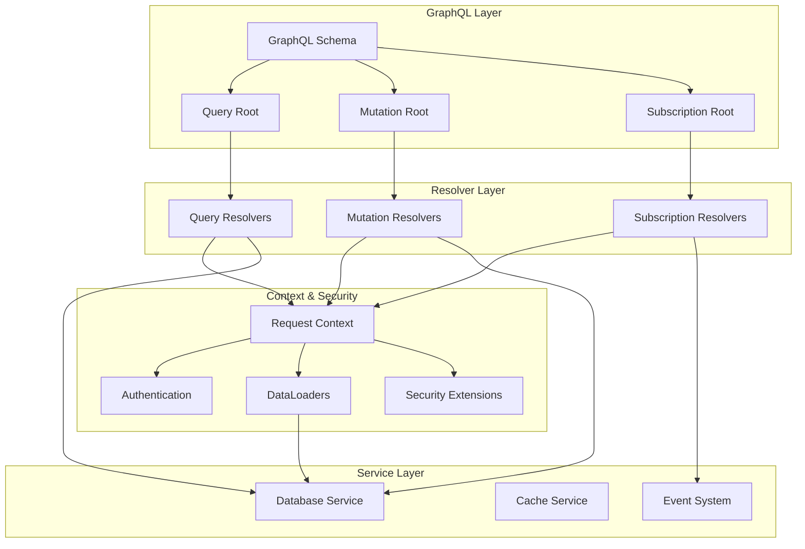

# GraphQL Module

The GraphQL module provides a complete GraphQL API implementation using async-graphql, offering queries, mutations, and real-time subscriptions with built-in security, performance optimization, and observability features.

<!-- toc -->

## Overview

The PCF API's GraphQL module is built on [async-graphql](https://github.com/async-graphql/async-graphql), providing a type-safe, high-performance GraphQL server. It implements:

- **Full GraphQL Specification**: Queries, mutations, and subscriptions
- **Security by Default**: Query depth limiting, complexity analysis, and introspection control
- **Performance Optimization**: DataLoader pattern for N+1 query prevention
- **Observability**: Built-in metrics and tracing
- **Developer Experience**: GraphQL playground and schema introspection

## Quick Example

Here's how to use the GraphQL module in your code:

```rust
use pcf_api::graphql::{create_schema, GraphQLConfig};
use pcf_api::services::database::MockDatabaseService;

// Create GraphQL schema with configuration
let config = GraphQLConfig {
    playground: true,
    introspection: true,
    max_depth: 10,
    max_complexity: 1000,
};

let database = Arc::new(MockDatabaseService::new());
let schema = create_schema(config, database);

// Use with Axum
let app = Router::new()
    .route("/graphql", post(graphql_handler))
    .route("/playground", get(graphql_playground))
    .with_state(schema);
```

## Architecture

The GraphQL module follows a layered architecture:



## Public API

### Core Types and Functions

```rust
/// Main GraphQL schema type
pub type AppSchema = Schema<Query, Mutation, Subscription>;

/// Create a new GraphQL schema with configuration
pub fn create_schema(
    config: GraphQLConfig,
    database: Arc<dyn DatabaseService>,
) -> AppSchema {
    // Schema creation with extensions
}

/// GraphQL configuration
#[derive(Debug, Clone)]
pub struct GraphQLConfig {
    pub playground: bool,        // Enable GraphQL playground
    pub introspection: bool,     // Enable schema introspection
    pub max_depth: usize,       // Maximum query depth
    pub max_complexity: usize,  // Maximum query complexity
}

/// Request context available to all resolvers
pub struct Context {
    pub database: Arc<dyn DatabaseService>,
    pub trace_id: String,
    pub session: Option<Session>,
    pub dataloaders: DataLoaders,
}
```

### Query Root

```rust
pub struct Query;

#[Object]
impl Query {
    /// Health check query
    async fn health(&self, ctx: &Context<'_>) -> Result<Health>;
    
    /// Get a single note by ID
    async fn note(&self, ctx: &Context<'_>, id: ID) -> Result<Option<Note>>;
    
    /// Get paginated list of notes
    async fn notes(
        &self,
        ctx: &Context<'_>,
        first: Option<i32>,
        after: Option<String>,
        filter: Option<NoteFilter>,
    ) -> Result<Connection<String, Note>>;
    
    /// Get notes by author with DataLoader
    async fn notes_by_author(
        &self,
        ctx: &Context<'_>,
        author_id: ID,
    ) -> Result<Vec<Note>>;
}
```

### Mutation Root

```rust
pub struct Mutation;

#[Object]
impl Mutation {
    /// Create a new note
    async fn create_note(
        &self,
        ctx: &Context<'_>,
        input: CreateNoteInput,
    ) -> Result<Note>;
    
    /// Update an existing note
    async fn update_note(
        &self,
        ctx: &Context<'_>,
        id: ID,
        input: UpdateNoteInput,
    ) -> Result<Note>;
    
    /// Delete a note
    async fn delete_note(
        &self,
        ctx: &Context<'_>,
        id: ID,
    ) -> Result<DeleteResult>;
}
```

### Subscription Root

```rust
pub struct Subscription;

#[Subscription]
impl Subscription {
    /// Subscribe to note events
    async fn note_events(&self, ctx: &Context<'_>) -> impl Stream<Item = NoteEvent>;
    
    /// Subscribe to specific note changes
    async fn note_changes(
        &self,
        ctx: &Context<'_>,
        id: ID,
    ) -> impl Stream<Item = Note>;
}
```

## Internal Architecture

### DataLoader Implementation

The module uses DataLoader to batch and cache database queries:

```rust
pub struct DataLoaders {
    pub note_by_author: DataLoader<NoteByAuthorLoader>,
    pub user_by_id: DataLoader<UserByIdLoader>,
}

#[async_trait]
impl Loader<Uuid> for NoteByAuthorLoader {
    type Value = Vec<Note>;
    type Error = AppError;
    
    async fn load(&self, keys: &[Uuid]) -> Result<HashMap<Uuid, Self::Value>>;
}
```

### Security Extensions

Query depth and complexity limiting:

```rust
pub struct DepthLimit {
    max_depth: usize,
}

pub struct ComplexityLimit {
    max_complexity: usize,
}

impl Extension for DepthLimit {
    async fn prepare_request(
        &self,
        ctx: &ExtensionContext<'_>,
        request: Request,
    ) -> ServerResult<Request>;
}
```

### Error Handling

GraphQL-specific error handling:

```rust
/// Convert AppError to GraphQL errors
impl From<AppError> for Error {
    fn from(err: AppError) -> Self {
        Error::new(err.message())
            .extend_with(|_, e| {
                e.set("code", err.code());
                e.set("trace_id", err.trace_id());
            })
    }
}
```

## Configuration Options

The GraphQL module can be configured through `GraphQLConfig`:

| Option | Type | Default | Description |
|--------|------|---------|-------------|
| `playground` | `bool` | `false` | Enable GraphQL playground (disable in production) |
| `introspection` | `bool` | `false` | Enable schema introspection (disable in production) |
| `max_depth` | `usize` | `10` | Maximum allowed query depth |
| `max_complexity` | `usize` | `1000` | Maximum allowed query complexity |
| `tracing` | `bool` | `true` | Enable query tracing |
| `query_timeout` | `Duration` | `30s` | Maximum query execution time |

### Environment Variables

```bash
# GraphQL configuration
PCF_API__GRAPHQL__PLAYGROUND=false
PCF_API__GRAPHQL__INTROSPECTION=false
PCF_API__GRAPHQL__MAX_DEPTH=10
PCF_API__GRAPHQL__MAX_COMPLEXITY=1000
```

## Error Handling

The GraphQL module provides structured error responses:

### Common Errors

| Error Code | HTTP Status | Description |
|------------|-------------|-------------|
| `VALIDATION_ERROR` | 400 | Input validation failed |
| `NOT_FOUND` | 404 | Resource not found |
| `UNAUTHORIZED` | 401 | Authentication required |
| `FORBIDDEN` | 403 | Insufficient permissions |
| `DEPTH_LIMIT_EXCEEDED` | 400 | Query too deep |
| `COMPLEXITY_LIMIT_EXCEEDED` | 400 | Query too complex |
| `INTERNAL_ERROR` | 500 | Server error |

### Error Response Format

```json
{
  "errors": [{
    "message": "Note not found",
    "locations": [{"line": 2, "column": 3}],
    "path": ["note"],
    "extensions": {
      "code": "NOT_FOUND",
      "trace_id": "550e8400-e29b-41d4-a716-446655440000"
    }
  }]
}
```

## Performance Considerations

### Query Optimization

1. **DataLoader Usage**: Automatically batches database queries
2. **Field Selection**: Only requested fields are fetched
3. **Pagination**: Cursor-based pagination for large datasets
4. **Caching**: Response caching for identical queries

### Performance Metrics

The module exposes these Prometheus metrics:

- `graphql_requests_total`: Total number of GraphQL requests
- `graphql_request_duration_seconds`: Request processing time
- `graphql_field_resolution_duration_seconds`: Per-field resolution time
- `graphql_errors_total`: Total errors by type
- `graphql_query_depth`: Query depth distribution
- `graphql_query_complexity`: Query complexity distribution

## Security

### Query Limits

Protect against malicious queries:

```rust
// Prevent deeply nested queries
query {
  note(id: "1") {
    author {
      notes {
        author {
          notes {
            # ... blocked at max_depth
          }
        }
      }
    }
  }
}

// Prevent overly complex queries
query {
  notes(first: 1000) {  # High cost
    edges {
      node {
        # ... blocked if total complexity > max_complexity
      }
    }
  }
}
```

### Authentication & Authorization

```rust
// Resolver-level authentication
async fn create_note(&self, ctx: &Context<'_>, input: CreateNoteInput) -> Result<Note> {
    // Check authentication
    let session = ctx.session.as_ref()
        .ok_or_else(|| Error::new("Authentication required"))?;
    
    // Check authorization
    if !session.can_create_notes() {
        return Err(Error::new("Insufficient permissions"));
    }
    
    // Create note...
}
```

### Input Validation

All inputs are validated using Garde:

```rust
#[derive(InputObject, Validate)]
pub struct CreateNoteInput {
    #[garde(length(min = 1, max = 200))]
    pub title: String,
    
    #[garde(length(min = 1, max = 10000))]
    pub content: String,
    
    #[garde(length(max = 10), inner(length(max = 50)))]
    pub tags: Vec<String>,
}
```

## Testing

### Unit Testing Resolvers

```rust
#[tokio::test]
async fn test_health_query() {
    let schema = create_test_schema();
    
    let query = r#"
        query {
            health {
                status
                version
            }
        }
    "#;
    
    let response = schema.execute(query).await;
    assert!(response.is_ok());
    
    let data = response.data.into_json().unwrap();
    assert_eq!(data["health"]["status"], "healthy");
}
```

### Integration Testing

```rust
#[tokio::test]
async fn test_note_crud_operations() {
    let schema = create_test_schema();
    
    // Create note
    let create_mutation = r#"
        mutation CreateNote($input: CreateNoteInput!) {
            createNote(input: $input) {
                id
                title
                content
            }
        }
    "#;
    
    let variables = json!({
        "input": {
            "title": "Test Note",
            "content": "Test content"
        }
    });
    
    let response = schema.execute(create_mutation).variables(variables).await;
    assert!(response.is_ok());
}
```

### Testing Security

```rust
#[tokio::test]
async fn test_query_depth_limit() {
    let schema = create_schema_with_config(GraphQLConfig {
        max_depth: 3,
        ..Default::default()
    });
    
    let deep_query = r#"
        query {
            note(id: "1") {
                author {
                    notes {
                        author {  # Exceeds depth limit
                            name
                        }
                    }
                }
            }
        }
    "#;
    
    let response = schema.execute(deep_query).await;
    assert!(response.is_err());
    assert!(response.errors[0].message.contains("depth limit"));
}
```

## Monitoring

### Health Checks

The GraphQL endpoint is monitored through:

1. **Query Health**: `/graphql` with health query
2. **Schema Health**: Periodic schema validation
3. **Subscription Health**: WebSocket connection monitoring

### Metrics Dashboard

Key metrics to monitor:

1. **Request Rate**: Requests per second by operation type
2. **Error Rate**: Errors per second by error type
3. **Latency**: P50, P95, P99 response times
4. **Query Complexity**: Distribution of query complexity
5. **Active Subscriptions**: Number of active WebSocket connections

## Troubleshooting

### Common Issues

1. **"Query depth limit exceeded"**
   - **Cause**: Query nesting exceeds `max_depth`
   - **Solution**: Restructure query or increase limit
   - **Example**: Use fragments to reduce nesting

2. **"Query complexity limit exceeded"**
   - **Cause**: Query requires too many resources
   - **Solution**: Add pagination or reduce field selection
   - **Example**: Request fewer items or fields

3. **"Field not found"**
   - **Cause**: Typo in field name or outdated schema
   - **Solution**: Check schema in playground
   - **Example**: Use introspection to verify fields

4. **"Authentication required"**
   - **Cause**: Protected resolver without auth
   - **Solution**: Include authentication token
   - **Example**: Add Authorization header

5. **N+1 Query Performance**
   - **Cause**: Missing DataLoader for related data
   - **Solution**: Implement DataLoader for the relationship
   - **Example**: Use `notes_by_author` instead of multiple queries

### Debug Mode

Enable debug mode for detailed error information:

```rust
let schema = Schema::build(Query, Mutation, Subscription)
    .extension(apollo_tracing::ApolloTracing)
    .enable_debug_mode()  // Only in development!
    .finish();
```

## Best Practices

1. **Use DataLoaders**: Always use DataLoaders for related data
2. **Validate Inputs**: Use Garde validation on all input types
3. **Handle Errors**: Provide meaningful error messages
4. **Limit Queries**: Set appropriate depth and complexity limits
5. **Monitor Performance**: Track resolver execution times
6. **Document Schema**: Add descriptions to all types and fields
7. **Version APIs**: Use field deprecation for backward compatibility

## Further Reading

- [async-graphql Documentation](https://async-graphql.github.io/async-graphql/)
- [GraphQL Best Practices](https://graphql.org/learn/best-practices/)
- [DataLoader Pattern](https://github.com/graphql/dataloader)
- [GraphQL Security](https://www.howtographql.com/advanced/4-security/)

## API Reference

<!-- mdbook-auto-doc:
  source_file: "../src/graphql/mod.rs"
  include_private: false
  group_by: "type"
-->

### Module Structure

<!-- Auto-generated module structure will appear here -->

### Public Types

<!-- Auto-generated type documentation will appear here -->

### Public Functions

<!-- Auto-generated function documentation will appear here -->

### Traits

<!-- Auto-generated trait documentation will appear here -->

<!-- Future Enhancement: Auto-Documentation
When mdbook-auto-doc plugin is available:
- Automatic extraction of doc comments from source
- Type signatures with links to dependencies
- Example code from doc tests
- Cross-references to related modules
-->
