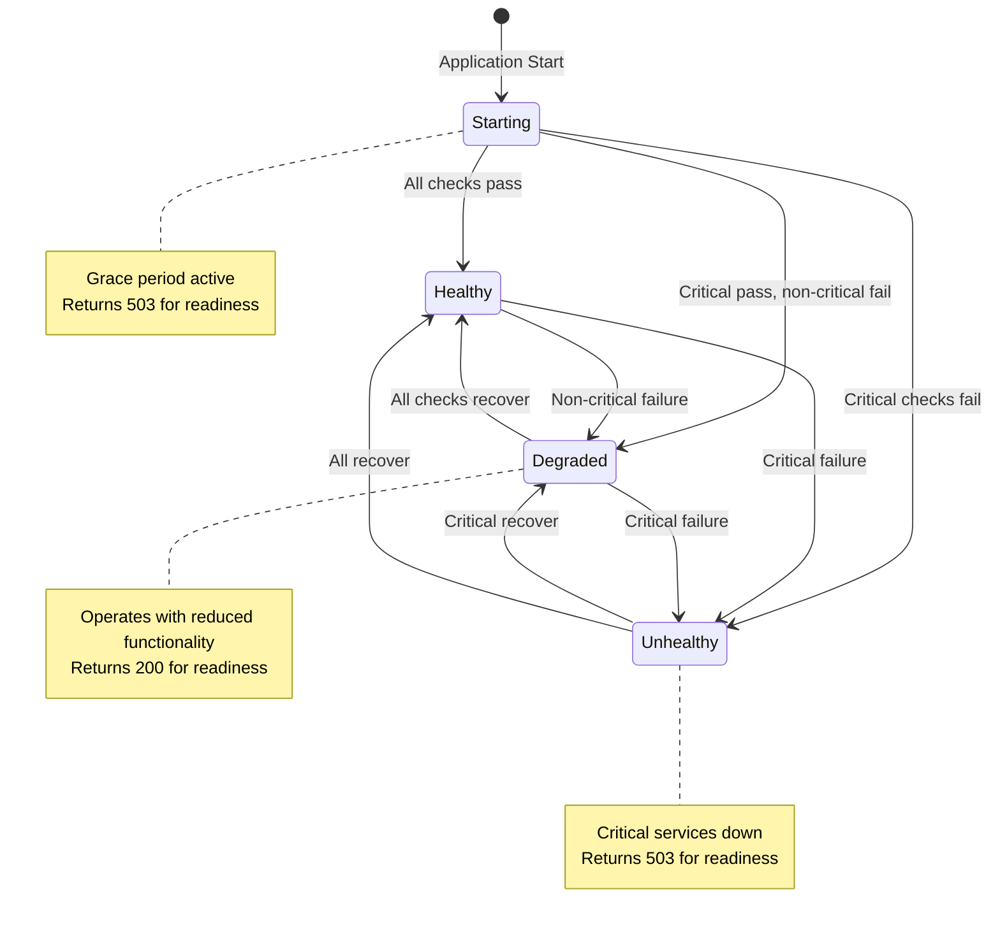

# Health Module

The Health module provides Kubernetes-compatible health checks with sophisticated state management, service dependency tracking, graceful degradation support, and comprehensive health monitoring capabilities.

<!-- toc -->

## Overview

The PCF API health module implements production-ready health checks that:

- **Support Container Orchestration**: Kubernetes-compatible liveness and readiness probes
- **Track Service Dependencies**: Monitor health of database, cache, and external services
- **Enable Graceful Degradation**: Operate in degraded mode when non-critical services fail
- **Provide Detailed Status**: Rich health information for debugging
- **Cache Health State**: Prevent health check storms during incidents
- **Support Startup Grace**: Allow time for services to initialize

## Quick Example

```rust
use pcf_api::health::{HealthManager, HealthCheck, HealthStatus};

// Create health manager
let health_manager = HealthManager::new(config.health);

// Register service health checks
health_manager.register_check("database", database_health);
health_manager.register_check("cache", cache_health);
health_manager.register_check("external_api", api_health);

// Use in HTTP handlers
async fn liveness_handler(health: State<HealthManager>) -> impl IntoResponse {
    // Simple liveness - is the process running?
    (StatusCode::OK, Json(json!({
        "status": "healthy",
        "timestamp": Utc::now()
    })))
}

async fn readiness_handler(health: State<HealthManager>) -> impl IntoResponse {
    let status = health.check_readiness().await;
    let status_code = if status.is_ready() {
        StatusCode::OK
    } else {
        StatusCode::SERVICE_UNAVAILABLE
    };
    
    (status_code, Json(status))
}
```

## Architecture

The health module uses a state machine approach:



### Component Architecture

```mermaid
graph TB
    subgraph "Health Manager"
        Manager[HealthManager]
        State[Health State]
        Cache[Result Cache]
        Checks[Health Checks]
    end
    
    subgraph "Health Checks"
        DB[Database Check]
        Cache2[Cache Check]
        API[API Check]
        Custom[Custom Checks]
    end
    
    subgraph "Endpoints"
        Liveness[/health/liveness]
        Readiness[/health/ready]
        Detailed[/health/detailed]
    end
    
    Manager --> State
    Manager --> Cache
    Manager --> Checks
    
    Checks --> DB
    Checks --> Cache2
    Checks --> API
    Checks --> Custom
    
    Liveness --> Manager
    Readiness --> Manager
    Detailed --> Manager
```

## Public API

### Core Types

```rust
/// Health check manager
pub struct HealthManager {
    config: HealthConfig,
    checks: Arc<RwLock<HashMap<String, Box<dyn HealthCheck>>>>,
    state: Arc<RwLock<HealthState>>,
    cache: Arc<Mutex<HealthCache>>,
}

/// Health check trait
#[async_trait]
pub trait HealthCheck: Send + Sync {
    /// Perform health check
    async fn check(&self) -> HealthStatus;
    
    /// Check name for reporting
    fn name(&self) -> &str;
    
    /// Is this check critical for readiness?
    fn is_critical(&self) -> bool {
        true
    }
}

/// Health status enum
#[derive(Debug, Clone, Serialize, Deserialize)]
pub enum HealthStatus {
    /// Service is healthy
    Healthy,
    /// Service is degraded but operational
    Degraded(String),
    /// Service is unhealthy
    Unhealthy(String),
}

/// Overall system health state
#[derive(Debug, Clone, Serialize)]
pub struct HealthState {
    pub status: SystemStatus,
    pub checks: HashMap<String, CheckResult>,
    pub version: String,
    pub uptime: Duration,
    pub timestamp: DateTime<Utc>,
}

/// Individual check result
#[derive(Debug, Clone, Serialize)]
pub struct CheckResult {
    pub status: HealthStatus,
    pub duration: Duration,
    pub last_checked: DateTime<Utc>,
    pub consecutive_failures: u32,
}
```

### Health Manager Methods

```rust
impl HealthManager {
    /// Create new health manager
    pub fn new(config: HealthConfig) -> Self;
    
    /// Register a health check
    pub fn register_check(&self, name: &str, check: impl HealthCheck + 'static);
    
    /// Check if system is alive (for liveness probe)
    pub async fn check_liveness(&self) -> LivenessStatus;
    
    /// Check if system is ready (for readiness probe)
    pub async fn check_readiness(&self) -> ReadinessStatus;
    
    /// Get detailed health information
    pub async fn check_detailed(&self) -> DetailedHealth;
    
    /// Force refresh all health checks
    pub async fn refresh_all(&self);
}
```

## Liveness vs Readiness

### Liveness Probe

Answers: "Is the application process running?"

```rust
// Simple liveness check
pub async fn liveness_handler() -> impl IntoResponse {
    // Always returns 200 OK unless the process is completely hung
    (StatusCode::OK, Json(json!({
        "status": "alive",
        "timestamp": Utc::now()
    })))
}
```

**When Liveness Fails**:
- Kubernetes restarts the container
- Use sparingly - only for unrecoverable states
- Don't check external dependencies

### Readiness Probe

Answers: "Can the application serve traffic?"

```rust
// Comprehensive readiness check
pub async fn readiness_handler(health: State<HealthManager>) -> impl IntoResponse {
    let status = health.check_readiness().await;
    
    match status.overall {
        SystemStatus::Healthy => (StatusCode::OK, Json(status)),
        SystemStatus::Degraded => (StatusCode::OK, Json(status)), // Still ready!
        SystemStatus::Unhealthy => (StatusCode::SERVICE_UNAVAILABLE, Json(status)),
        SystemStatus::Starting => (StatusCode::SERVICE_UNAVAILABLE, Json(status)),
    }
}
```

**When Readiness Fails**:
- Kubernetes stops routing traffic
- Container continues running
- Can recover without restart

## Health States

### Healthy

All health checks passing:

```json
{
  "status": "healthy",
  "checks": {
    "database": {
      "status": "healthy",
      "duration_ms": 5
    },
    "cache": {
      "status": "healthy",
      "duration_ms": 2
    }
  },
  "version": "1.0.0",
  "uptime_seconds": 3600
}
```

### Degraded

Non-critical services failing:

```json
{
  "status": "degraded",
  "checks": {
    "database": {
      "status": "healthy",
      "duration_ms": 5
    },
    "cache": {
      "status": "unhealthy",
      "error": "Connection timeout",
      "duration_ms": 1000,
      "consecutive_failures": 3
    }
  },
  "degraded_services": ["cache"],
  "version": "1.0.0",
  "uptime_seconds": 3600
}
```

### Unhealthy

Critical services failing:

```json
{
  "status": "unhealthy",
  "checks": {
    "database": {
      "status": "unhealthy",
      "error": "Connection pool exhausted",
      "duration_ms": 5000,
      "consecutive_failures": 10
    }
  },
  "failed_services": ["database"],
  "version": "1.0.0",
  "uptime_seconds": 3600
}
```

## Service Dependencies

### Defining Critical vs Non-Critical

```rust
// Critical service - system cannot function without it
pub struct DatabaseHealthCheck {
    pool: DatabasePool,
}

#[async_trait]
impl HealthCheck for DatabaseHealthCheck {
    async fn check(&self) -> HealthStatus {
        match self.pool.acquire_timeout(Duration::from_secs(5)).await {
            Ok(conn) => {
                // Verify connection works
                match conn.execute("SELECT 1").await {
                    Ok(_) => HealthStatus::Healthy,
                    Err(e) => HealthStatus::Unhealthy(format!("Query failed: {}", e)),
                }
            }
            Err(e) => HealthStatus::Unhealthy(format!("Connection failed: {}", e)),
        }
    }
    
    fn name(&self) -> &str {
        "database"
    }
    
    fn is_critical(&self) -> bool {
        true // System cannot work without database
    }
}

// Non-critical service - system can operate without it
pub struct CacheHealthCheck {
    client: CacheClient,
}

#[async_trait]
impl HealthCheck for CacheHealthCheck {
    async fn check(&self) -> HealthStatus {
        match self.client.ping().await {
            Ok(_) => HealthStatus::Healthy,
            Err(e) => HealthStatus::Degraded(format!("Cache unavailable: {}", e)),
        }
    }
    
    fn name(&self) -> &str {
        "cache"
    }
    
    fn is_critical(&self) -> bool {
        false // System can work without cache (slower)
    }
}
```

## Degraded Mode

### Operating with Degraded Services

```rust
// Service adapter that handles degraded mode
pub struct CacheService {
    client: Option<CacheClient>,
    health: Arc<HealthManager>,
}

impl CacheService {
    pub async fn get(&self, key: &str) -> Option<String> {
        // Check if cache is healthy
        if self.health.is_service_healthy("cache").await {
            if let Some(client) = &self.client {
                return client.get(key).await.ok();
            }
        }
        
        // Cache unhealthy - return None to trigger database lookup
        None
    }
    
    pub async fn set(&self, key: &str, value: &str) -> Result<(), CacheError> {
        // Only attempt if cache is healthy
        if self.health.is_service_healthy("cache").await {
            if let Some(client) = &self.client {
                return client.set(key, value).await;
            }
        }
        
        // Silently skip caching in degraded mode
        Ok(())
    }
}
```

## Performance

### Health Check Caching

Prevent health check storms:

```rust
pub struct HealthCache {
    results: HashMap<String, CachedResult>,
    ttl: Duration,
}

pub struct CachedResult {
    status: HealthStatus,
    timestamp: Instant,
    stale_allowed: bool,
}

impl HealthManager {
    async fn check_with_cache(&self, name: &str) -> HealthStatus {
        let mut cache = self.cache.lock().await;
        
        // Return cached result if fresh
        if let Some(cached) = cache.results.get(name) {
            if cached.timestamp.elapsed() < self.config.cache_ttl {
                return cached.status.clone();
            }
            
            // Return stale result if check is slow and stale allowed
            if cached.stale_allowed && cached.timestamp.elapsed() < self.config.max_stale {
                tokio::spawn(self.refresh_check(name));
                return cached.status.clone();
            }
        }
        
        // Perform fresh check
        drop(cache);
        self.perform_check(name).await
    }
}
```

### Performance Metrics

- **Check Latency**: Target <10ms for cached, <100ms for fresh
- **Memory Usage**: ~1KB per health check result
- **CPU Usage**: Negligible for cached results

## Security

### Preventing Information Disclosure

```rust
impl HealthState {
    /// Get public-safe health information
    pub fn public_view(&self) -> PublicHealth {
        PublicHealth {
            status: self.status.clone(),
            // Don't expose internal error details
            services: self.checks.iter()
                .map(|(name, result)| {
                    (name.clone(), match &result.status {
                        HealthStatus::Healthy => "healthy",
                        HealthStatus::Degraded(_) => "degraded",
                        HealthStatus::Unhealthy(_) => "unhealthy",
                    })
                })
                .collect(),
        }
    }
    
    /// Get detailed health for internal use only
    pub fn detailed_view(&self) -> DetailedHealth {
        // Include full error messages, timings, etc.
        self.clone()
    }
}
```

### Authentication for Detailed Health

```rust
// Public endpoint - basic info only
pub async fn public_health(health: State<HealthManager>) -> impl IntoResponse {
    let status = health.check_readiness().await;
    Json(status.public_view())
}

// Admin endpoint - full details
pub async fn admin_health(
    health: State<HealthManager>,
    auth: AdminAuth,
) -> impl IntoResponse {
    let status = health.check_detailed().await;
    Json(status)
}
```

## Testing

### Unit Testing Health Checks

```rust
#[tokio::test]
async fn test_database_health_check() {
    let pool = create_test_pool();
    let check = DatabaseHealthCheck { pool };
    
    // Test healthy state
    let status = check.check().await;
    assert!(matches!(status, HealthStatus::Healthy));
    
    // Test unhealthy state
    drop_test_database().await;
    let status = check.check().await;
    assert!(matches!(status, HealthStatus::Unhealthy(_)));
}

#[tokio::test]
async fn test_health_manager_state_transitions() {
    let manager = HealthManager::new(Default::default());
    
    // Register checks
    manager.register_check("critical", MockHealthCheck::new(true, true));
    manager.register_check("non_critical", MockHealthCheck::new(false, true));
    
    // Test healthy state
    let status = manager.check_readiness().await;
    assert_eq!(status.overall, SystemStatus::Healthy);
    
    // Fail non-critical - should be degraded
    manager.set_check_status("non_critical", HealthStatus::Unhealthy("test".into()));
    let status = manager.check_readiness().await;
    assert_eq!(status.overall, SystemStatus::Degraded);
    
    // Fail critical - should be unhealthy
    manager.set_check_status("critical", HealthStatus::Unhealthy("test".into()));
    let status = manager.check_readiness().await;
    assert_eq!(status.overall, SystemStatus::Unhealthy);
}
```

### Integration Testing

```rust
#[tokio::test]
async fn test_health_endpoints() {
    let app = create_test_app();
    
    // Test liveness always returns 200
    let response = app.get("/health/liveness").await;
    assert_eq!(response.status(), StatusCode::OK);
    
    // Test readiness during startup
    let response = app.get("/health/ready").await;
    assert_eq!(response.status(), StatusCode::SERVICE_UNAVAILABLE);
    
    // Wait for startup
    tokio::time::sleep(Duration::from_secs(6)).await;
    
    // Test readiness after startup
    let response = app.get("/health/ready").await;
    assert_eq!(response.status(), StatusCode::OK);
}
```

## Container Integration

### Docker HEALTHCHECK

```dockerfile
FROM rust:1.75 as runtime
COPY --from=builder /app/target/release/pcf-api /usr/local/bin/

# Health check configuration
HEALTHCHECK --interval=30s --timeout=3s --start-period=10s --retries=3 \
  CMD curl -f http://localhost:8080/health/ready || exit 1

CMD ["pcf-api"]
```

### Kubernetes Probes

```yaml
apiVersion: v1
kind: Pod
spec:
  containers:
  - name: pcf-api
    image: pcf-api:latest
    
    # Liveness probe - restart if hung
    livenessProbe:
      httpGet:
        path: /health/liveness
        port: 8080
      initialDelaySeconds: 10
      periodSeconds: 10
      timeoutSeconds: 1
      failureThreshold: 3
    
    # Readiness probe - route traffic when ready
    readinessProbe:
      httpGet:
        path: /health/ready
        port: 8080
      initialDelaySeconds: 5
      periodSeconds: 5
      timeoutSeconds: 3
      successThreshold: 1
      failureThreshold: 3
    
    # Startup probe - allow time for initialization
    startupProbe:
      httpGet:
        path: /health/ready
        port: 8080
      initialDelaySeconds: 0
      periodSeconds: 1
      timeoutSeconds: 1
      failureThreshold: 60  # 60 seconds to start
```

## Monitoring

### Health Metrics

```rust
// Prometheus metrics
lazy_static! {
    static ref HEALTH_CHECK_DURATION: HistogramVec = register_histogram_vec!(
        "health_check_duration_seconds",
        "Health check duration by service",
        &["service", "status"]
    ).unwrap();
    
    static ref HEALTH_CHECK_STATUS: IntGaugeVec = register_int_gauge_vec!(
        "health_check_status",
        "Current health check status (0=healthy, 1=degraded, 2=unhealthy)",
        &["service"]
    ).unwrap();
    
    static ref HEALTH_CHECK_FAILURES: IntCounterVec = register_int_counter_vec!(
        "health_check_failures_total",
        "Total health check failures by service",
        &["service"]
    ).unwrap();
}
```

### Alerting Rules

```yaml
# Prometheus alerting rules
groups:
  - name: health
    rules:
      - alert: ServiceUnhealthy
        expr: health_check_status{service="database"} == 2
        for: 5m
        labels:
          severity: critical
        annotations:
          summary: "Database health check failing"
          
      - alert: ServiceDegraded
        expr: health_check_status == 1
        for: 15m
        labels:
          severity: warning
        annotations:
          summary: "Service {{ $labels.service }} is degraded"
          
      - alert: HealthCheckSlow
        expr: rate(health_check_duration_seconds[5m]) > 1
        labels:
          severity: warning
        annotations:
          summary: "Health check for {{ $labels.service }} is slow"
```

## Troubleshooting

### Common Issues

1. **"Readiness probe failed" during deployment**
   - **Cause**: Services not ready within startup period
   - **Solution**: Increase `startupProbe.failureThreshold`
   - **Check**: Application logs during startup

2. **"Liveness probe failed" causing restarts**
   - **Cause**: Application deadlock or resource exhaustion
   - **Solution**: Investigate thread dumps and resource usage
   - **Prevention**: Don't check external services in liveness

3. **Health checks timing out**
   - **Cause**: Slow service checks
   - **Solution**: Implement timeouts in health checks
   - **Example**: Use `timeout(Duration::from_secs(5))`

4. **Degraded mode not working**
   - **Cause**: Code not checking health state
   - **Solution**: Implement fallback logic
   - **Pattern**: Check health before using service

5. **Health check storms during incidents**
   - **Cause**: No caching, too frequent checks
   - **Solution**: Enable health check caching
   - **Config**: Set appropriate `cache_ttl`

## Best Practices

1. **Separate Liveness and Readiness**: Different purposes, different checks
2. **Use Startup Probes**: Allow time for initialization
3. **Cache Results**: Prevent overwhelming unhealthy services
4. **Set Timeouts**: Health checks should be fast
5. **Log Failures**: Include context for debugging
6. **Monitor Trends**: Track health over time
7. **Test Failure Scenarios**: Ensure graceful degradation works

## Further Reading

- [Kubernetes Probes](https://kubernetes.io/docs/tasks/configure-pod-container/configure-liveness-readiness-startup-probes/)
- [Health Check Patterns](https://microservices.io/patterns/observability/health-check-api.html)
- [Circuit Breaker Pattern](https://martinfowler.com/bliki/CircuitBreaker.html)
- [Graceful Degradation](https://www.nginx.com/blog/microservices-march-improve-resiliency-distributed-systems/)
