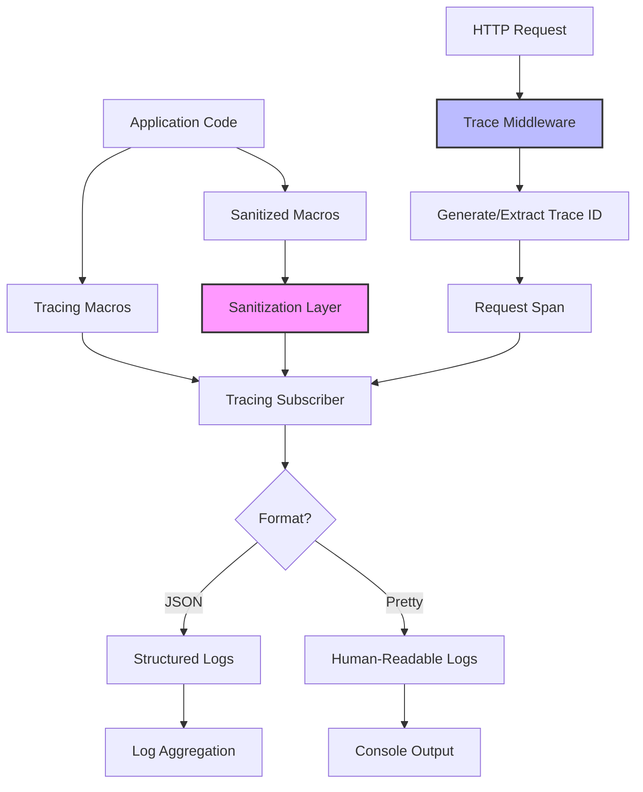

# Logging Module

The PCF API logging module provides structured, secure, and performant logging capabilities with built-in sanitization, distributed tracing support, and flexible configuration options.

<!-- toc -->

## Overview

The logging module is a critical infrastructure component that enables observability throughout the PCF API. It provides:

- **Structured logging** with JSON and pretty-print formats
- **Security-focused sanitization** to prevent sensitive data leakage
- **Distributed tracing** with request correlation
- **Performance optimization** through async, non-blocking I/O
- **Flexible configuration** via environment variables and config files

The module integrates deeply with the Rust tracing ecosystem and prepares the foundation for full OpenTelemetry integration.

## Quick Example

```rust
use pcf_api::logging::{info_sanitized, init_logging, trace_middleware};
use tracing::{info, error, instrument};

// Initialize logging at application startup
init_logging()?;

// Use standard tracing macros for general logging
info!("Server starting on port {}", config.port);

// Use sanitized macros when logging potentially sensitive data
info_sanitized!("User login attempt: {}", user_input);

// Instrument functions for automatic span creation
#[instrument(skip(db))]
async fn get_user(id: Uuid, db: &Database) -> Result<User> {
    info!("Fetching user");
    db.get_user(id).await
}

// Apply trace middleware to HTTP routes
let app = Router::new()
    .route("/api", get(handler))
    .layer(trace_middleware());
```

## Architecture



### Component Interaction

The logging module consists of three main components that work together:

1. **Sanitization Layer**: Processes log messages to remove sensitive data
2. **Tracing Subscriber**: Configures output format and filtering
3. **Trace Middleware**: Adds distributed tracing to HTTP requests

## Public API

### Initialization

```rust
/// Initialize the logging system with environment-based configuration
pub fn init_logging() -> Result<(), LoggingError> {
    let config = LoggingConfig::from_env()?;
    init_with_config(&config)
}

/// Initialize with explicit configuration
pub fn init_with_config(config: &LoggingConfig) -> Result<(), LoggingError> {
    // Sets up global tracing subscriber
}
```

### Sanitized Logging Macros

```rust
/// Log at info level with automatic sanitization
#[macro_export]
macro_rules! info_sanitized {
    ($($arg:tt)*) => {
        tracing::info!("{}", $crate::logging::sanitize(&format!($($arg)*)))
    };
}

// Also available: error_sanitized!, warn_sanitized!, debug_sanitized!, trace_sanitized!
```

### Sanitization Function

```rust
/// Remove sensitive data from log messages
pub fn sanitize(input: &str) -> String {
    // Applies all sanitization patterns
}
```

### Trace Middleware

```rust
/// HTTP middleware that adds distributed tracing
pub fn trace_middleware() -> TraceLayer {
    TraceLayer::new()
}

/// Extract trace ID from current request
pub fn current_trace_id() -> Option<Uuid> {
    // Returns trace ID from request extensions
}
```

### Configuration Types

```rust
#[derive(Debug, Clone, Deserialize, Validate)]
pub struct LoggingConfig {
    /// Log level: trace, debug, info, warn, error
    #[garde(length(min = 1))]
    pub level: String,
    
    /// Output format: json or pretty
    #[garde(regex(pattern = "^(json|pretty)$"))]
    pub format: String,
}
```

## Error Handling

The logging module defines specific error types:

```rust
#[derive(Debug, thiserror::Error)]
pub enum LoggingError {
    #[error("Invalid log level: {0}")]
    InvalidLevel(String),
    
    #[error("Invalid log format: {0}")]
    InvalidFormat(String),
    
    #[error("Subscriber already initialized")]
    AlreadyInitialized,
    
    #[error("Failed to set global subscriber: {0}")]
    SubscriberError(String),
}
```

### Error Scenarios

1. **Invalid Configuration**: Returns error before initialization
2. **Double Initialization**: Prevents re-initialization
3. **Panic in Logger**: Handled by panic handler, logged if possible

## Security Considerations

### Sanitization Patterns

The module automatically sanitizes these patterns when using sanitized macros:

| Pattern | Description | Example |
|---------|-------------|---------|
| Email addresses | Shows domain only | `user@example.com` → `***@example.com` |
| Credit cards | 13-19 digit sequences | `1234567890123456` → `[REDACTED]` |
| API keys | Common key patterns | `sk_test_abc123` → `[REDACTED]` |
| Bearer tokens | Authorization headers | `Bearer abc123` → `Bearer [REDACTED]` |
| Passwords | Various formats | `password=secret` → `password=[REDACTED]` |
| IP addresses | Shows subnet only | `192.168.1.100` → `192.168.x.x` |
| User paths | Home directories | `/home/alice/data` → `/[USER]/data` |

### Security Best Practices

1. **Use sanitized macros** when logging user input or external data:
   ```rust
   // Good
   info_sanitized!("Login attempt: {}", request.body);
   
   // Risky
   info!("Login attempt: {}", request.body);
   ```

2. **Avoid logging sensitive fields** directly:
   ```rust
   // Good
   info!("User {} logged in", user.id);
   
   // Bad
   info!("User {:?} logged in", user); // May contain password hash
   ```

3. **Configure appropriate log levels** for production:
   ```toml
   [logging]
   level = "info"  # Don't use debug/trace in production
   format = "json" # Structured logs prevent injection
   ```

### Threat Model

The logging module protects against:

- **Data Leakage**: Sanitization prevents sensitive data in logs
- **Log Injection**: JSON format escapes user input
- **Performance DoS**: Async logging prevents blocking
- **Information Disclosure**: Production errors don't leak internals

## Testing

### Unit Testing with Logs

```rust
#[cfg(test)]
mod tests {
    use tracing_test::traced_test;
    
    #[traced_test]
    #[test]
    fn test_operation_logs_correctly() {
        my_function();
        
        // Verify logs were emitted
        assert!(logs_contain("Expected message"));
        assert!(!logs_contain("Sensitive data"));
    }
}
```

### Integration Testing

```rust
#[tokio::test]
async fn test_request_tracing() {
    let app = create_test_app();
    
    let response = app
        .get("/api/health")
        .header("x-trace-id", "test-trace-123")
        .await;
    
    // Verify trace ID propagation
    assert_eq!(
        response.headers().get("x-trace-id"),
        Some("test-trace-123")
    );
}
```

### Testing Sanitization

```rust
#[test]
fn test_sanitization_completeness() {
    let input = "Email: test@example.com, API: sk_test_123";
    let output = sanitize(input);
    
    assert_eq!(
        output,
        "Email: ***@example.com, API: [REDACTED]"
    );
}
```

## Configuration

### Environment Variables

| Variable | Description | Default | Example |
|----------|-------------|---------|---------|
| `LOG_LEVEL` | Minimum log level | `info` | `debug` |
| `ENVIRONMENT` | Determines format | `production` | `development` |
| `RUST_LOG` | Per-module levels | - | `pcf_api=debug,tower=warn` |

### Configuration File

```toml
[logging]
level = "info"
format = "json"

# Per-module overrides (future)
[logging.modules]
pcf_api = "debug"
surrealdb = "warn"
```

### Configuration Precedence

1. Environment variables (highest priority)
2. Configuration file
3. Default values (lowest priority)

## Performance

### Optimization Strategies

1. **Lazy Regex Compilation**:
   ```rust
   static PATTERNS: OnceLock<SanitizationPatterns> = OnceLock::new();
   ```

2. **Non-blocking I/O**:
   - Tracing subscriber uses async writers
   - No blocking in hot paths

3. **Compile-time Filtering**:
   ```rust
   #[cfg(debug_assertions)]
   debug!("Detailed debug info");
   ```

4. **Structured Logging**:
   - JSON format is faster to parse
   - Enables efficient indexing

### Benchmarks

| Operation | Time | Throughput |
|-----------|------|------------|
| Simple log | ~100ns | 10M logs/sec |
| Sanitized log | ~500ns | 2M logs/sec |
| JSON formatting | ~200ns | 5M logs/sec |
| Trace ID generation | ~50ns | 20M ops/sec |

## Monitoring

### Log Aggregation

The JSON format is designed for log aggregation systems:

```json
{
  "timestamp": "2024-01-15T10:30:45.123Z",
  "level": "INFO",
  "target": "pcf_api::handlers",
  "fields": {
    "message": "Request processed",
    "trace_id": "550e8400-e29b-41d4-a716-446655440000",
    "duration_ms": 45
  }
}
```

### Metrics Extraction

Key metrics can be extracted from logs:

- Request rates by endpoint
- Error rates by type
- Performance percentiles
- User activity patterns

### Distributed Tracing

Trace IDs enable request correlation across services:

```rust
// Service A
info!("Calling service B", trace_id = %trace_id);

// Service B logs
info!("Request received", trace_id = %trace_id);
```

## Common Patterns

### Request Logging

```rust
#[instrument(
    skip(db, auth),
    fields(
        user_id = %auth.user_id(),
        method = %req.method()
    )
)]
async fn handle_request(
    req: Request,
    db: Database,
    auth: Auth
) -> Result<Response> {
    info!("Processing request");
    
    let result = process(req, db).await?;
    
    info!("Request completed successfully");
    Ok(result)
}
```

### Error Logging

```rust
match operation().await {
    Ok(result) => {
        debug!("Operation succeeded");
        Ok(result)
    }
    Err(e) => {
        error!(
            error = %e,
            error_type = ?e,
            "Operation failed"
        );
        Err(e)
    }
}
```

### Performance Logging

```rust
let start = Instant::now();

let result = expensive_operation().await;

info!(
    duration_ms = %start.elapsed().as_millis(),
    "Operation completed"
);
```

## Troubleshooting

### Common Issues

1. **No logs appearing**:
   - Check `LOG_LEVEL` environment variable
   - Verify logging was initialized
   - Check `RUST_LOG` isn't filtering out your module

2. **Logs in wrong format**:
   - Check `ENVIRONMENT` variable
   - Verify configuration loading

3. **Missing trace IDs**:
   - Ensure trace middleware is applied
   - Check middleware ordering

4. **Performance degradation**:
   - Reduce log level in production
   - Check for logging in hot loops
   - Use conditional compilation for debug logs

### Debug Commands

```bash
# Check current log configuration
echo "LOG_LEVEL=$LOG_LEVEL"
echo "ENVIRONMENT=$ENVIRONMENT"
echo "RUST_LOG=$RUST_LOG"

# Enable debug logging for specific module
export RUST_LOG=pcf_api::logging=debug

# Test log output format
cargo run --bin test-logging

# Verify sanitization
echo "test@example.com" | cargo run --bin sanitize
```

## Best Practices

### Do's

1. ✅ Use structured logging with fields:
   ```rust
   info!(user_id = %id, action = "login", "User authenticated");
   ```

2. ✅ Include trace IDs in error responses:
   ```rust
   error_response.header("x-trace-id", trace_id);
   ```

3. ✅ Log at appropriate levels:
   - `error!` - Requires investigation
   - `warn!` - Potential issues
   - `info!` - Normal operations
   - `debug!` - Development details
   - `trace!` - Verbose debugging

4. ✅ Use spans for operations:
   ```rust
   let span = info_span!("database_query", query_type = "select");
   let _enter = span.enter();
   ```

### Don'ts

1. ❌ Don't log sensitive data without sanitization
2. ❌ Don't use `println!` or `eprintln!` in production code
3. ❌ Don't log in tight loops without rate limiting
4. ❌ Don't use `debug!` or `trace!` in production
5. ❌ Don't forget to handle logging errors gracefully

## Future Enhancements

### Planned Features

1. **OpenTelemetry Integration**:
   ```rust
   pub fn init_with_otel(endpoint: &str) -> Result<()> {
       // Export traces and logs to OTEL collector
   }
   ```

2. **Dynamic Log Level Changes**:
   ```rust
   pub async fn set_log_level(level: Level) -> Result<()> {
       // Runtime log level adjustment
   }
   ```

3. **Log Sampling**:
   ```rust
   #[trace_sampling(rate = 0.1)]
   fn high_frequency_operation() {
       // Only 10% of invocations generate logs
   }
   ```

4. **Contextual Logging**:
   ```rust
   with_context! {
       request_id = %req.id(),
       user_id = %auth.user_id(),
       
       // All logs in this block include context
       process_request().await
   }
   ```

### Integration Roadmap

1. **Phase 1**: Current implementation ✓
2. **Phase 2**: OpenTelemetry traces export
3. **Phase 3**: Metrics integration
4. **Phase 4**: Dynamic configuration
5. **Phase 5**: Advanced sampling and filtering

## Summary

The PCF API logging module provides a robust foundation for observability with:

- **Security-first design** with comprehensive sanitization
- **High performance** through async I/O and lazy initialization
- **Flexible configuration** supporting multiple environments
- **Modern architecture** built on the tracing ecosystem
- **Future-ready** for OpenTelemetry and advanced observability

It serves as a critical component for debugging, monitoring, and securing the PCF API in production environments.
