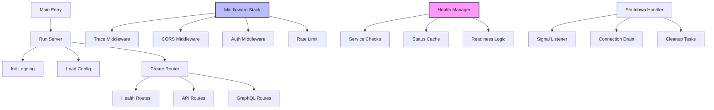

# Server Module

The PCF API server module provides a production-ready HTTP server with health monitoring, graceful shutdown, request tracing, and comprehensive middleware support built on Axum and Tower.

<!-- toc -->

## Overview

The server module is the core runtime component that brings together all PCF API functionality into a cohesive HTTP service. It provides:

- **Async HTTP server** using Axum and Tokio
- **Health monitoring** with Kubernetes-compatible probes
- **Graceful shutdown** handling for zero-downtime deployments
- **Request tracing** with distributed trace ID propagation
- **Middleware pipeline** for cross-cutting concerns
- **Configuration management** with environment-aware settings

The module follows cloud-native principles and is designed for containerized deployments with comprehensive observability.

## Quick Example

```rust
use pcf_api::{run_server, config::AppConfig};
use tokio::signal;

#[tokio::main]
async fn main() -> Result<()> {
    // Initialize and run the server
    let handle = run_server().await?;
    
    // Wait for shutdown signal
    signal::ctrl_c().await?;
    
    // Graceful shutdown
    handle.shutdown().await;
    
    Ok(())
}

// Or use the provided binary
// $ cargo run --release
// $ curl http://localhost:3000/health
```

## Architecture



### Component Responsibilities

1. **Runtime**: Manages the async Tokio runtime and server lifecycle
2. **Router**: Configures routes and applies middleware
3. **Health Manager**: Monitors service health and readiness
4. **Middleware**: Handles cross-cutting concerns like tracing and auth
5. **Shutdown Handler**: Ensures graceful termination

## Public API

### Server Initialization

```rust
/// Run the PCF API server with default configuration
pub async fn run_server() -> Result<(), ServerError> {
    // Initialize logging
    init_logging()?;
    
    // Load configuration
    let config = AppConfig::load()?;
    
    // Create and run server
    let server = Server::new(config);
    server.run().await
}

/// Create server with custom configuration
pub async fn create_server(config: AppConfig) -> Result<Server, ServerError> {
    Server::new(config)
}
```

### Server Type

```rust
pub struct Server {
    config: AppConfig,
    health_manager: Arc<HealthManager>,
    shutdown_tx: Option<Sender<()>>,
}

impl Server {
    /// Create new server instance
    pub fn new(config: AppConfig) -> Self {
        let health_manager = Arc::new(HealthManager::new());
        Self {
            config,
            health_manager,
            shutdown_tx: None,
        }
    }
    
    /// Run the server
    pub async fn run(&mut self) -> Result<(), ServerError> {
        let app = self.create_app()?;
        let addr = self.socket_addr()?;
        
        let listener = TcpListener::bind(&addr).await?;
        info!("Server listening on {}", addr);
        
        axum::serve(listener, app)
            .with_graceful_shutdown(shutdown_signal())
            .await?;
            
        Ok(())
    }
    
    /// Create the application router
    pub fn create_app(&self) -> Result<Router, ServerError> {
        let router = Router::new()
            .merge(health_routes(self.health_manager.clone()))
            .merge(api_routes())
            .layer(trace_middleware())
            .layer(cors_middleware());
            
        Ok(router)
    }
}
```

### Health Monitoring

```rust
/// Health check manager
pub struct HealthManager {
    services: RwLock<HashMap<String, ServiceHealth>>,
    cache: RwLock<Option<CachedResponse>>,
    startup_time: Instant,
}

impl HealthManager {
    /// Register a health check
    pub async fn register_check(
        &self,
        name: impl Into<String>,
        check: Box<dyn HealthCheck>
    ) {
        self.services.write().await.insert(
            name.into(),
            ServiceHealth::new(check)
        );
    }
    
    /// Get overall health status
    pub async fn get_status(&self) -> HealthStatus {
        // Check cache first
        if let Some(cached) = self.get_cached_response().await {
            return cached.status;
        }
        
        // Compute fresh status
        let status = self.compute_status().await;
        self.cache_response(status.clone()).await;
        
        status
    }
}

/// Health check trait
#[async_trait]
pub trait HealthCheck: Send + Sync {
    async fn check(&self) -> HealthStatus;
}
```

### Middleware

```rust
/// Request tracing middleware
pub fn trace_middleware() -> TraceLayer {
    TraceLayer::new()
        .make_span_with(|request: &Request<_>| {
            let trace_id = extract_or_generate_trace_id(request);
            
            tracing::info_span!(
                "http_request",
                method = %request.method(),
                uri = %request.uri(),
                trace_id = %trace_id,
            )
        })
        .on_response(|response: &Response<_>, latency: Duration, _span: &Span| {
            let status = response.status();
            let latency_ms = latency.as_millis();
            
            tracing::info!(
                status = status.as_u16(),
                latency_ms = latency_ms,
                "Response sent"
            );
        })
}

/// CORS middleware for browser support
pub fn cors_middleware() -> CorsLayer {
    CorsLayer::new()
        .allow_origin(cors::Any)
        .allow_methods(cors::Any)
        .allow_headers(cors::Any)
        .expose_headers(["x-trace-id"])
}
```

### Routes

```rust
/// Health check routes
pub fn health_routes(health_manager: Arc<HealthManager>) -> Router {
    Router::new()
        .route("/health", get(health_handler))
        .route("/health/liveness", get(liveness_handler))
        .route("/health/readiness", get(readiness_handler))
        .route("/health/ready", get(readiness_handler))
        .with_state(health_manager)
}

/// API routes
pub fn api_routes() -> Router {
    Router::new()
        .route("/api/v1/notes", get(list_notes).post(create_note))
        .route("/api/v1/notes/:id", get(get_note).put(update_note).delete(delete_note))
}

/// GraphQL routes (when integrated)
pub fn graphql_routes(schema: GraphQLSchema) -> Router {
    Router::new()
        .route("/graphql", post(graphql_handler))
        .route("/graphql/playground", get(playground_handler))
        .with_state(schema)
}
```

## Error Handling

### Server Errors

```rust
#[derive(Debug, thiserror::Error)]
pub enum ServerError {
    #[error("Failed to bind to address {0}: {1}")]
    BindError(SocketAddr, std::io::Error),
    
    #[error("Configuration error: {0}")]
    ConfigError(String),
    
    #[error("Failed to initialize logging: {0}")]
    LoggingError(#[from] LoggingError),
    
    #[error("Server runtime error: {0}")]
    RuntimeError(String),
    
    #[error("Shutdown timeout after {0} seconds")]
    ShutdownTimeout(u64),
}
```

### Error Recovery

```rust
/// Bind with fallback ports
async fn bind_with_fallback(
    config: &ServerConfig
) -> Result<TcpListener, ServerError> {
    let primary_addr = config.socket_addr();
    
    match TcpListener::bind(&primary_addr).await {
        Ok(listener) => Ok(listener),
        Err(e) if e.kind() == ErrorKind::AddrInUse => {
            warn!("Port {} in use, trying fallback", config.port);
            
            // Try fallback ports
            for port in &config.fallback_ports {
                let addr = SocketAddr::new(config.host, *port);
                if let Ok(listener) = TcpListener::bind(&addr).await {
                    info!("Bound to fallback port {}", port);
                    return Ok(listener);
                }
            }
            
            Err(ServerError::BindError(primary_addr, e))
        }
        Err(e) => Err(ServerError::BindError(primary_addr, e))
    }
}
```

## Security Considerations

### CORS Configuration

```rust
/// Production CORS configuration
pub fn production_cors() -> CorsLayer {
    CorsLayer::new()
        .allow_origin([
            "https://app.example.com".parse::<HeaderValue>().unwrap(),
            "https://api.example.com".parse::<HeaderValue>().unwrap(),
        ])
        .allow_methods([Method::GET, Method::POST, Method::PUT, Method::DELETE])
        .allow_headers([CONTENT_TYPE, AUTHORIZATION])
        .allow_credentials(true)
        .max_age(Duration::from_secs(86400)) // 24 hours
}
```

### Security Headers

```rust
/// Security headers middleware
pub fn security_headers_middleware() -> impl Layer<Route> {
    SetResponseHeaderLayer::overriding(
        HeaderName::from_static("x-content-type-options"),
        HeaderValue::from_static("nosniff")
    )
    .layer(SetResponseHeaderLayer::overriding(
        HeaderName::from_static("x-frame-options"),
        HeaderValue::from_static("DENY")
    ))
    .layer(SetResponseHeaderLayer::overriding(
        HeaderName::from_static("x-xss-protection"),
        HeaderValue::from_static("1; mode=block")
    ))
}
```

### Rate Limiting

```rust
/// Rate limiting middleware
pub fn rate_limit_middleware() -> RateLimitLayer {
    let governor = Arc::new(
        RateLimiter::direct(Quota::per_minute(NonZeroU32::new(60).unwrap()))
    );
    
    RateLimitLayer::new(governor)
        .with_key_extractor(|req: &Request<_>| {
            // Extract client IP or API key
            req.headers()
                .get("x-forwarded-for")
                .and_then(|h| h.to_str().ok())
                .unwrap_or("unknown")
                .to_string()
        })
}
```

## Testing

### Integration Tests

```rust
#[tokio::test]
async fn test_server_startup() {
    let config = AppConfig {
        server: ServerConfig {
            host: "127.0.0.1".parse().unwrap(),
            port: 0, // Random port
            ..Default::default()
        },
        ..Default::default()
    };
    
    let server = Server::new(config);
    let app = server.create_app().unwrap();
    
    // Test with test client
    let client = TestClient::new(app);
    let response = client.get("/health").await;
    
    assert_eq!(response.status(), StatusCode::OK);
}

#[tokio::test]
async fn test_graceful_shutdown() {
    let (shutdown_tx, shutdown_rx) = oneshot::channel();
    
    let handle = tokio::spawn(async move {
        run_server_with_shutdown(shutdown_rx).await
    });
    
    // Give server time to start
    tokio::time::sleep(Duration::from_millis(100)).await;
    
    // Trigger shutdown
    shutdown_tx.send(()).unwrap();
    
    // Should complete within timeout
    tokio::time::timeout(Duration::from_secs(5), handle).await
        .expect("Server should shutdown gracefully");
}
```

### Health Check Testing

```rust
#[tokio::test]
async fn test_health_endpoint_states() {
    let health_manager = Arc::new(HealthManager::new());
    
    // Register failing check
    health_manager.register_check(
        "database",
        Box::new(AlwaysUnhealthyCheck)
    ).await;
    
    let app = health_routes(health_manager);
    let client = TestClient::new(app);
    
    // Readiness should fail
    let response = client.get("/health/ready").await;
    assert_eq!(response.status(), StatusCode::SERVICE_UNAVAILABLE);
    
    // Liveness should still pass
    let response = client.get("/health/liveness").await;
    assert_eq!(response.status(), StatusCode::OK);
}
```

## Configuration

### Server Configuration

```rust
#[derive(Debug, Clone, Deserialize, Validate)]
pub struct ServerConfig {
    /// Server host address
    #[garde(skip)]
    pub host: IpAddr,
    
    /// Server port
    #[garde(range(min = 1024, max = 65535))]
    pub port: u16,
    
    /// Worker threads (0 = CPU cores)
    #[garde(range(max = 512))]
    pub workers: usize,
    
    /// Request timeout in seconds
    #[garde(range(min = 1, max = 300))]
    pub request_timeout: u64,
    
    /// Graceful shutdown timeout
    #[garde(range(min = 1, max = 300))]
    pub shutdown_timeout: u64,
    
    /// Maximum request body size
    #[garde(range(min = 1024, max = 104857600))] // 100MB max
    pub max_body_size: usize,
}

impl Default for ServerConfig {
    fn default() -> Self {
        Self {
            host: IpAddr::V4(Ipv4Addr::new(0, 0, 0, 0)),
            port: 3000,
            workers: 0,
            request_timeout: 30,
            shutdown_timeout: 30,
            max_body_size: 10 * 1024 * 1024, // 10MB
        }
    }
}
```

### Environment Variables

| Variable | Description | Default |
|----------|-------------|---------|
| `APP_SERVER_HOST` | Bind address | `0.0.0.0` |
| `APP_SERVER_PORT` | Listen port | `3000` |
| `APP_SERVER_WORKERS` | Worker threads | CPU cores |
| `APP_SERVER_REQUEST_TIMEOUT` | Request timeout (seconds) | `30` |
| `APP_SERVER_SHUTDOWN_TIMEOUT` | Shutdown timeout (seconds) | `30` |

## Performance

### Connection Tuning

```rust
/// Configure TCP listener with performance options
async fn create_listener(addr: SocketAddr) -> Result<TcpListener> {
    let socket = if addr.is_ipv4() {
        TcpSocket::new_v4()?
    } else {
        TcpSocket::new_v6()?
    };
    
    // Enable SO_REUSEADDR for faster restarts
    socket.set_reuseaddr(true)?;
    
    // Set receive buffer size
    socket.set_recv_buffer_size(4 * 1024 * 1024)?;
    
    // Bind and listen
    socket.bind(addr)?;
    socket.listen(1024)?;
    
    Ok(socket.into())
}
```

### Request Pipeline Optimization

```rust
/// Optimized middleware ordering
pub fn create_optimized_app() -> Router {
    Router::new()
        // Early termination middleware first
        .layer(rate_limit_middleware())
        .layer(request_size_limit(10 * 1024 * 1024))
        
        // Observability
        .layer(trace_middleware())
        .layer(metrics_middleware())
        
        // Security
        .layer(cors_middleware())
        .layer(auth_middleware())
        
        // Routes
        .merge(api_routes())
        .merge(graphql_routes())
        
        // Compression last
        .layer(CompressionLayer::new())
}
```

### Health Check Performance

The health system includes several optimizations:

1. **Response caching** (5-second TTL)
2. **Stale-while-revalidate** pattern
3. **Parallel health checks**
4. **Minimal liveness endpoint**

## Monitoring

### Metrics Collection

```rust
/// Server metrics
pub struct ServerMetrics {
    requests_total: Counter,
    request_duration: Histogram,
    response_size: Histogram,
    concurrent_requests: Gauge,
}

impl ServerMetrics {
    pub fn record_request(&self, method: &Method, path: &str, status: StatusCode, duration: Duration) {
        self.requests_total
            .with_label_values(&[method.as_str(), path, status.as_str()])
            .inc();
            
        self.request_duration
            .with_label_values(&[method.as_str(), path])
            .observe(duration.as_secs_f64());
    }
}
```

### Distributed Tracing

```rust
/// Extract or generate trace ID
fn extract_or_generate_trace_id(request: &Request<Body>) -> Uuid {
    request
        .headers()
        .get("x-trace-id")
        .and_then(|h| h.to_str().ok())
        .and_then(|s| Uuid::parse_str(s).ok())
        .unwrap_or_else(Uuid::new_v4)
}

/// Inject trace ID into response
fn inject_trace_id(response: &mut Response<Body>, trace_id: Uuid) {
    response.headers_mut().insert(
        "x-trace-id",
        HeaderValue::from_str(&trace_id.to_string()).unwrap()
    );
}
```

## Common Patterns

### Graceful Shutdown

```rust
/// Shutdown signal handler
async fn shutdown_signal() {
    let ctrl_c = async {
        signal::ctrl_c()
            .await
            .expect("Failed to install Ctrl+C handler");
    };

    #[cfg(unix)]
    let terminate = async {
        signal::unix::signal(signal::unix::SignalKind::terminate())
            .expect("Failed to install signal handler")
            .recv()
            .await;
    };

    #[cfg(not(unix))]
    let terminate = std::future::pending::<()>();

    tokio::select! {
        _ = ctrl_c => {
            info!("Received SIGINT, starting graceful shutdown");
        },
        _ = terminate => {
            info!("Received SIGTERM, starting graceful shutdown");
        },
    }
}
```

### Request Context

```rust
/// Request extension for shared context
#[derive(Clone)]
pub struct RequestContext {
    pub trace_id: Uuid,
    pub start_time: Instant,
    pub user_id: Option<UserId>,
}

/// Middleware to inject context
pub async fn context_middleware(
    mut req: Request<Body>,
    next: Next<Body>,
) -> Response<Body> {
    let context = RequestContext {
        trace_id: extract_or_generate_trace_id(&req),
        start_time: Instant::now(),
        user_id: None, // Set by auth middleware
    };
    
    req.extensions_mut().insert(context);
    next.run(req).await
}
```

### State Management

```rust
/// Application state
#[derive(Clone)]
pub struct AppState {
    pub config: Arc<AppConfig>,
    pub database: Arc<dyn DatabaseService>,
    pub health_manager: Arc<HealthManager>,
    pub metrics: Arc<ServerMetrics>,
}

/// State injection
pub fn with_state(state: AppState) -> Router {
    Router::new()
        .route("/api/notes", get(list_notes))
        .with_state(state)
}
```

## Troubleshooting

### Common Issues

1. **Port binding failures**:
   ```bash
   # Check if port is in use
   lsof -i :3000
   netstat -an | grep 3000
   
   # Use different port
   APP_SERVER_PORT=3001 cargo run
   ```

2. **Health check failures**:
   ```bash
   # Check detailed health status
   curl -v http://localhost:3000/health/ready
   
   # Check individual service health
   curl http://localhost:3000/health/services
   ```

3. **Slow shutdown**:
   - Check for hanging connections
   - Verify shutdown timeout configuration
   - Look for blocking operations in shutdown handlers

4. **High memory usage**:
   - Check connection pool sizes
   - Monitor request body sizes
   - Review middleware ordering

### Debug Endpoints

```rust
#[cfg(debug_assertions)]
pub fn debug_routes() -> Router {
    Router::new()
        .route("/debug/config", get(show_config))
        .route("/debug/routes", get(list_routes))
        .route("/debug/middleware", get(list_middleware))
        .route("/debug/connections", get(show_connections))
}
```

## Best Practices

### Do's

1. ✅ Always implement graceful shutdown
2. ✅ Use health checks for all dependencies
3. ✅ Include trace IDs in all responses
4. ✅ Set appropriate timeouts
5. ✅ Monitor key metrics

### Don'ts

1. ❌ Don't use blocking operations in handlers
2. ❌ Don't ignore shutdown signals
3. ❌ Don't skip health check caching
4. ❌ Don't expose debug endpoints in production
5. ❌ Don't forget CORS configuration

## Future Enhancements

### Planned Features

1. **HTTP/3 Support**:
   ```rust
   pub async fn create_http3_server(config: ServerConfig) -> Result<()> {
       // QUIC-based HTTP/3 server
   }
   ```

2. **WebSocket Support**:
   ```rust
   pub fn websocket_routes() -> Router {
       Router::new()
           .route("/ws", get(websocket_handler))
   }
   ```

3. **gRPC Support**:
   ```rust
   pub async fn create_grpc_server(config: ServerConfig) -> Result<()> {
       // Tonic-based gRPC server
   }
   ```

4. **Service Mesh Integration**:
   ```rust
   pub fn envoy_compatible_routes() -> Router {
       // xDS protocol support
   }
   ```

### Integration Roadmap

1. **Phase 1**: Current HTTP/2 server ✓
2. **Phase 2**: WebSocket for subscriptions
3. **Phase 3**: gRPC for internal services
4. **Phase 4**: HTTP/3 support
5. **Phase 5**: Service mesh native

## Summary

The PCF API server module provides a production-grade foundation with:

- **High performance** async runtime on Tokio
- **Cloud-native** design with health probes and graceful shutdown
- **Observable** with distributed tracing and metrics
- **Secure** with configurable middleware pipeline
- **Extensible** architecture for additional protocols

It serves as the runtime that brings together all PCF API components into a cohesive, production-ready service.
