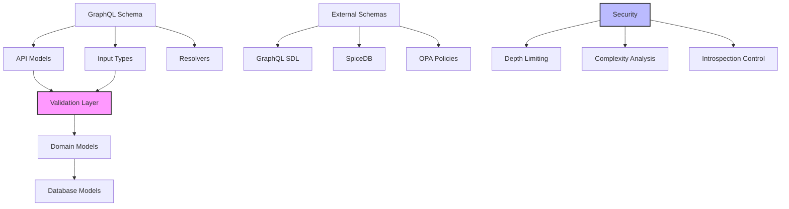

# Schema Module

The PCF API schema module provides type-safe data modeling, validation, and GraphQL schema management with clear separation between API contracts and database storage.

<!-- toc -->

## Overview

The schema module is the foundation for data consistency and type safety in the PCF API. It provides:

- **GraphQL schema definition** with Query, Mutation, and Subscription types
- **Multi-layer validation** using `garde` for comprehensive data integrity
- **Dual model architecture** separating API and database concerns
- **Type-safe IDs** with custom wrapper types
- **Extensible validation** with custom validators
- **Schema security** through depth and complexity limiting

The module uses `async-graphql` for GraphQL implementation and `garde` for validation, providing a robust foundation for API development.

## Quick Example

```rust
use pcf_api::schema::{Note, CreateNoteInput, NoteId};
use async_graphql::{Schema, Object, Context};
use garde::Validate;

// Define GraphQL input with validation
#[derive(InputObject, Validate)]
struct CreateNoteInput {
    #[garde(length(min = 1, max = 200))]
    title: String,
    
    #[garde(length(min = 1, max = 10000))]
    #[garde(custom(no_script_tags))]
    content: String,
    
    #[garde(length(max = 10))]
    tags: Option<Vec<String>>,
}

// GraphQL resolver using schema types
#[Object]
impl Mutation {
    async fn create_note(
        &self,
        ctx: &Context<'_>,
        input: CreateNoteInput,
    ) -> Result<Note> {
        // Validation happens automatically
        input.validate()?;
        
        let db = ctx.data::<DatabaseService>()?;
        let note = db.create_note(input.into()).await?;
        
        Ok(note.into())
    }
}
```

## Architecture



### Model Layers

The schema module implements a three-layer architecture:

1. **API Layer**: GraphQL types exposed to clients
2. **Domain Layer**: Business logic and validation
3. **Database Layer**: Storage-specific models

This separation allows independent evolution of API contracts and storage implementation.

## Public API

### GraphQL Schema Creation

```rust
/// Create a basic GraphQL schema
pub fn create_schema(
    config: GraphQLConfig,
    database: Arc<dyn DatabaseService>,
) -> Schema<Query, Mutation, Subscription> {
    Schema::build(Query, Mutation, Subscription)
        .data(config)
        .data(database)
        .finish()
}

/// Create production-ready schema with security extensions
pub fn create_production_schema(
    config: GraphQLConfig,
    database: Arc<dyn DatabaseService>,
) -> Schema<Query, Mutation, Subscription> {
    let mut builder = Schema::build(Query, Mutation, Subscription)
        .data(config.clone())
        .data(database)
        .extension(DepthLimit::new(config.max_depth))
        .extension(ComplexityLimit::new(config.max_complexity));
    
    if !config.enable_introspection {
        builder = builder.disable_introspection();
    }
    
    builder.finish()
}
```

### Core Types

```rust
/// GraphQL-specific Note model
#[derive(SimpleObject, Clone)]
pub struct Note {
    pub id: ID,
    pub title: String,
    pub content: String,
    pub tags: Vec<String>,
    #[graphql(name = "createdAt")]
    pub created_at: DateTime<Utc>,
    #[graphql(name = "updatedAt")]
    pub updated_at: DateTime<Utc>,
}

/// Database-specific Note model with validation
#[derive(Debug, Clone, Serialize, Deserialize, Validate)]
pub struct DbNote {
    pub id: NoteId,
    
    #[garde(length(min = 1, max = 200))]
    pub title: String,
    
    #[garde(length(min = 1, max = 10000))]
    #[garde(custom(no_script_tags))]
    pub content: String,
    
    #[garde(custom(valid_author))]
    pub author: String,
    
    #[garde(length(max = 10))]
    #[garde(dive)]
    pub tags: Vec<#[garde(length(min = 1, max = 50))] String>,
}
```

### Custom ID Types

```rust
/// Type-safe wrapper for SurrealDB Thing IDs
#[derive(Debug, Clone, PartialEq, Eq, Hash)]
pub struct NoteId(Thing);

impl NoteId {
    pub fn new(tb: &str, id: impl Into<Id>) -> Self {
        Self(Thing::from((tb, id.into())))
    }
    
    pub fn generate() -> Self {
        Self::new("notes", Id::ulid())
    }
    
    pub fn from_string(s: &str) -> Result<Self, ParseError> {
        // Parse format: "notes:ulid"
    }
}
```

### Input Types with Validation

```rust
#[derive(InputObject, Validate)]
pub struct CreateNoteInput {
    #[garde(length(min = 1, max = 200))]
    pub title: String,
    
    #[garde(length(min = 1, max = 10000))]
    pub content: String,
    
    #[garde(length(max = 10))]
    pub tags: Option<Vec<String>>,
}

impl CreateNoteInput {
    pub fn validate(&self) -> Result<(), ValidationError> {
        // Custom validation logic
        if self.title.trim().is_empty() {
            return Err(ValidationError::new("Title cannot be empty"));
        }
        
        if let Some(tags) = &self.tags {
            for tag in tags {
                if tag.trim().is_empty() {
                    return Err(ValidationError::new("Tags cannot be empty"));
                }
            }
        }
        
        Ok(())
    }
}
```

### Custom Validators

```rust
/// Prevent XSS attacks by rejecting script tags
pub fn no_script_tags(value: &str, _: &()) -> garde::Result {
    if value.to_lowercase().contains("<script") {
        return Err(garde::Error::new("Script tags are not allowed"));
    }
    Ok(())
}

/// Validate author format
pub fn valid_author(value: &str, _: &()) -> garde::Result {
    if value.is_empty() || value.len() > 100 {
        return Err(garde::Error::new("Invalid author"));
    }
    Ok(())
}
```

## Error Handling

### Validation Errors

```rust
#[derive(Debug, thiserror::Error)]
pub enum SchemaError {
    #[error("Validation failed: {0}")]
    Validation(String),
    
    #[error("Invalid ID format: {0}")]
    InvalidId(String),
    
    #[error("Type conversion failed: {0}")]
    ConversionError(String),
    
    #[error("Schema not found: {0}")]
    NotFound(String),
}

// Automatic conversion to GraphQL errors
impl From<garde::Errors> for SchemaError {
    fn from(errors: garde::Errors) -> Self {
        let messages: Vec<String> = errors
            .iter()
            .map(|(path, error)| format!("{}: {}", path, error))
            .collect();
        
        SchemaError::Validation(messages.join(", "))
    }
}
```

### GraphQL Error Extensions

```rust
impl From<SchemaError> for async_graphql::Error {
    fn from(err: SchemaError) -> Self {
        match err {
            SchemaError::Validation(msg) => {
                Error::new(msg).extend_with(|_, e| {
                    e.set("code", "VALIDATION_ERROR");
                })
            }
            SchemaError::NotFound(msg) => {
                Error::new(msg).extend_with(|_, e| {
                    e.set("code", "NOT_FOUND");
                })
            }
            _ => Error::new(err.to_string()),
        }
    }
}
```

## Security Considerations

### Query Depth Limiting

```rust
/// Prevent deeply nested queries
pub struct DepthLimit {
    max_depth: usize,
}

impl Extension for DepthLimit {
    async fn parse_query(&self, ctx: &ExtensionContext<'_>) -> Result<()> {
        let depth = calculate_query_depth(&ctx.query);
        if depth > self.max_depth {
            return Err(Error::new(format!(
                "Query depth {} exceeds maximum allowed depth of {}",
                depth, self.max_depth
            )));
        }
        Ok(())
    }
}
```

### Complexity Analysis

```rust
/// Prevent resource-intensive queries
pub struct ComplexityLimit {
    max_complexity: usize,
}

impl ComplexityLimit {
    fn calculate_field_complexity(&self, field: &Field) -> usize {
        let mut complexity = 1;
        
        // Lists multiply complexity
        if field.ty.is_list() {
            complexity *= 10;
        }
        
        // Nested selections add complexity
        complexity += field.selection_set.len();
        
        complexity
    }
}
```

### Introspection Control

```rust
// Disable introspection in production
if std::env::var("ENVIRONMENT").unwrap_or_default() == "production" {
    schema = schema.disable_introspection();
}
```

## Testing

### Unit Testing Models

```rust
#[cfg(test)]
mod tests {
    use super::*;
    use garde::Validate;
    
    #[test]
    fn test_create_note_validation() {
        let input = CreateNoteInput {
            title: "".to_string(), // Invalid
            content: "Valid content".to_string(),
            tags: None,
        };
        
        assert!(input.validate().is_err());
    }
    
    #[test]
    fn test_note_id_parsing() {
        let id = NoteId::from_string("notes:01234567890123456789012345").unwrap();
        assert_eq!(id.table(), "notes");
        assert_eq!(id.to_string(), "notes:01234567890123456789012345");
    }
}
```

### Integration Testing

```rust
#[tokio::test]
async fn test_graphql_schema() {
    let schema = create_test_schema();
    
    let query = r#"
        query {
            notes {
                id
                title
                content
            }
        }
    "#;
    
    let response = schema.execute(query).await;
    assert!(response.is_ok());
}
```

### Testing Validation

```rust
#[test]
fn test_custom_validators() {
    // Test XSS prevention
    assert!(no_script_tags("<script>alert('xss')</script>", &()).is_err());
    assert!(no_script_tags("Normal content", &()).is_ok());
    
    // Test author validation
    assert!(valid_author("", &()).is_err());
    assert!(valid_author("John Doe", &()).is_ok());
    assert!(valid_author(&"a".repeat(101), &()).is_err());
}
```

## Configuration

### GraphQL Configuration

```rust
#[derive(Debug, Clone, Deserialize, Validate)]
pub struct GraphQLConfig {
    /// Maximum query depth
    #[garde(range(min = 1, max = 100))]
    pub max_depth: usize,
    
    /// Maximum query complexity
    #[garde(range(min = 1, max = 10000))]
    pub max_complexity: usize,
    
    /// Enable GraphQL playground
    pub enable_playground: bool,
    
    /// Enable introspection queries
    pub enable_introspection: bool,
    
    /// Enable query logging
    pub enable_logging: bool,
}

impl Default for GraphQLConfig {
    fn default() -> Self {
        Self {
            max_depth: 15,
            max_complexity: 1000,
            enable_playground: cfg!(feature = "demo"),
            enable_introspection: cfg!(debug_assertions),
            enable_logging: cfg!(debug_assertions),
        }
    }
}
```

### Validation Configuration

```toml
[validation]
# Field length limits
max_title_length = 200
max_content_length = 10000
max_tag_length = 50
max_tags_count = 10

# Security settings
allow_html = false
allow_scripts = false
sanitize_input = true
```

## Performance

### Model Conversion Optimization

```rust
// Use From/Into for zero-cost conversions
impl From<DbNote> for Note {
    fn from(db_note: DbNote) -> Self {
        Self {
            id: db_note.id.into(),
            title: db_note.title,
            content: db_note.content,
            tags: db_note.tags,
            created_at: db_note.created_at,
            updated_at: db_note.updated_at,
        }
    }
}
```

### Validation Caching

```rust
// Cache compiled regex patterns
lazy_static! {
    static ref SCRIPT_TAG_REGEX: Regex = 
        Regex::new(r"(?i)<script[^>]*>").unwrap();
    
    static ref EMAIL_REGEX: Regex = 
        Regex::new(r"^[a-zA-Z0-9._%+-]+@[a-zA-Z0-9.-]+\.[a-zA-Z]{2,}$").unwrap();
}
```

### Schema Precompilation

```rust
// Build schema once at startup
lazy_static! {
    static ref SCHEMA_SDL: String = include_str!("schema.graphql");
}
```

## Monitoring

### Schema Metrics

Key metrics to monitor:

- Query depth distribution
- Query complexity scores
- Validation failure rates
- Field usage frequency
- Resolver execution times

### Validation Metrics

```rust
#[instrument(skip(input))]
pub fn validate_input<T: Validate>(input: &T) -> Result<(), ValidationError> {
    let start = Instant::now();
    
    let result = input.validate();
    
    metrics::histogram!(
        "schema.validation.duration",
        start.elapsed().as_micros() as f64,
        "type" => std::any::type_name::<T>(),
        "success" => result.is_ok().to_string()
    );
    
    result
}
```

## Common Patterns

### Relay-Style Pagination

```rust
#[derive(SimpleObject)]
pub struct NoteConnection {
    pub edges: Vec<NoteEdge>,
    pub page_info: PageInfo,
    pub total_count: i32,
}

#[derive(SimpleObject)]
pub struct NoteEdge {
    pub node: Note,
    pub cursor: String,
}

#[derive(SimpleObject)]
pub struct PageInfo {
    pub has_previous_page: bool,
    pub has_next_page: bool,
    pub start_cursor: Option<String>,
    pub end_cursor: Option<String>,
}
```

### Union Types for Errors

```rust
#[derive(Union)]
pub enum CreateNoteResult {
    Success(CreateNoteSuccess),
    ValidationError(ValidationError),
    AuthError(AuthError),
}

#[Object]
impl Mutation {
    async fn create_note(&self, input: CreateNoteInput) -> CreateNoteResult {
        match validate_and_create(input).await {
            Ok(note) => CreateNoteResult::Success(CreateNoteSuccess { note }),
            Err(e) => match e {
                Error::Validation(msg) => CreateNoteResult::ValidationError(msg),
                Error::Auth(msg) => CreateNoteResult::AuthError(msg),
                _ => panic!("Unexpected error"),
            }
        }
    }
}
```

### Field Resolvers

```rust
#[Object]
impl Note {
    /// Resolve author information
    async fn author(&self, ctx: &Context<'_>) -> Result<User> {
        let loader = ctx.data::<DataLoader<UserLoader>>()?;
        loader.load_one(self.author_id).await?
            .ok_or_else(|| Error::new("Author not found"))
    }
    
    /// Calculate read time
    async fn read_time_minutes(&self) -> i32 {
        const WORDS_PER_MINUTE: usize = 200;
        let word_count = self.content.split_whitespace().count();
        ((word_count as f64 / WORDS_PER_MINUTE as f64).ceil()) as i32
    }
}
```

## Troubleshooting

### Common Issues

1. **Validation failures not descriptive**:
   - Use `garde`'s path information
   - Implement custom error messages
   - Log validation details in development

2. **ID parsing errors**:
   - Verify ID format matches expected pattern
   - Check for proper URL encoding
   - Validate table names

3. **Schema doesn't reflect changes**:
   - Clear any schema caches
   - Restart the server
   - Check for conditional compilation

4. **Performance degradation**:
   - Monitor query complexity
   - Check for N+1 queries
   - Enable query logging

### Debug Tools

```rust
// Enable schema debugging
#[cfg(debug_assertions)]
impl Schema {
    pub fn debug_query(&self, query: &str) {
        println!("Query AST: {:#?}", parse_query(query));
        println!("Complexity: {}", calculate_complexity(query));
        println!("Depth: {}", calculate_depth(query));
    }
}
```

## Best Practices

### Do's

1. ✅ Separate API and database models
2. ✅ Use strong typing for IDs
3. ✅ Implement comprehensive validation
4. ✅ Version your schema changes
5. ✅ Document field deprecations

### Don'ts

1. ❌ Don't expose database internals
2. ❌ Don't skip validation for "trusted" inputs
3. ❌ Don't allow unbounded queries
4. ❌ Don't use strings for IDs
5. ❌ Don't ignore validation errors

## Future Enhancements

### Planned Features

1. **Schema Federation**:
   ```rust
   #[derive(SimpleObject)]
   #[graphql(extends)]
   pub struct User {
       #[graphql(external)]
       pub id: ID,
       
       #[graphql(requires = "id")]
       pub notes: Vec<Note>,
   }
   ```

2. **Schema Versioning**:
   ```rust
   pub trait SchemaVersion {
       fn version() -> &'static str;
       fn migrate_from(prev: &dyn SchemaVersion) -> Result<()>;
   }
   ```

3. **Dynamic Schema Loading**:
   ```rust
   pub async fn load_schema_from_file(path: &Path) -> Result<Schema> {
       let sdl = fs::read_to_string(path).await?;
       Schema::parse(&sdl)
   }
   ```

4. **Schema Registry**:
   ```rust
   pub struct SchemaRegistry {
       schemas: HashMap<String, Schema>,
       versions: HashMap<String, Version>,
   }
   ```

### Integration Roadmap

1. **Phase 1**: Current implementation ✓
2. **Phase 2**: Additional entity types
3. **Phase 3**: Schema federation
4. **Phase 4**: Dynamic schema updates
5. **Phase 5**: Schema registry and versioning

## Summary

The PCF API schema module provides a comprehensive foundation for type-safe API development with:

- **Strong typing** throughout the stack
- **Multi-layer validation** for data integrity
- **Security by default** with depth and complexity limits
- **Performance optimization** through careful design
- **Future-proof architecture** supporting federation and versioning

It serves as the contract between clients and the API, ensuring consistency, safety, and maintainability.
