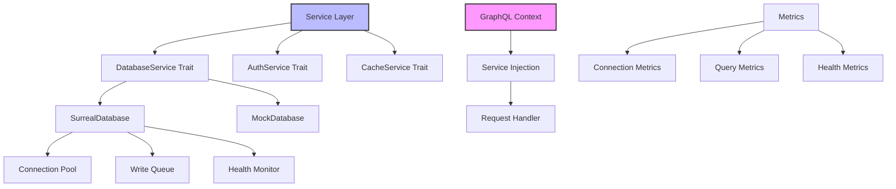

# Services Module

The PCF API services module provides a trait-based service layer with dependency injection, health monitoring, and resilience features for managing external dependencies like databases, caches, and third-party APIs.

<!-- toc -->

## Overview

The services module implements a clean service-oriented architecture that abstracts external dependencies behind well-defined traits. It provides:

- **Trait-based abstractions** for testability and flexibility
- **Connection pooling** with health monitoring
- **Resilience features** including retry logic and write queuing
- **Mock implementations** for comprehensive testing
- **Metrics collection** for observability
- **Graceful degradation** during service disruptions

Currently, the database service is the primary implementation, with the architecture ready for additional services.

## Quick Example

```rust
use pcf_api::services::{DatabaseService, MockDatabase, SurrealDatabase};
use std::sync::Arc;

// Production: Use real database
let database: Arc<dyn DatabaseService> = Arc::new(
    SurrealDatabase::new(config).await?
);

// Testing: Use mock
let database: Arc<dyn DatabaseService> = Arc::new(
    MockDatabase::builder()
        .with_note(test_note)
        .with_error_on_update()
        .build()
);

// Use service through trait
let note = database.read("notes", &id).await?;

// Health monitoring
let health = database.health_check().await;
if !health.is_available() {
    return Err(ServiceUnavailable);
}
```

## Architecture



### Service Components

1. **Service Traits**: Define contracts for external dependencies
2. **Implementations**: Concrete implementations (SurrealDB, Mock)
3. **Connection Management**: Pooling, health checks, retry logic
4. **Resilience Layer**: Write queue, circuit breakers
5. **Metrics & Monitoring**: Performance and health tracking

## Public API

### Core Service Trait

```rust
/// Database service trait for data persistence
#[async_trait]
pub trait DatabaseService: Send + Sync {
    /// Establish database connection
    async fn connect(&self) -> Result<(), DatabaseError>;
    
    /// Check service health
    async fn health_check(&self) -> DatabaseHealth;
    
    /// Get database version information
    async fn version(&self) -> Result<DatabaseVersion, DatabaseError>;
    
    /// Create a new record
    async fn create(&self, collection: &str, data: Value) -> Result<String, DatabaseError>;
    
    /// Read a record by ID
    async fn read(&self, collection: &str, id: &str) -> Result<Option<Value>, DatabaseError>;
    
    /// Update an existing record
    async fn update(&self, collection: &str, id: &str, data: Value) -> Result<(), DatabaseError>;
    
    /// Delete a record
    async fn delete(&self, collection: &str, id: &str) -> Result<(), DatabaseError>;
    
    /// Execute a query
    async fn query(&self, collection: &str, query: Query) -> Result<Vec<Value>, DatabaseError>;
}
```

### Health Monitoring

```rust
/// Database health status
#[derive(Debug, Clone)]
pub struct DatabaseHealth {
    pub status: HealthStatus,
    pub connection_state: ConnectionState,
    pub latency_ms: Option<u64>,
    pub error_message: Option<String>,
    pub last_check: DateTime<Utc>,
}

/// Connection states
#[derive(Debug, Clone, Copy, PartialEq, Eq)]
pub enum ConnectionState {
    Connected,
    Connecting,
    Failed,
    Disconnected,
}

impl DatabaseHealth {
    /// Check if service is available for operations
    pub fn is_available(&self) -> bool {
        matches!(self.connection_state, ConnectionState::Connected)
    }
    
    /// Get retry-after duration if unavailable
    pub fn retry_after(&self) -> Option<Duration> {
        if !self.is_available() {
            Some(Duration::from_secs(30))
        } else {
            None
        }
    }
}
```

### Connection Pool

```rust
/// Connection pool configuration
#[derive(Debug, Clone, Deserialize, Validate)]
pub struct PoolConfig {
    #[garde(range(min = 1, max = 1000))]
    pub min_connections: u32,
    
    #[garde(range(min = 1, max = 1000))]
    pub max_connections: u32,
    
    #[garde(range(min = 1, max = 3600))]
    pub idle_timeout_seconds: u64,
    
    #[garde(range(min = 1, max = 300))]
    pub connection_timeout_seconds: u64,
}

/// Connection pool manager
pub struct ConnectionPool {
    config: PoolConfig,
    connections: Arc<RwLock<Vec<Connection>>>,
    semaphore: Arc<Semaphore>,
    health_monitor: Arc<HealthMonitor>,
}

impl ConnectionPool {
    /// Acquire a connection from the pool
    pub async fn acquire(&self) -> Result<PooledConnection, DatabaseError> {
        let _permit = self.semaphore.acquire().await?;
        
        // Try to get healthy connection
        if let Some(conn) = self.get_idle_connection().await {
            return Ok(PooledConnection::new(conn, self.clone()));
        }
        
        // Create new connection if under limit
        self.create_connection().await
    }
}
```

### Write Queue

```rust
/// Write queue for resilience during outages
pub struct WriteQueue {
    queue: Arc<RwLock<VecDeque<QueuedOperation>>>,
    max_size: usize,
    retry_policy: RetryPolicy,
    persistence: Option<QueuePersistence>,
}

/// Queued operation
#[derive(Debug, Clone, Serialize, Deserialize)]
pub struct QueuedOperation {
    pub id: Uuid,
    pub operation_type: OperationType,
    pub collection: String,
    pub data: Value,
    pub created_at: DateTime<Utc>,
    pub retry_count: u32,
    pub last_error: Option<String>,
}

impl WriteQueue {
    /// Enqueue operation for later processing
    pub async fn enqueue(&self, operation: QueuedOperation) -> Result<(), QueueError> {
        let mut queue = self.queue.write().await;
        
        if queue.len() >= self.max_size {
            return Err(QueueError::QueueFull);
        }
        
        queue.push_back(operation);
        
        // Persist to disk if configured
        if let Some(persistence) = &self.persistence {
            persistence.save(&*queue).await?;
        }
        
        Ok(())
    }
    
    /// Process queued operations
    pub async fn process_queue(&self, database: &dyn DatabaseService) -> ProcessResult {
        let mut processed = 0;
        let mut failed = 0;
        
        while let Some(op) = self.dequeue().await {
            match self.execute_operation(&op, database).await {
                Ok(_) => processed += 1,
                Err(e) => {
                    failed += 1;
                    self.handle_failure(op, e).await;
                }
            }
        }
        
        ProcessResult { processed, failed }
    }
}
```

### Retry Logic

```rust
/// Exponential backoff retry strategy
pub struct RetryStrategy {
    base_delay: Duration,
    max_delay: Duration,
    max_attempts: u32,
    jitter: bool,
}

impl RetryStrategy {
    /// Execute operation with retry
    pub async fn execute<F, T, E>(&self, operation: F) -> Result<T, E>
    where
        F: Fn() -> Fut,
        Fut: Future<Output = Result<T, E>>,
        E: RetryableError,
    {
        let mut attempt = 0;
        
        loop {
            match operation().await {
                Ok(result) => return Ok(result),
                Err(e) if !e.is_retryable() => return Err(e),
                Err(e) if attempt >= self.max_attempts => return Err(e),
                Err(_) => {
                    attempt += 1;
                    let delay = self.calculate_delay(attempt);
                    tokio::time::sleep(delay).await;
                }
            }
        }
    }
    
    fn calculate_delay(&self, attempt: u32) -> Duration {
        let exponential = self.base_delay * 2u32.pow(attempt.min(10));
        let delay = exponential.min(self.max_delay);
        
        if self.jitter {
            self.add_jitter(delay)
        } else {
            delay
        }
    }
}
```

## Error Handling

### Service Errors

```rust
#[derive(Debug, thiserror::Error)]
pub enum DatabaseError {
    #[error("Connection failed: {0}")]
    ConnectionFailed(String),
    
    #[error("Query execution failed: {0}")]
    QueryFailed(String),
    
    #[error("Record not found: {collection}:{id}")]
    NotFound { collection: String, id: String },
    
    #[error("Validation failed: {0}")]
    ValidationFailed(String),
    
    #[error("Operation timeout after {0} seconds")]
    Timeout(u64),
    
    #[error("Service unavailable: {reason}")]
    ServiceUnavailable { reason: String },
    
    #[error("Version incompatibility: requires {required}, found {actual}")]
    IncompatibleVersion { required: String, actual: String },
}

impl DatabaseError {
    /// Check if error is retryable
    pub fn is_retryable(&self) -> bool {
        matches!(
            self,
            DatabaseError::ConnectionFailed(_) |
            DatabaseError::Timeout(_) |
            DatabaseError::ServiceUnavailable { .. }
        )
    }
    
    /// Get suggested retry after duration
    pub fn retry_after(&self) -> Option<Duration> {
        match self {
            DatabaseError::ServiceUnavailable { .. } => Some(Duration::from_secs(30)),
            DatabaseError::Timeout(_) => Some(Duration::from_secs(5)),
            _ => None,
        }
    }
}
```

### Error Recovery

```rust
/// Service with automatic recovery
pub struct ResilientDatabaseService {
    inner: Arc<dyn DatabaseService>,
    write_queue: Arc<WriteQueue>,
    circuit_breaker: Arc<CircuitBreaker>,
}

impl ResilientDatabaseService {
    pub async fn create(&self, collection: &str, data: Value) -> Result<String, DatabaseError> {
        // Check circuit breaker
        if self.circuit_breaker.is_open() {
            // Queue for later
            self.write_queue.enqueue(QueuedOperation {
                operation_type: OperationType::Create,
                collection: collection.to_string(),
                data,
                // ...
            }).await?;
            
            return Err(DatabaseError::ServiceUnavailable {
                reason: "Circuit breaker open".into()
            });
        }
        
        // Try operation
        match self.inner.create(collection, data.clone()).await {
            Ok(id) => {
                self.circuit_breaker.record_success();
                Ok(id)
            }
            Err(e) if e.is_retryable() => {
                self.circuit_breaker.record_failure();
                
                // Queue for retry
                self.write_queue.enqueue(/* ... */).await?;
                
                Err(e)
            }
            Err(e) => Err(e),
        }
    }
}
```

## Security Considerations

### Connection Security

```rust
/// Secure database configuration
#[derive(Debug, Clone, Deserialize)]
pub struct DatabaseConfig {
    /// Endpoint with TLS required in production
    #[serde(deserialize_with = "validate_endpoint")]
    pub endpoint: String,
    
    /// Credentials loaded from secure storage
    #[serde(skip)]
    pub credentials: Option<Credentials>,
    
    /// Namespace isolation
    pub namespace: String,
    
    /// Database name
    pub database: String,
    
    /// TLS configuration
    pub tls: Option<TlsConfig>,
}

/// Validate endpoint security
fn validate_endpoint<'de, D>(deserializer: D) -> Result<String, D::Error>
where
    D: Deserializer<'de>,
{
    let endpoint = String::deserialize(deserializer)?;
    
    // Require HTTPS in production
    if cfg!(not(debug_assertions)) && !endpoint.starts_with("https://") {
        return Err(de::Error::custom("HTTPS required in production"));
    }
    
    Ok(endpoint)
}
```

### Query Sanitization

```rust
/// Safe query builder
pub struct QueryBuilder {
    collection: String,
    filters: Vec<Filter>,
    limit: Option<usize>,
    offset: Option<usize>,
}

impl QueryBuilder {
    /// Add sanitized filter
    pub fn filter(mut self, field: &str, op: Op, value: Value) -> Result<Self, ValidationError> {
        // Validate field name
        if !is_valid_field_name(field) {
            return Err(ValidationError::InvalidField(field.to_string()));
        }
        
        // Sanitize value
        let sanitized = sanitize_value(value)?;
        
        self.filters.push(Filter {
            field: field.to_string(),
            op,
            value: sanitized,
        });
        
        Ok(self)
    }
}
```

## Testing

### Mock Service

```rust
/// Mock database for testing
pub struct MockDatabase {
    data: Arc<RwLock<HashMap<String, HashMap<String, Value>>>>,
    errors: Arc<RwLock<HashMap<String, DatabaseError>>>,
    delay: Option<Duration>,
    health: Arc<RwLock<DatabaseHealth>>,
}

impl MockDatabase {
    /// Builder for test scenarios
    pub fn builder() -> MockDatabaseBuilder {
        MockDatabaseBuilder::default()
    }
}

pub struct MockDatabaseBuilder {
    data: HashMap<String, HashMap<String, Value>>,
    errors: HashMap<String, DatabaseError>,
    delay: Option<Duration>,
    health_status: HealthStatus,
}

impl MockDatabaseBuilder {
    /// Add test data
    pub fn with_data(mut self, collection: &str, id: &str, data: Value) -> Self {
        self.data
            .entry(collection.to_string())
            .or_default()
            .insert(id.to_string(), data);
        self
    }
    
    /// Configure error response
    pub fn with_error_on(mut self, operation: &str, error: DatabaseError) -> Self {
        self.errors.insert(operation.to_string(), error);
        self
    }
    
    /// Set response delay
    pub fn with_delay(mut self, delay: Duration) -> Self {
        self.delay = Some(delay);
        self
    }
    
    /// Build mock instance
    pub fn build(self) -> MockDatabase {
        MockDatabase {
            data: Arc::new(RwLock::new(self.data)),
            errors: Arc::new(RwLock::new(self.errors)),
            delay: self.delay,
            health: Arc::new(RwLock::new(DatabaseHealth {
                status: self.health_status,
                // ...
            })),
        }
    }
}
```

### Integration Testing

```rust
#[tokio::test]
async fn test_service_recovery() {
    // Create service with write queue
    let database = create_test_database();
    let queue = WriteQueue::new(QueueConfig::default());
    let service = ResilientDatabaseService::new(database, queue);
    
    // Simulate outage
    database.set_health(ConnectionState::Failed).await;
    
    // Operations should be queued
    let result = service.create("notes", json!({
        "title": "Test",
        "content": "Content"
    })).await;
    
    assert!(matches!(result, Err(DatabaseError::ServiceUnavailable { .. })));
    assert_eq!(queue.size().await, 1);
    
    // Restore connection
    database.set_health(ConnectionState::Connected).await;
    
    // Process queue
    let processed = queue.process_queue(&*database).await;
    assert_eq!(processed.processed, 1);
    assert_eq!(processed.failed, 0);
}
```

## Configuration

### Service Configuration

```rust
#[derive(Debug, Clone, Deserialize, Validate)]
pub struct ServicesConfig {
    pub database: DatabaseConfig,
    pub pool: PoolConfig,
    pub health: HealthConfig,
    pub queue: QueueConfig,
    pub retry: RetryConfig,
}

#[derive(Debug, Clone, Deserialize, Validate)]
pub struct HealthConfig {
    /// Health check interval in seconds
    #[garde(range(min = 1, max = 300))]
    pub check_interval: u64,
    
    /// Startup grace period in seconds
    #[garde(range(min = 10, max = 600))]
    pub startup_timeout: u64,
    
    /// Operation timeout in seconds
    #[garde(range(min = 1, max = 60))]
    pub operation_timeout: u64,
}

#[derive(Debug, Clone, Deserialize, Validate)]
pub struct QueueConfig {
    /// Maximum queue size
    #[garde(range(min = 100, max = 100000))]
    pub max_size: usize,
    
    /// Queue persistence
    pub persistence: Option<PersistenceConfig>,
    
    /// Processing interval in seconds
    #[garde(range(min = 1, max = 300))]
    pub process_interval: u64,
}
```

### Environment Variables

| Variable | Description | Default |
|----------|-------------|---------|
| `DATABASE_ENDPOINT` | Database server URL | `http://localhost:8000` |
| `DATABASE_NAMESPACE` | Database namespace | `test` |
| `DATABASE_NAME` | Database name | `pcf` |
| `POOL_MIN_CONNECTIONS` | Minimum pool size | `5` |
| `POOL_MAX_CONNECTIONS` | Maximum pool size | `20` |
| `HEALTH_CHECK_INTERVAL` | Health check frequency | `30s` |
| `QUEUE_MAX_SIZE` | Write queue capacity | `10000` |

## Performance

### Connection Pool Optimization

```rust
impl ConnectionPool {
    /// Pre-warm connections on startup
    pub async fn initialize(&self) -> Result<(), DatabaseError> {
        let mut handles = Vec::new();
        
        // Create minimum connections concurrently
        for _ in 0..self.config.min_connections {
            handles.push(tokio::spawn({
                let pool = self.clone();
                async move { pool.create_connection().await }
            }));
        }
        
        // Wait for all connections
        for handle in handles {
            handle.await??;
        }
        
        Ok(())
    }
    
    /// Background connection maintenance
    pub fn start_maintenance(&self) {
        tokio::spawn({
            let pool = self.clone();
            async move {
                loop {
                    pool.cleanup_idle_connections().await;
                    pool.ensure_min_connections().await;
                    tokio::time::sleep(Duration::from_secs(30)).await;
                }
            }
        });
    }
}
```

### Query Optimization

```rust
/// Batch operations for efficiency
pub struct BatchProcessor {
    database: Arc<dyn DatabaseService>,
    batch_size: usize,
}

impl BatchProcessor {
    pub async fn create_many(&self, collection: &str, items: Vec<Value>) -> Result<Vec<String>, DatabaseError> {
        let mut ids = Vec::with_capacity(items.len());
        
        // Process in batches
        for chunk in items.chunks(self.batch_size) {
            let batch_ids = self.database
                .query(collection, Query::batch_insert(chunk))
                .await?;
                
            ids.extend(batch_ids);
        }
        
        Ok(ids)
    }
}
```

## Monitoring

### Service Metrics

```rust
/// Service metrics collection
#[derive(Debug, Clone)]
pub struct ServiceMetrics {
    // Connection metrics
    pub connections_total: AtomicU64,
    pub connections_active: AtomicU64,
    pub connections_idle: AtomicU64,
    pub connection_errors: AtomicU64,
    
    // Operation metrics
    pub operations_total: AtomicU64,
    pub operations_success: AtomicU64,
    pub operations_failed: AtomicU64,
    pub operations_queued: AtomicU64,
    
    // Performance metrics
    pub operation_duration_ms: AtomicU64,
    pub queue_size: AtomicU64,
}

impl ServiceMetrics {
    pub fn record_operation(&self, duration: Duration, success: bool) {
        self.operations_total.fetch_add(1, Ordering::Relaxed);
        
        if success {
            self.operations_success.fetch_add(1, Ordering::Relaxed);
        } else {
            self.operations_failed.fetch_add(1, Ordering::Relaxed);
        }
        
        self.operation_duration_ms.store(
            duration.as_millis() as u64,
            Ordering::Relaxed
        );
    }
}
```

### Health Monitoring

```rust
/// Comprehensive health checks
pub struct HealthMonitor {
    checks: Vec<Box<dyn HealthCheck>>,
    interval: Duration,
    results: Arc<RwLock<HashMap<String, HealthResult>>>,
}

impl HealthMonitor {
    pub async fn run_checks(&self) {
        let mut handles = Vec::new();
        
        for check in &self.checks {
            handles.push(tokio::spawn({
                let check = check.clone();
                async move { check.check().await }
            }));
        }
        
        let results = futures::future::join_all(handles).await;
        
        // Update results
        let mut current = self.results.write().await;
        for (name, result) in results {
            current.insert(name, result);
        }
    }
}
```

## Common Patterns

### Service Registry

```rust
/// Central service registry
pub struct ServiceRegistry {
    services: Arc<RwLock<HashMap<TypeId, Box<dyn Any + Send + Sync>>>>,
}

impl ServiceRegistry {
    /// Register a service
    pub async fn register<T: 'static + Send + Sync>(&self, service: T) {
        let mut services = self.services.write().await;
        services.insert(TypeId::of::<T>(), Box::new(service));
    }
    
    /// Get a service
    pub async fn get<T: 'static + Send + Sync>(&self) -> Option<Arc<T>> {
        let services = self.services.read().await;
        services
            .get(&TypeId::of::<T>())
            .and_then(|s| s.downcast_ref::<Arc<T>>())
            .cloned()
    }
}
```

### Dependency Injection

```rust
/// Service container for dependency injection
pub struct ServiceContainer {
    database: Arc<dyn DatabaseService>,
    cache: Option<Arc<dyn CacheService>>,
    auth: Option<Arc<dyn AuthService>>,
    metrics: Arc<ServiceMetrics>,
}

impl ServiceContainer {
    /// Create GraphQL context with services
    pub fn create_context(&self, request: Request) -> GraphQLContext {
        GraphQLContext {
            database: self.database.clone(),
            cache: self.cache.clone(),
            auth: self.auth.clone(),
            request_id: generate_request_id(),
            // ...
        }
    }
}
```

### Service Decorators

```rust
/// Logging decorator
pub struct LoggingDatabaseService<T: DatabaseService> {
    inner: T,
}

#[async_trait]
impl<T: DatabaseService> DatabaseService for LoggingDatabaseService<T> {
    async fn create(&self, collection: &str, data: Value) -> Result<String, DatabaseError> {
        let start = Instant::now();
        
        info!("Creating record in {}", collection);
        
        let result = self.inner.create(collection, data).await;
        
        match &result {
            Ok(id) => info!("Created {} in {:?}", id, start.elapsed()),
            Err(e) => error!("Create failed: {}", e),
        }
        
        result
    }
    
    // ... other methods
}
```

## Troubleshooting

### Common Issues

1. **Connection pool exhaustion**:
   - Check `connections_active` metric
   - Increase `max_connections`
   - Look for connection leaks

2. **Write queue overflow**:
   - Monitor `queue_size` metric
   - Enable queue persistence
   - Increase processing frequency

3. **Service unavailable errors**:
   - Check health endpoint
   - Verify network connectivity
   - Review service logs

4. **Slow operations**:
   - Check `operation_duration_ms` metric
   - Enable query logging
   - Review database indexes

### Debug Tools

```rust
/// Service debugging utilities
pub mod debug {
    pub async fn dump_pool_state(pool: &ConnectionPool) -> PoolState {
        PoolState {
            total: pool.total_connections().await,
            active: pool.active_connections().await,
            idle: pool.idle_connections().await,
            waiters: pool.waiting_count().await,
        }
    }
    
    pub async fn dump_queue_state(queue: &WriteQueue) -> QueueState {
        QueueState {
            size: queue.size().await,
            oldest: queue.oldest_operation().await,
            retry_histogram: queue.retry_histogram().await,
        }
    }
}
```

## Best Practices

### Do's

1. ✅ Always use service traits for abstraction
2. ✅ Implement health checks for all services
3. ✅ Use connection pooling for efficiency
4. ✅ Handle service degradation gracefully
5. ✅ Monitor service metrics

### Don'ts

1. ❌ Don't bypass the service layer
2. ❌ Don't ignore health check failures
3. ❌ Don't hardcode service configurations
4. ❌ Don't skip retry logic for transient failures
5. ❌ Don't forget to clean up resources

## Future Enhancements

### Planned Services

1. **Authentication Service**:
   ```rust
   #[async_trait]
   pub trait AuthService: Send + Sync {
       async fn verify_token(&self, token: &str) -> Result<Session, AuthError>;
       async fn refresh_token(&self, refresh: &str) -> Result<TokenPair, AuthError>;
       async fn revoke_token(&self, token: &str) -> Result<(), AuthError>;
   }
   ```

2. **Cache Service**:
   ```rust
   #[async_trait]
   pub trait CacheService: Send + Sync {
       async fn get(&self, key: &str) -> Result<Option<Value>, CacheError>;
       async fn set(&self, key: &str, value: Value, ttl: Duration) -> Result<(), CacheError>;
       async fn invalidate(&self, pattern: &str) -> Result<u64, CacheError>;
   }
   ```

3. **Event Service**:
   ```rust
   #[async_trait]
   pub trait EventService: Send + Sync {
       async fn publish(&self, topic: &str, event: Event) -> Result<(), EventError>;
       async fn subscribe(&self, topics: Vec<String>) -> Result<EventStream, EventError>;
   }
   ```

### Service Mesh Integration

```rust
/// Service discovery integration
pub trait ServiceDiscovery: Send + Sync {
    async fn register(&self, service: ServiceInfo) -> Result<(), DiscoveryError>;
    async fn discover(&self, name: &str) -> Result<Vec<ServiceEndpoint>, DiscoveryError>;
    async fn health_check(&self, endpoint: &ServiceEndpoint) -> Result<bool, DiscoveryError>;
}
```

## Summary

The PCF API services module provides a robust foundation for managing external dependencies with:

- **Clean abstractions** through trait-based design
- **High reliability** with connection pooling and retry logic
- **Graceful degradation** through write queuing and circuit breakers
- **Comprehensive testing** with mock implementations
- **Production readiness** with metrics and health monitoring

The architecture is designed to scale with additional services while maintaining consistency and reliability across the platform.
