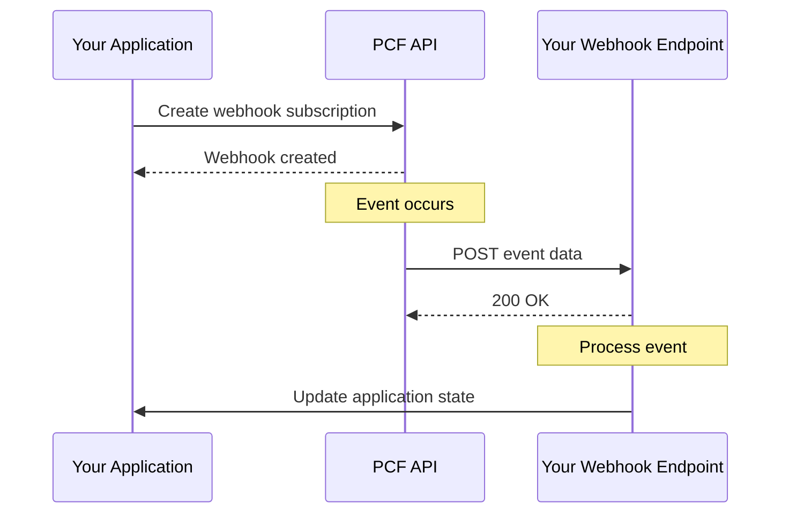

# Webhook Integration Cookbook

Complete guide to implementing and managing webhooks with the PCF API, including setup, security, event handling, and best practices.

<!-- toc -->

## Overview

Webhooks allow your application to receive real-time notifications when events occur in the PCF API. Instead of polling for changes, webhooks push event data to your specified endpoints, enabling efficient event-driven architectures.

## Webhook Concepts

### Event-Driven Architecture



### Event Types

| Event Category | Event Types |
|----------------|-------------|
| Resources | `resource.created`, `resource.updated`, `resource.deleted` |
| Users | `user.created`, `user.updated`, `user.deleted`, `user.login` |
| Authentication | `auth.login`, `auth.logout`, `auth.token_refresh` |
| System | `system.maintenance`, `system.alert`, `system.update` |
| Custom | `custom.*` (application-specific events) |

## Setting Up Webhooks

### Creating a Webhook

```bash
# Create a webhook subscription
curl -X POST https://api.pcf.example.com/v1/webhooks \
  -H "Authorization: Bearer YOUR_TOKEN" \
  -H "Content-Type: application/json" \
  -d '{
    "url": "https://your-app.com/webhooks/pcf",
    "events": [
      "resource.created",
      "resource.updated",
      "resource.deleted"
    ],
    "active": true,
    "config": {
      "content_type": "application/json",
      "insecure_ssl": false,
      "secret": "your_webhook_secret"
    },
    "description": "Production webhook for resource events"
  }'

# Response
{
  "id": "webhook_123",
  "url": "https://your-app.com/webhooks/pcf",
  "events": [
    "resource.created",
    "resource.updated",
    "resource.deleted"
  ],
  "active": true,
  "secret": "whsec_abc123def456...",
  "created_at": "2024-01-15T10:00:00Z"
}
```

### Webhook Configuration Options

```typescript
interface WebhookConfig {
  // Endpoint URL
  url: string;
  
  // Events to subscribe to
  events: string[];
  
  // Enable/disable webhook
  active: boolean;
  
  // Optional configuration
  config?: {
    // Content type: 'application/json' or 'application/x-www-form-urlencoded'
    content_type?: string;
    
    // Custom headers to include
    headers?: Record<string, string>;
    
    // Skip SSL verification (not recommended)
    insecure_ssl?: boolean;
    
    // Webhook secret for signature verification
    secret?: string;
    
    // Retry configuration
    retry?: {
      enabled: boolean;
      max_attempts: number;
      backoff_rate: number;
    };
  };
  
  // Optional filters
  filters?: {
    // Only send events for specific resource types
    resource_types?: string[];
    
    // Only send events for specific users
    user_ids?: string[];
    
    // Custom filter expressions
    expressions?: string[];
  };
}
```

## Webhook Security

### Signature Verification

All webhook payloads are signed using HMAC-SHA256 to ensure authenticity.

```javascript
// Node.js webhook signature verification
import crypto from 'crypto';

function verifyWebhookSignature(payload, signature, secret) {
  const hmac = crypto.createHmac('sha256', secret);
  const digest = hmac.update(payload).digest('hex');
  const expectedSignature = `sha256=${digest}`;
  
  // Use timing-safe comparison
  return crypto.timingSafeEqual(
    Buffer.from(signature),
    Buffer.from(expectedSignature)
  );
}

// Express.js middleware
app.post('/webhooks/pcf', express.raw({ type: 'application/json' }), (req, res) => {
  const signature = req.headers['x-pcf-signature'];
  const timestamp = req.headers['x-pcf-timestamp'];
  const payload = req.body;
  
  // Verify timestamp to prevent replay attacks
  const currentTime = Math.floor(Date.now() / 1000);
  const webhookTime = parseInt(timestamp);
  
  if (Math.abs(currentTime - webhookTime) > 300) { // 5 minutes
    return res.status(400).json({ error: 'Timestamp too old' });
  }
  
  // Verify signature
  const expectedSignature = `${timestamp}.${payload}`;
  if (!verifyWebhookSignature(expectedSignature, signature, WEBHOOK_SECRET)) {
    return res.status(401).json({ error: 'Invalid signature' });
  }
  
  // Process webhook
  const event = JSON.parse(payload);
  handleWebhookEvent(event);
  
  res.status(200).json({ received: true });
});
```

### Python Implementation

```python
import hmac
import hashlib
import time
from flask import Flask, request, abort

app = Flask(__name__)
WEBHOOK_SECRET = 'your_webhook_secret'

def verify_webhook_signature(payload, signature, secret):
    """Verify webhook signature using HMAC-SHA256"""
    expected_signature = 'sha256=' + hmac.new(
        secret.encode('utf-8'),
        payload,
        hashlib.sha256
    ).hexdigest()
    
    return hmac.compare_digest(signature, expected_signature)

@app.route('/webhooks/pcf', methods=['POST'])
def handle_webhook():
    # Get headers
    signature = request.headers.get('X-PCF-Signature')
    timestamp = request.headers.get('X-PCF-Timestamp')
    
    if not signature or not timestamp:
        abort(400, 'Missing required headers')
    
    # Verify timestamp
    current_time = int(time.time())
    webhook_time = int(timestamp)
    
    if abs(current_time - webhook_time) > 300:  # 5 minutes
        abort(400, 'Timestamp too old')
    
    # Verify signature
    payload = request.get_data()
    signed_payload = f"{timestamp}.{payload.decode('utf-8')}"
    
    if not verify_webhook_signature(
        signed_payload.encode('utf-8'),
        signature,
        WEBHOOK_SECRET
    ):
        abort(401, 'Invalid signature')
    
    # Process event
    event = request.get_json()
    process_webhook_event(event)
    
    return {'received': True}, 200
```

## Webhook Payload Format

### Standard Event Structure

```json
{
  "id": "evt_123abc",
  "type": "resource.created",
  "created_at": "2024-01-15T10:30:00Z",
  "data": {
    "object": {
      "id": "res_456",
      "type": "resource",
      "attributes": {
        "name": "New Resource",
        "status": "active"
      }
    },
    "previous_attributes": null,
    "changes": null
  },
  "metadata": {
    "user_id": "user_789",
    "ip_address": "192.168.1.1",
    "user_agent": "PCF-SDK/1.0",
    "request_id": "req_xyz789"
  },
  "webhook": {
    "id": "webhook_123",
    "attempt": 1,
    "version": "1.0"
  }
}
```

### Update Event with Changes

```json
{
  "id": "evt_456def",
  "type": "resource.updated",
  "created_at": "2024-01-15T11:00:00Z",
  "data": {
    "object": {
      "id": "res_456",
      "type": "resource",
      "attributes": {
        "name": "Updated Resource",
        "status": "inactive",
        "updated_at": "2024-01-15T11:00:00Z"
      }
    },
    "previous_attributes": {
      "name": "New Resource",
      "status": "active",
      "updated_at": "2024-01-15T10:30:00Z"
    },
    "changes": {
      "name": ["New Resource", "Updated Resource"],
      "status": ["active", "inactive"]
    }
  }
}
```

## Handling Webhook Events

### Event Router Pattern

```javascript
class WebhookEventRouter {
  constructor() {
    this.handlers = new Map();
  }
  
  // Register event handlers
  on(eventType, handler) {
    if (!this.handlers.has(eventType)) {
      this.handlers.set(eventType, []);
    }
    this.handlers.get(eventType).push(handler);
    return this;
  }
  
  // Process incoming webhook
  async process(event) {
    const { type, data } = event;
    const handlers = this.handlers.get(type) || [];
    
    // Execute all handlers for this event type
    const results = await Promise.allSettled(
      handlers.map(handler => handler(event))
    );
    
    // Log any handler errors
    results.forEach((result, index) => {
      if (result.status === 'rejected') {
        console.error(`Handler ${index} for ${type} failed:`, result.reason);
      }
    });
    
    // Also check for wildcard handlers
    const wildcardHandlers = this.handlers.get('*') || [];
    await Promise.allSettled(
      wildcardHandlers.map(handler => handler(event))
    );
  }
}

// Usage
const router = new WebhookEventRouter();

// Register specific handlers
router
  .on('resource.created', async (event) => {
    console.log('New resource created:', event.data.object.id);
    await notifyTeam('New resource created');
  })
  .on('resource.updated', async (event) => {
    const { changes } = event.data;
    if (changes.status) {
      console.log('Status changed:', changes.status);
      await updateLocalCache(event.data.object);
    }
  })
  .on('resource.deleted', async (event) => {
    await removeFromLocalCache(event.data.object.id);
  })
  .on('*', async (event) => {
    // Log all events
    await logEvent(event);
  });

// Process webhook
app.post('/webhooks/pcf', async (req, res) => {
  try {
    await router.process(req.body);
    res.status(200).json({ received: true });
  } catch (error) {
    console.error('Webhook processing error:', error);
    res.status(500).json({ error: 'Processing failed' });
  }
});
```

### Async Processing with Queue

```javascript
// Use a job queue for reliable processing
import Bull from 'bull';

const webhookQueue = new Bull('webhook-processing', {
  redis: {
    host: 'localhost',
    port: 6379,
  },
});

// Webhook endpoint - quickly acknowledge and queue
app.post('/webhooks/pcf', async (req, res) => {
  // Verify webhook (as shown above)
  
  // Queue for processing
  await webhookQueue.add('process-webhook', {
    event: req.body,
    receivedAt: new Date().toISOString(),
  }, {
    attempts: 3,
    backoff: {
      type: 'exponential',
      delay: 2000,
    },
  });
  
  // Respond immediately
  res.status(200).json({ received: true });
});

// Process webhooks from queue
webhookQueue.process('process-webhook', async (job) => {
  const { event } = job.data;
  
  try {
    await processWebhookEvent(event);
    return { processed: true, eventId: event.id };
  } catch (error) {
    console.error('Failed to process webhook:', error);
    throw error; // Will retry based on job configuration
  }
});
```

## Testing Webhooks

### Local Development with ngrok

```bash
# Start local server
node webhook-server.js

# Expose local server to internet
ngrok http 3000

# Use ngrok URL for webhook
# https://abc123.ngrok.io/webhooks/pcf
```

### Webhook Testing Tool

```javascript
// Test webhook delivery
const testWebhook = async (webhookId, eventType) => {
  const response = await fetch(
    `https://api.pcf.example.com/v1/webhooks/${webhookId}/test`,
    {
      method: 'POST',
      headers: {
        'Authorization': `Bearer ${token}`,
        'Content-Type': 'application/json',
      },
      body: JSON.stringify({
        event_type: eventType || 'test.ping',
        data: {
          message: 'Test webhook delivery',
        },
      }),
    }
  );
  
  return response.json();
  // {
  //   "delivered": true,
  //   "response_code": 200,
  //   "response_time_ms": 123,
  //   "response_body": "{\"received\":true}"
  // }
};
```

### Mock Events for Testing

```javascript
// Generate mock events for testing
const mockEvents = {
  'resource.created': {
    id: 'evt_test_123',
    type: 'resource.created',
    created_at: new Date().toISOString(),
    data: {
      object: {
        id: 'res_test_456',
        type: 'resource',
        attributes: {
          name: 'Test Resource',
          status: 'active',
        },
      },
    },
  },
  'resource.updated': {
    id: 'evt_test_456',
    type: 'resource.updated',
    created_at: new Date().toISOString(),
    data: {
      object: {
        id: 'res_test_456',
        type: 'resource',
        attributes: {
          name: 'Updated Test Resource',
          status: 'inactive',
        },
      },
      previous_attributes: {
        name: 'Test Resource',
        status: 'active',
      },
      changes: {
        name: ['Test Resource', 'Updated Test Resource'],
        status: ['active', 'inactive'],
      },
    },
  },
};

// Send mock event to local endpoint
const testLocalWebhook = async (eventType) => {
  const event = mockEvents[eventType];
  const payload = JSON.stringify(event);
  const timestamp = Math.floor(Date.now() / 1000).toString();
  const signedPayload = `${timestamp}.${payload}`;
  
  const signature = 'sha256=' + crypto
    .createHmac('sha256', WEBHOOK_SECRET)
    .update(signedPayload)
    .digest('hex');
  
  const response = await fetch('http://localhost:3000/webhooks/pcf', {
    method: 'POST',
    headers: {
      'Content-Type': 'application/json',
      'X-PCF-Signature': signature,
      'X-PCF-Timestamp': timestamp,
    },
    body: payload,
  });
  
  return response.json();
};
```

## Webhook Management

### Listing Webhooks

```javascript
// Get all webhooks
const listWebhooks = async () => {
  const response = await fetch('https://api.pcf.example.com/v1/webhooks', {
    headers: {
      'Authorization': `Bearer ${token}`,
    },
  });
  
  return response.json();
  // {
  //   "data": [
  //     {
  //       "id": "webhook_123",
  //       "url": "https://app.example.com/webhooks",
  //       "events": ["resource.*"],
  //       "active": true,
  //       "created_at": "2024-01-01T00:00:00Z",
  //       "last_delivery": {
  //         "delivered": true,
  //         "delivered_at": "2024-01-15T10:00:00Z",
  //         "response_code": 200
  //       }
  //     }
  //   ]
  // }
};
```

### Updating Webhooks

```javascript
// Update webhook configuration
const updateWebhook = async (webhookId, updates) => {
  const response = await fetch(
    `https://api.pcf.example.com/v1/webhooks/${webhookId}`,
    {
      method: 'PATCH',
      headers: {
        'Authorization': `Bearer ${token}`,
        'Content-Type': 'application/json',
      },
      body: JSON.stringify(updates),
    }
  );
  
  return response.json();
};

// Example: Add new events
await updateWebhook('webhook_123', {
  events: [
    'resource.created',
    'resource.updated',
    'resource.deleted',
    'user.login', // New event
  ],
});
```

### Webhook Delivery Logs

```javascript
// Get delivery history
const getDeliveryLogs = async (webhookId) => {
  const response = await fetch(
    `https://api.pcf.example.com/v1/webhooks/${webhookId}/deliveries`,
    {
      headers: {
        'Authorization': `Bearer ${token}`,
      },
    }
  );
  
  return response.json();
  // {
  //   "deliveries": [
  //     {
  //       "id": "del_789",
  //       "event_id": "evt_456",
  //       "event_type": "resource.created",
  //       "delivered": true,
  //       "attempts": 1,
  //       "response_code": 200,
  //       "response_time_ms": 145,
  //       "delivered_at": "2024-01-15T10:30:00Z"
  //     },
  //     {
  //       "id": "del_790",
  //       "event_id": "evt_457",
  //       "event_type": "resource.updated",
  //       "delivered": false,
  //       "attempts": 3,
  //       "last_error": "Connection timeout",
  //       "next_retry_at": "2024-01-15T11:00:00Z"
  //     }
  //   ]
  // }
};
```

## Error Handling and Retries

### Retry Configuration

```json
{
  "retry_policy": {
    "enabled": true,
    "max_attempts": 5,
    "intervals": [
      60,    // 1 minute
      300,   // 5 minutes
      900,   // 15 minutes
      3600,  // 1 hour
      7200   // 2 hours
    ],
    "timeout": 30,
    "backoff_rate": 2.0
  }
}
```

### Handling Failed Deliveries

```javascript
// Implement idempotency
const processedEvents = new Set();

const handleWebhookEvent = async (event) => {
  // Check if already processed
  if (processedEvents.has(event.id)) {
    console.log('Event already processed:', event.id);
    return { processed: true, duplicate: true };
  }
  
  try {
    // Process event
    await processEvent(event);
    
    // Mark as processed
    processedEvents.add(event.id);
    
    // Store in database for persistence
    await db.webhookEvents.upsert({
      where: { id: event.id },
      create: {
        id: event.id,
        type: event.type,
        data: event.data,
        processed_at: new Date(),
      },
      update: {
        processed_at: new Date(),
      },
    });
    
    return { processed: true };
  } catch (error) {
    console.error('Failed to process event:', error);
    throw error;
  }
};
```

### Manual Retry

```javascript
// Retry failed delivery
const retryDelivery = async (deliveryId) => {
  const response = await fetch(
    `https://api.pcf.example.com/v1/webhooks/deliveries/${deliveryId}/retry`,
    {
      method: 'POST',
      headers: {
        'Authorization': `Bearer ${token}`,
      },
    }
  );
  
  return response.json();
};
```

## Performance Optimization

### Batch Event Delivery

```javascript
// Configure batch delivery
const createBatchWebhook = async () => {
  return fetch('https://api.pcf.example.com/v1/webhooks', {
    method: 'POST',
    headers: {
      'Authorization': `Bearer ${token}`,
      'Content-Type': 'application/json',
    },
    body: JSON.stringify({
      url: 'https://app.example.com/webhooks/batch',
      events: ['resource.*'],
      config: {
        batch: {
          enabled: true,
          max_size: 100,
          max_wait_ms: 5000,
        },
      },
    }),
  });
};

// Handle batched events
app.post('/webhooks/batch', async (req, res) => {
  const { events } = req.body;
  
  console.log(`Received ${events.length} events`);
  
  // Process events in parallel
  await Promise.all(
    events.map(event => processEventAsync(event))
  );
  
  res.status(200).json({ received: true, count: events.length });
});
```

### Connection Pooling

```javascript
// Webhook delivery with connection pooling
import https from 'https';

const agent = new https.Agent({
  keepAlive: true,
  maxSockets: 50,
  maxFreeSockets: 10,
  timeout: 60000,
  keepAliveMsecs: 1000,
});

const deliverWebhook = async (url, payload, headers) => {
  const response = await fetch(url, {
    method: 'POST',
    headers: {
      'Content-Type': 'application/json',
      ...headers,
    },
    body: JSON.stringify(payload),
    agent,
    timeout: 30000,
  });
  
  return {
    status: response.status,
    headers: response.headers,
    body: await response.text(),
  };
};
```

## Monitoring and Alerting

### Webhook Metrics

```javascript
// Track webhook metrics
const webhookMetrics = {
  deliveries: {
    total: 0,
    successful: 0,
    failed: 0,
  },
  latency: [],
  errors: new Map(),
};

const trackDelivery = (event, success, latency, error = null) => {
  webhookMetrics.deliveries.total++;
  
  if (success) {
    webhookMetrics.deliveries.successful++;
  } else {
    webhookMetrics.deliveries.failed++;
    
    if (error) {
      const errorCount = webhookMetrics.errors.get(error.code) || 0;
      webhookMetrics.errors.set(error.code, errorCount + 1);
    }
  }
  
  webhookMetrics.latency.push(latency);
  
  // Keep only last 1000 latency measurements
  if (webhookMetrics.latency.length > 1000) {
    webhookMetrics.latency.shift();
  }
};

// Expose metrics endpoint
app.get('/metrics/webhooks', (req, res) => {
  const avgLatency = webhookMetrics.latency.reduce((a, b) => a + b, 0) 
    / webhookMetrics.latency.length;
  
  res.json({
    deliveries: webhookMetrics.deliveries,
    latency: {
      average: avgLatency,
      p95: percentile(webhookMetrics.latency, 0.95),
      p99: percentile(webhookMetrics.latency, 0.99),
    },
    errors: Object.fromEntries(webhookMetrics.errors),
  });
});
```

## Best Practices

### 1. Implement Idempotency

```javascript
// Use event ID to ensure idempotent processing
const idempotencyKeys = new Map();

const processIdempotent = async (event) => {
  const key = event.id;
  
  if (idempotencyKeys.has(key)) {
    return idempotencyKeys.get(key);
  }
  
  const result = await processEvent(event);
  idempotencyKeys.set(key, result);
  
  // Expire after 24 hours
  setTimeout(() => idempotencyKeys.delete(key), 24 * 60 * 60 * 1000);
  
  return result;
};
```

### 2. Handle Timeouts Gracefully

```javascript
// Set reasonable timeouts
const WEBHOOK_TIMEOUT = 30000; // 30 seconds

app.post('/webhooks/pcf', async (req, res) => {
  // Acknowledge receipt immediately
  res.status(200).json({ received: true });
  
  // Process asynchronously
  setImmediate(async () => {
    try {
      await Promise.race([
        processWebhookEvent(req.body),
        new Promise((_, reject) => 
          setTimeout(() => reject(new Error('Timeout')), WEBHOOK_TIMEOUT)
        ),
      ]);
    } catch (error) {
      console.error('Webhook processing failed:', error);
      // Log for retry or manual intervention
    }
  });
});
```

### 3. Secure Your Endpoints

```javascript
// IP allowlist
const ALLOWED_IPS = [
  '192.168.1.0/24',
  '10.0.0.0/8',
];

const ipAllowlistMiddleware = (req, res, next) => {
  const clientIp = req.ip;
  
  if (!isIpAllowed(clientIp, ALLOWED_IPS)) {
    return res.status(403).json({ error: 'Forbidden' });
  }
  
  next();
};

// Rate limiting
import rateLimit from 'express-rate-limit';

const webhookLimiter = rateLimit({
  windowMs: 60 * 1000, // 1 minute
  max: 100, // 100 requests per minute
  message: 'Too many webhook requests',
});

app.use('/webhooks', webhookLimiter);
```

## Summary

Key webhook implementation guidelines:
1. Always verify webhook signatures
2. Implement idempotent event processing
3. Handle failures with exponential backoff
4. Use async processing for reliability
5. Monitor webhook health and performance
6. Set reasonable timeouts
7. Secure endpoints with authentication
8. Log all webhook activity
9. Provide manual retry mechanisms
10. Test thoroughly with mock events
